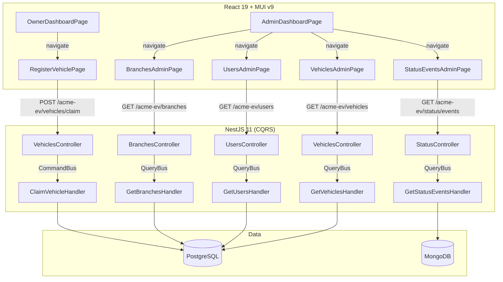

# Design Document: Admin & Owner Enhancements

## Overview

This feature adds two major capabilities to the ACME EV Data Platform:

1. **Admin Management Dashboard**: Transforms the existing Admin Dashboard into a navigation hub with quick-access cards linking to new dedicated admin pages (Vehicles, Users, Branches, Status Events) — each built with MUI DataGrid, server-side pagination, search, sorting, and filtering.

2. **Owner Vehicle Claim**: A new POST `/acme-ev/vehicles/claim` endpoint that lets OWNER-role users claim a vehicle by VIN. If the VIN doesn't exist in the system, a demo vehicle is auto-generated. The frontend provides a dedicated Register Vehicle page accessible from the Owner Dashboard.

Both features build on existing modules, entities, guards, and UI patterns — no architectural changes required.

## Architecture



### Key Design Decisions

1. **Extend existing controllers** (VehiclesController, UsersController, BranchesController, StatusController) with pagination/filter parameters rather than creating new controllers. The only new handler is `ClaimVehicleHandler` (a command, not a query).

2. **Server-side pagination for all admin pages** using the existing `PaginationParamsDto` + `FilterParamsDto` pattern. Each handler returns `PaginationResponse<T>`.

3. **Reuse existing ProtectedRoute** for frontend access control — no new guards needed, just new route entries with `allowedRoles={['ADMIN']}` or `allowedRoles={['OWNER']}`.

4. **CommandBus for the claim endpoint** since it mutates state (creates Vehicle and VehicleOwner records). This is the first write operation using CQRS in the project.

5. **Transaction for claim** — vehicle creation + owner assignment happen in a single TypeORM transaction to prevent orphaned records.

## Components and Interfaces

### Backend Components

#### 1. Enhanced VehiclesController

Add a `POST /vehicles/claim` endpoint restricted to OWNER role:

```typescript
@Post('claim')
@Roles(Role.OWNER)
claimVehicle(
  @Body() dto: ClaimVehicleRequestDto,
  @CurrentUser() user: JwtPayload,
): Promise<ClaimVehicleResponseDto>
```

Extend `GET /vehicles` to accept `FilterParamsDto` (search, sortBy, sortOrder):

```typescript
// Updated request DTO
export class GetVehiclesRequestDto extends PaginationParamsDto {
  @IsOptional() @IsString() search?: string;
  @IsOptional() @IsString() sortBy?: string;
  @IsOptional() @IsIn(['ASC', 'DESC']) sortOrder?: 'ASC' | 'DESC';
}
```

#### 2. Enhanced UsersController

Extend `GET /users` to accept pagination + filter + role filter:

```typescript
export class GetUsersRequestDto extends PaginationParamsDto {
  @IsOptional() @IsString() search?: string;
  @IsOptional() @IsIn(['ADMIN', 'BRANCH_USER', 'OWNER']) role?: string;
  @IsOptional() @IsString() sortBy?: string;
  @IsOptional() @IsIn(['ASC', 'DESC']) sortOrder?: 'ASC' | 'DESC';
}
```

#### 3. Enhanced BranchesController

Extend `GET /branches` to accept pagination + filter with vehicle/owner counts:

```typescript
export class GetBranchesRequestDto extends PaginationParamsDto {
  @IsOptional() @IsString() search?: string;
  @IsOptional() @IsString() sortBy?: string;
  @IsOptional() @IsIn(['ASC', 'DESC']) sortOrder?: 'ASC' | 'DESC';
}
```

Response includes `vehicleCount` and `ownerCount` per branch.

#### 4. Enhanced StatusController (events endpoint)

Make `vin`, `startDate`, `endDate` optional for the admin explorer use case:

```typescript
export class GetStatusEventsAdminRequestDto extends PaginationParamsDto {
  @IsOptional() @IsString() vin?: string;
  @IsOptional() @IsISO8601() startDate?: string;
  @IsOptional() @IsISO8601() endDate?: string;
}
```

#### 5. ClaimVehicleCommand + Handler

```typescript
// Command
export class ClaimVehicleCommand {
  constructor(
    public readonly vin: string,
    public readonly userId: number,
  ) {}
}

// Handler uses DataSource.transaction to:
// 1. Check if VIN already has an owner
// 2. If vehicle doesn't exist → create demo vehicle
// 3. Create VehicleOwner record
```

#### 6. Demo Vehicle Generator (Service)

A `DemoVehicleService` with a static model list:

```typescript
const EV_MODELS = [
  { model: 'ACME Volt', brand: 'ACME' },
  { model: 'ACME Spark', brand: 'ACME' },
  { model: 'ACME Thunder', brand: 'ACME' },
  { model: 'ACME Wave', brand: 'ACME' },
  { model: 'ACME Pulse', brand: 'ACME' },
];
```

Selects a random model, assigns current year, sets the lowest-ID branch.

### Frontend Components

#### 7. AdminDashboardPage (enhanced)

Refactored to show navigation cards (Vehicles, Users, Branches, Status Events) with counts from `GET /acme-ev/dashboard/admin`. Each card links to its respective admin page.

#### 8. VehiclesAdminPage (new)

- MUI DataGrid with server-side pagination
- VIN search field (debounced, min 1 char)
- Sortable columns: VIN, Vehicle ID, Model, Year, Branch Name, Created
- Page size options: 10, 25, 50

#### 9. UsersAdminPage (new)

- MUI DataGrid with server-side pagination
- Text search (debounced 300ms) on name/email
- Role dropdown filter (ADMIN, BRANCH_USER, OWNER)
- Sortable columns: Name, Email, Role, Branch, Created
- Page size options: 25, 50, 100

#### 10. BranchesAdminPage (new)

- MUI DataGrid with server-side pagination
- Name search field
- Sortable columns: Name, Country, Region, Status, Vehicle Count, Owner Count
- Page size options: 10, 25, 50

#### 11. StatusEventsAdminPage (new)

- MUI DataGrid with server-side pagination
- VIN quick search field
- Date range picker (start/end)
- Clear Filters button
- Columns: VIN, DateTime, BatteryLevel, EngineStatus, FaultCodes, Odometer
- Page size max: 50

#### 12. RegisterVehiclePage (new)

- VIN text input (maxLength 17, uppercase only)
- "Claim" button disabled until 17 valid characters
- Loading state disables both input and button
- Success/error alerts from API response
- Clears input on success

#### 13. OwnerDashboardPage (enhanced)

Add a "Register Vehicle" card/button that navigates to `/register-vehicle`.

#### 14. Header (enhanced)

No changes needed for admin pages (already has Dashboard link). The Register Vehicle page is accessed from the Owner Dashboard content, not the header.

### API Contracts

| Endpoint | Method | Roles | Request Params | Response |
|----------|--------|-------|----------------|----------|
| `/acme-ev/vehicles` | GET | ADMIN, BRANCH_USER | page, limit, search, sortBy, sortOrder | `PaginationResponse<GetVehicleResponseDto>` |
| `/acme-ev/vehicles/claim` | POST | OWNER | `{ vin: string }` | `ClaimVehicleResponseDto` |
| `/acme-ev/users` | GET | ADMIN | page, limit, search, role, sortBy, sortOrder | `PaginationResponse<GetUserResponseDto>` |
| `/acme-ev/branches` | GET | ADMIN | page, limit, search, sortBy, sortOrder | `PaginationResponse<GetBranchResponseDto>` |
| `/acme-ev/status/events` | GET | ADMIN, BRANCH_USER | vin?, startDate?, endDate?, page, limit | `PaginationResponse<StatusEventDto>` |
| `/acme-ev/dashboard/admin` | GET | ADMIN | — | `AdminDashboardResponseDto` |

## Data Models

### Existing Entities (no schema changes)

#### Vehicle (PostgreSQL — `vehicles` table)
| Column | Type | Constraints |
|--------|------|-------------|
| id | int | PK, auto-increment |
| vin | varchar(17) | UNIQUE |
| id_vehiculo | varchar | NOT NULL |
| model | varchar | NOT NULL |
| year | int | NOT NULL |
| branch_id | int | FK → branches.id |
| created_at | timestamp | DEFAULT CURRENT_TIMESTAMP |

#### VehicleOwner (PostgreSQL — `vehicle_owners` table)
| Column | Type | Constraints |
|--------|------|-------------|
| id | int | PK, auto-increment |
| user_id | int | FK → users.id |
| vehicle_id | int | FK → vehicles.id |
| assigned_at | timestamp | DEFAULT CURRENT_TIMESTAMP |

#### User (PostgreSQL — `users` table)
| Column | Type | Constraints |
|--------|------|-------------|
| id | int | PK, auto-increment |
| email | varchar | UNIQUE |
| password | varchar | bcrypt hash |
| name | varchar | NOT NULL |
| role | enum | ADMIN, BRANCH_USER, OWNER |
| branch_id | int | FK → branches.id, nullable |
| created_at | timestamp | DEFAULT CURRENT_TIMESTAMP |

#### Branch (PostgreSQL — `branches` table)
| Column | Type | Constraints |
|--------|------|-------------|
| id | int | PK, auto-increment |
| name | varchar | NOT NULL |
| country | varchar | NOT NULL |
| region | varchar | NOT NULL |
| is_active | boolean | DEFAULT true |
| created_at | timestamp | DEFAULT CURRENT_TIMESTAMP |

#### StatusEvent (MongoDB — `status_events` collection)
| Field | Type | Description |
|-------|------|-------------|
| id_vehiculo | string | Vehicle identifier |
| vin | string | VIN |
| event_timestamp | Date | Event time |
| tipo_trama | string | Frame type |
| zona_referencia | string | Reference zone |
| departamento | string | Department |
| bateria | number | Battery level |
| encendido | boolean | Engine on/off |
| codigo_problema | string | Fault code (empty = no fault) |
| kilometraje | number | Odometer |
| processed_at | Date | Processing time |

### New DTOs

#### ClaimVehicleRequestDto
```typescript
export class ClaimVehicleRequestDto {
  @IsString()
  @Length(17, 17)
  @Matches(/^[A-Z0-9]{17}$/)
  vin: string;
}
```

#### ClaimVehicleResponseDto
```typescript
export class ClaimVehicleResponseDto {
  message: string;
  vin: string;
}
```

#### GetBranchAdminResponseDto (extended)
```typescript
export class GetBranchAdminResponseDto {
  id: number;
  name: string;
  country: string;
  region: string;
  isActive: boolean;
  vehicleCount: number;
  ownerCount: number;
  createdAt: string;
}
```

### Demo Vehicle Model List

```typescript
const EV_MODELS = [
  { model: 'ACME Volt', brand: 'ACME' },
  { model: 'ACME Spark', brand: 'ACME' },
  { model: 'ACME Thunder', brand: 'ACME' },
  { model: 'ACME Wave', brand: 'ACME' },
  { model: 'ACME Pulse', brand: 'ACME' },
];
```


## Correctness Properties

*A property is a characteristic or behavior that should hold true across all valid executions of a system — essentially, a formal statement about what the system should do. Properties serve as the bridge between human-readable specifications and machine-verifiable correctness guarantees.*

### Property 1: Already-owned VIN rejection

*For any* valid 17-character VIN that already has a VehicleOwner record in the database, when any OWNER-role user submits a claim for that VIN, the endpoint SHALL return HTTP 400 with an error message and SHALL NOT create a new VehicleOwner record.

**Validates: Requirements 7.1, 7.2**

### Property 2: Successful claim for existing unowned vehicle

*For any* valid 17-character VIN that exists in the vehicles table but has no corresponding VehicleOwner record, when an OWNER-role user submits a claim, the endpoint SHALL create exactly one VehicleOwner record linking that vehicle to the authenticated user and return HTTP 200.

**Validates: Requirements 7.3**

### Property 3: Demo vehicle creation for non-existing VIN

*For any* valid 17-character VIN that does not exist in the vehicles table and has no VehicleOwner record, when an OWNER-role user submits a claim, the endpoint SHALL create a new Vehicle record and a VehicleOwner record associating it to the user, and return HTTP 200.

**Validates: Requirements 7.4**

### Property 4: VIN-to-owner uniqueness invariant

*For any* sequence of claim operations against the system, the vehicle_owners table SHALL never contain two records referencing the same vehicle_id. Each vehicle has at most one owner at any time.

**Validates: Requirements 7.5**

### Property 5: VIN format validation

*For any* string that does not match the pattern `/^[A-Z0-9]{17}$/` (i.e., not exactly 17 uppercase alphanumeric characters), the claim endpoint SHALL return HTTP 400 with a validation error message and SHALL NOT create any records.

**Validates: Requirements 7.7**

### Property 6: Claim transaction integrity

*For any* claim operation where the VehicleOwner record persistence fails (simulated database error), the system SHALL NOT leave a Vehicle record in the database without its corresponding VehicleOwner record. Either both are persisted or neither is.

**Validates: Requirements 7.8**

### Property 7: Demo vehicle data invariants

*For any* demo vehicle created by the claim endpoint, ALL of the following SHALL hold:
- The vehicle's VIN equals the submitted VIN
- The vehicle's model is a member of the predefined EV_MODELS list (at least 5 models)
- The vehicle's brand corresponds to the selected model via the model-to-brand mapping
- The vehicle's branchId equals the minimum id in the branches table

**Validates: Requirements 8.1, 8.2, 8.3, 8.6**

### Property 8: Claim endpoint role restriction

*For any* authenticated user with a role other than OWNER (i.e., ADMIN or BRANCH_USER), a POST request to /acme-ev/vehicles/claim SHALL return HTTP 403 regardless of the request body content.

**Validates: Requirements 7.6**

### Property 9: Admin endpoint role restriction

*For any* authenticated user with a role other than ADMIN (i.e., BRANCH_USER or OWNER), a GET request to /acme-ev/users or /acme-ev/branches SHALL return HTTP 403.

**Validates: Requirements 6.4**

### Property 10: Claim button disabled for invalid VIN input

*For any* string entered in the VIN input field that has fewer than 17 characters or contains characters outside [A-Z0-9], the "Claim" button SHALL be disabled (not clickable).

**Validates: Requirements 9.2**

## Error Handling

### Backend Error Handling

| Scenario | HTTP Status | Response Body | Recovery |
|----------|------------|---------------|----------|
| Invalid VIN format (not 17 uppercase alphanumeric) | 400 | `{ message: "VIN format is invalid..." }` | Client corrects input |
| VIN already assigned to an owner | 400 | `{ message: "Vehicle is already assigned to an owner" }` | Client informs user |
| No JWT token provided | 401 | `{ message: "Unauthorized" }` | Client redirects to login |
| Wrong role for endpoint | 403 | `{ message: "Forbidden resource" }` | Client shows access denied |
| Database transaction failure during claim | 500 | `{ message: "Internal server error" }` | Automatic rollback, client shows generic error |
| No branches in database (demo vehicle needs branch) | 500 | `{ message: "Internal server error" }` | Admin must seed branches |

### Frontend Error Handling

| Component | Error Type | Behavior |
|-----------|-----------|----------|
| Admin Dashboard | API failure | Show ErrorAlert, display cards without counts |
| Admin DataGrid pages | API failure | Show error alert, preserve previous data, allow retry |
| Admin DataGrid pages | Empty results | Show "No results found" empty state |
| Register Vehicle | 400 response | Show server error message in alert |
| Register Vehicle | 5xx / network error | Show generic "Something went wrong" alert |
| Register Vehicle | Success | Show success alert, clear input |
| All pages | 401 response | Auto-redirect to /login (handled by useRequest hook) |

### Transaction Strategy

The `ClaimVehicleHandler` wraps all operations in a TypeORM `DataSource.transaction()`:

```typescript
await this.dataSource.transaction(async (manager) => {
  // 1. Check existing ownership
  // 2. Find or create vehicle
  // 3. Create VehicleOwner
  // If any step fails → full rollback
});
```

This ensures no partial state: a Vehicle is never created without its VehicleOwner.

## Testing Strategy

### Property-Based Testing

**Library:** [fast-check](https://github.com/dubzzz/fast-check) (TypeScript PBT library)

Property-based tests will validate the 10 correctness properties defined above. Each test runs a minimum of 100 iterations with randomly generated inputs.

**Configuration:**
```typescript
fc.assert(
  fc.property(/* arbitraries */, (input) => {
    // property assertion
  }),
  { numRuns: 100 }
);
```

**Tag format:** Each test is tagged with:
```typescript
// Feature: admin-owner-enhancements, Property N: <property title>
```

**Focus areas for PBT:**
- VIN validation (Property 5): Generate random strings of various lengths and character sets
- Claim business logic (Properties 1-4): Generate random VINs with varying database states
- Demo vehicle generation (Property 7): Verify invariants hold across many random model selections
- Role-based access (Properties 8, 9): Generate random users with different roles

### Unit Testing (Example-Based)

Unit tests cover specific scenarios and integration points:

**Backend:**
- `ClaimVehicleHandler`: Happy path (existing vehicle, no owner), demo vehicle creation, already-owned rejection
- Enhanced query handlers: Pagination math, filter/search/sort SQL generation, empty result handling
- DTOs: Validation decorator behavior for edge cases

**Frontend:**
- Admin pages: Initial render, loading states, error states, empty states
- Register Vehicle: Form interaction, button enable/disable, success/error alerts
- Navigation: Card clicks route correctly, ProtectedRoute redirects unauthorized users

### Integration Testing

- Full claim flow: POST with valid VIN → verify database state
- Admin endpoint access control: Verify 403 for non-ADMIN users
- Pagination: Verify page/limit/total math across endpoints

### Test Organization

```
backend/src/vehicles/commands/__tests__/
  claim-vehicle.handler.spec.ts       # Unit + property tests for claim logic
  claim-vehicle.handler.pbt.spec.ts   # Dedicated PBT file

backend/src/vehicles/queries/__tests__/
  get-vehicles.handler.spec.ts        # Enhanced pagination/filter tests

backend/src/users/queries/__tests__/
  get-users.handler.spec.ts           # Pagination + role filter tests

backend/src/branches/queries/__tests__/
  get-branches.handler.spec.ts        # Pagination + counts tests

client/src/pages/__tests__/
  VehiclesAdminPage.test.tsx
  UsersAdminPage.test.tsx
  BranchesAdminPage.test.tsx
  StatusEventsAdminPage.test.tsx
  RegisterVehiclePage.test.tsx
```
