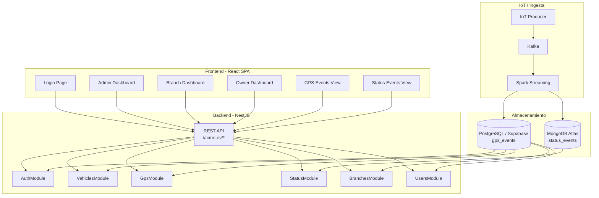
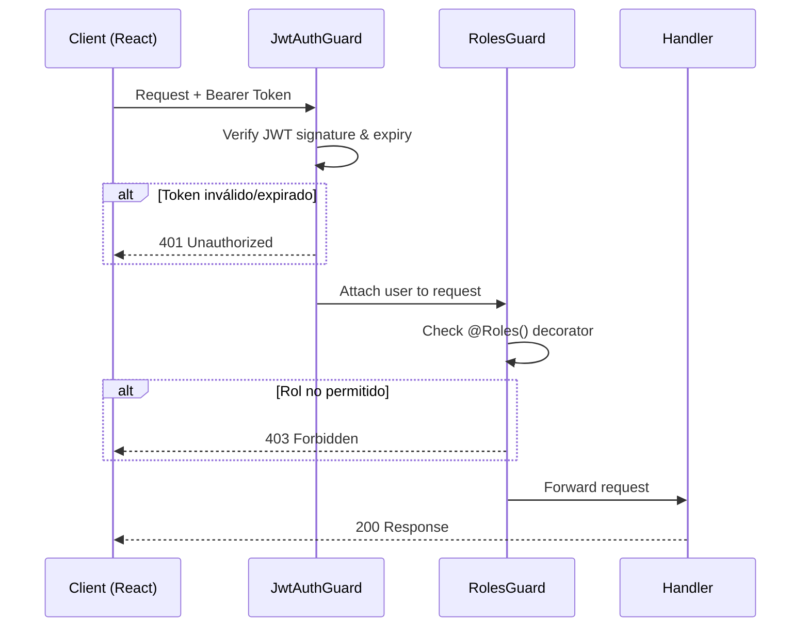
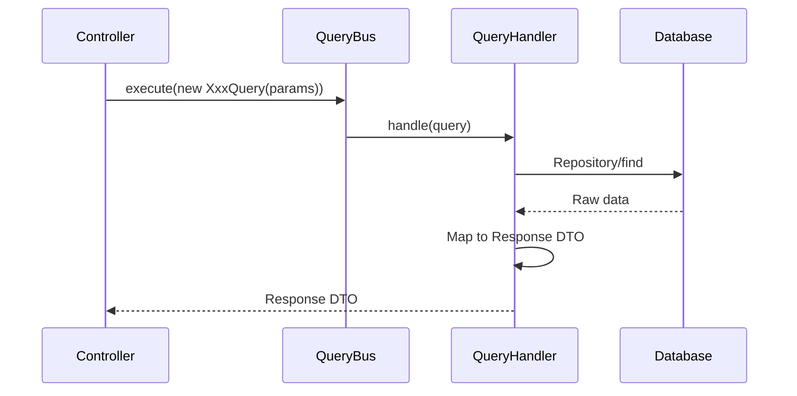
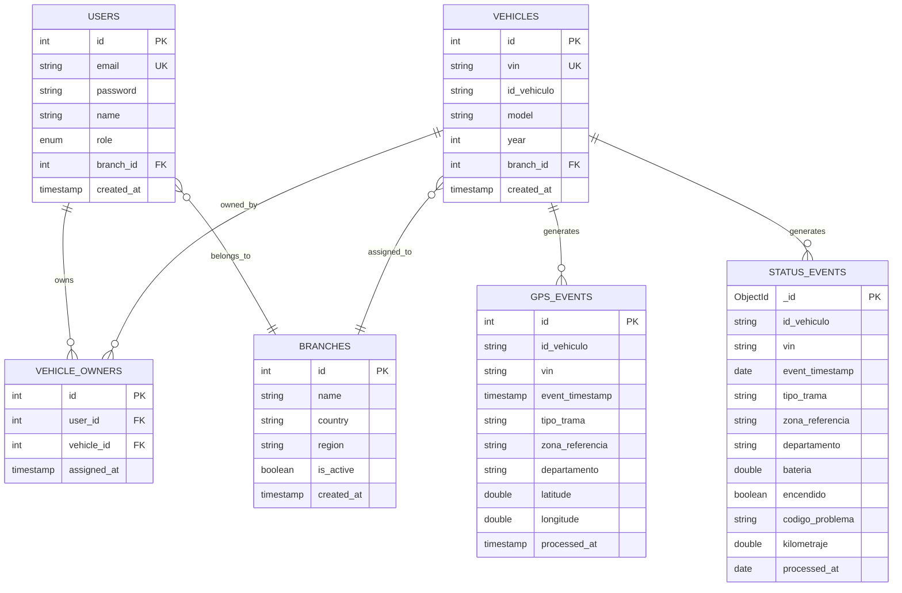

# Design Document — EV Fleet Dashboard

## Overview

El EV Fleet Dashboard es una aplicación full-stack que expone los datos procesados por los pipelines Spark (GPS en PostgreSQL, estado operacional en MongoDB Atlas) a través de una API REST NestJS y una SPA React. El sistema implementa autenticación JWT con control de acceso basado en roles (ADMIN, BRANCH_USER, OWNER) y ofrece dashboards diferenciados, consulta paginada, filtros y descarga CSV.

**Principio fundamental:** El backend es read-only respecto a datos de telemetría. No modifica los pipelines Kafka/Spark existentes. Solo consulta los datos ya procesados y almacenados.

### Decisiones Arquitectónicas Clave

| Decisión | Justificación |
|----------|---------------|
| CQRS (solo queries) | Consistente con el patrón existente; la app es read-heavy, no necesita commands para datos de telemetría |
| TypeORM para PostgreSQL | ORM maduro con soporte NestJS nativo, generación de entidades y repositorios |
| Mongoose/MongoDB driver nativo | Conexión directa a MongoDB Atlas para documentos de estado |
| JWT con claims de rol | Stateless auth, transporta `userId`, `role`, `branchId` en el token |
| bcrypt para passwords | Estándar de hashing seguro para contraseñas almacenadas |
| CSV streaming | Evita cargar todos los registros en memoria para descargas grandes |
| Seed script | Datos de demostración para defensa del proyecto universitario |

## Architecture

### High-Level System Diagram



### Authentication & Authorization Flow



### Request Flow (CQRS Pattern)



## Components and Interfaces

### Backend Module Structure

```
backend/src/
├── main.ts
├── app.module.ts
├── common/
│   ├── constants/
│   │   ├── index.ts
│   │   ├── pagination.constant.ts
│   │   └── roles.constant.ts
│   ├── decorators/
│   │   ├── roles.decorator.ts
│   │   └── current-user.decorator.ts
│   ├── dtos/
│   │   ├── index.ts
│   │   ├── pagination.params.dto.ts
│   │   ├── pagination-response.dto.ts
│   │   └── filter.params.dto.ts
│   ├── guards/
│   │   ├── jwt-auth.guard.ts
│   │   └── roles.guard.ts
│   └── interfaces/
│       └── jwt-payload.interface.ts
├── config/
│   ├── configuration.ts
│   ├── config.interface.ts
│   ├── config.schema.ts
│   └── envs/
├── auth/
│   ├── auth.module.ts
│   ├── controllers/
│   │   └── auth.controller.ts
│   ├── dtos/
│   │   ├── login-request.dto.ts
│   │   └── login-response.dto.ts
│   ├── queries/
│   │   ├── login.query.ts
│   │   └── handlers/
│   │       ├── index.ts
│   │       └── login.handler.ts
│   └── strategies/
│       └── jwt.strategy.ts
├── users/
│   ├── users.module.ts
│   ├── controllers/
│   │   └── users.controller.ts
│   ├── entities/
│   │   └── user.entity.ts
│   ├── dtos/
│   │   └── get-user-response.dto.ts
│   ├── queries/
│   │   ├── get-users.query.ts
│   │   └── handlers/
│   │       ├── index.ts
│   │       └── get-users.handler.ts
│   └── mappers/
│       └── user.mapper.ts
├── branches/
│   ├── branches.module.ts
│   ├── controllers/
│   │   └── branches.controller.ts
│   ├── entities/
│   │   └── branch.entity.ts
│   ├── dtos/
│   │   └── get-branch-response.dto.ts
│   ├── queries/
│   │   ├── get-branches.query.ts
│   │   └── handlers/
│   │       ├── index.ts
│   │       └── get-branches.handler.ts
│   └── mappers/
│       └── branch.mapper.ts
├── vehicles/
│   ├── vehicles.module.ts
│   ├── controllers/
│   │   └── vehicles.controller.ts
│   ├── entities/
│   │   ├── vehicle.entity.ts
│   │   └── vehicle-owner.entity.ts
│   ├── dtos/
│   │   ├── get-vehicle-response.dto.ts
│   │   └── get-vehicles-request.dto.ts
│   ├── queries/
│   │   ├── get-vehicles.query.ts
│   │   ├── get-vehicle-by-vin.query.ts
│   │   └── handlers/
│   │       ├── index.ts
│   │       ├── get-vehicles.handler.ts
│   │       └── get-vehicle-by-vin.handler.ts
│   └── mappers/
│       └── vehicle.mapper.ts
├── gps/
│   ├── gps.module.ts
│   ├── controllers/
│   │   └── gps.controller.ts
│   ├── entities/
│   │   └── gps-event.entity.ts
│   ├── dtos/
│   │   ├── get-gps-events-request.dto.ts
│   │   ├── get-gps-events-response.dto.ts
│   │   └── download-csv-request.dto.ts
│   ├── queries/
│   │   ├── get-gps-events.query.ts
│   │   ├── download-gps-csv.query.ts
│   │   └── handlers/
│   │       ├── index.ts
│   │       ├── get-gps-events.handler.ts
│   │       └── download-gps-csv.handler.ts
│   └── mappers/
│       └── gps-event.mapper.ts
├── status/
│   ├── status.module.ts
│   ├── controllers/
│   │   └── status.controller.ts
│   ├── dtos/
│   │   ├── get-status-events-request.dto.ts
│   │   ├── get-status-events-response.dto.ts
│   │   └── get-vehicles-with-faults-response.dto.ts
│   ├── schemas/
│   │   └── status-event.schema.ts
│   ├── queries/
│   │   ├── get-status-events.query.ts
│   │   ├── get-latest-status.query.ts
│   │   ├── get-vehicles-with-faults.query.ts
│   │   └── handlers/
│   │       ├── index.ts
│   │       ├── get-status-events.handler.ts
│   │       ├── get-latest-status.handler.ts
│   │       └── get-vehicles-with-faults.handler.ts
│   └── mappers/
│       └── status-event.mapper.ts
├── dashboard/
│   ├── dashboard.module.ts
│   ├── controllers/
│   │   └── dashboard.controller.ts
│   ├── dtos/
│   │   ├── admin-dashboard-response.dto.ts
│   │   └── branch-dashboard-response.dto.ts
│   ├── queries/
│   │   ├── get-admin-dashboard.query.ts
│   │   ├── get-branch-dashboard.query.ts
│   │   └── handlers/
│   │       ├── index.ts
│   │       ├── get-admin-dashboard.handler.ts
│   │       └── get-branch-dashboard.handler.ts
│   └── mappers/
│       └── dashboard.mapper.ts
└── seed/
    ├── seed.module.ts
    ├── seed.service.ts
    └── data/
        ├── users.seed.ts
        ├── branches.seed.ts
        ├── vehicles.seed.ts
        └── vehicle-owners.seed.ts
```

### Frontend Structure

```
client/src/
├── index.tsx
├── App.tsx
├── pages/
│   ├── LoginPage.tsx
│   ├── AdminDashboardPage.tsx
│   ├── BranchDashboardPage.tsx
│   ├── OwnerDashboardPage.tsx
│   ├── GpsEventsPage.tsx
│   ├── StatusEventsPage.tsx
│   └── NotFoundPage.tsx
├── components/
│   ├── header/
│   │   └── Header.tsx
│   ├── auth/
│   │   ├── LoginForm.tsx
│   │   └── ProtectedRoute.tsx
│   ├── dashboard/
│   │   ├── MetricCard.tsx
│   │   ├── VehicleList.tsx
│   │   └── FaultVehicleTable.tsx
│   ├── gps/
│   │   ├── GpsEventTable.tsx
│   │   ├── GpsFilters.tsx
│   │   └── CsvDownloadButton.tsx
│   ├── status/
│   │   ├── StatusEventTable.tsx
│   │   └── StatusFilters.tsx
│   └── common/
│       ├── LoadingSpinner.tsx
│       ├── ErrorAlert.tsx
│       └── PaginationControls.tsx
├── hooks/
│   ├── use-request.hook.ts
│   ├── use-auth.hook.ts
│   └── interfaces/
│       └── use-request.interface.ts
├── interfaces/
│   ├── User.ts
│   ├── Vehicle.ts
│   ├── GpsEvent.ts
│   ├── StatusEvent.ts
│   ├── Branch.ts
│   ├── Dashboard.ts
│   └── Auth.ts
├── routes/
│   └── Routes.tsx
├── constants/
│   └── urls.ts
├── themes/
│   └── dark.theme.ts
├── utils/
│   ├── check-email.util.ts
│   ├── auth-storage.util.ts
│   └── date-format.util.ts
└── context/
    └── AuthContext.tsx
```

### REST API Endpoints

Global prefix: `/acme-ev`

#### Auth Module

| Method | Path | Description | Auth | Roles |
|--------|------|-------------|------|-------|
| POST | `/acme-ev/auth/login` | Authenticate user | No | — |

#### Dashboard Module

| Method | Path | Description | Auth | Roles |
|--------|------|-------------|------|-------|
| GET | `/acme-ev/dashboard/admin` | Admin metrics | Yes | ADMIN |
| GET | `/acme-ev/dashboard/branch` | Branch vehicle summary | Yes | BRANCH_USER |

#### Vehicles Module

| Method | Path | Description | Auth | Roles |
|--------|------|-------------|------|-------|
| GET | `/acme-ev/vehicles` | List vehicles (paginated, filtered by role) | Yes | ADMIN, BRANCH_USER |
| GET | `/acme-ev/vehicles/:vin` | Get vehicle by VIN | Yes | ADMIN, BRANCH_USER |
| GET | `/acme-ev/vehicles/owner` | List owner's vehicles | Yes | OWNER |

#### GPS Module

| Method | Path | Description | Auth | Roles |
|--------|------|-------------|------|-------|
| GET | `/acme-ev/gps/events` | GPS events by VIN + date range | Yes | OWNER |
| GET | `/acme-ev/gps/events/download` | Download GPS CSV | Yes | OWNER |

#### Status Module

| Method | Path | Description | Auth | Roles |
|--------|------|-------------|------|-------|
| GET | `/acme-ev/status/events` | Status events by VIN + date range | Yes | ADMIN, BRANCH_USER |
| GET | `/acme-ev/status/latest/:vin` | Latest status for vehicle | Yes | ADMIN, BRANCH_USER |
| GET | `/acme-ev/status/faults` | Vehicles with active faults | Yes | BRANCH_USER |

#### Users Module

| Method | Path | Description | Auth | Roles |
|--------|------|-------------|------|-------|
| GET | `/acme-ev/users` | List all users | Yes | ADMIN |

#### Branches Module

| Method | Path | Description | Auth | Roles |
|--------|------|-------------|------|-------|
| GET | `/acme-ev/branches` | List all branches | Yes | ADMIN |

### Endpoint Details

#### POST `/acme-ev/auth/login`

**Request Body:**
```json
{
  "email": "admin@acme-ev.com",
  "password": "secret123"
}
```

**Response 200:**
```json
{
  "accessToken": "eyJhbGciOi...",
  "user": {
    "id": 1,
    "email": "admin@acme-ev.com",
    "name": "Admin ACME",
    "role": "ADMIN",
    "branchId": null
  }
}
```

**Response 401:**
```json
{
  "statusCode": 401,
  "message": "Credenciales inválidas"
}
```

#### GET `/acme-ev/gps/events`

**Query Params:**
- `vin` (string, required, 17 chars)
- `startDate` (ISO 8601, required)
- `endDate` (ISO 8601, required)
- `page` (number, optional, default: 1)
- `limit` (number, optional, default: 100, max: 100)

**Response 200:**
```json
{
  "data": [
    {
      "vin": "1HGCM82633A123456",
      "eventTimestamp": "2025-01-15T14:30:00.000Z",
      "latitude": 14.634915,
      "longitude": -90.506882
    }
  ],
  "meta": {
    "total": 250,
    "page": 1,
    "limit": 100,
    "totalPages": 3
  }
}
```

#### GET `/acme-ev/gps/events/download`

**Query Params:** Same as `/gps/events` (without pagination)

**Response 200:** Binary CSV file
- `Content-Type: text/csv`
- `Content-Disposition: attachment; filename="{VIN}_{startDate}_{endDate}.csv"`

**CSV Format:**
```csv
VIN,datetime,latitude,longitude
1HGCM82633A123456,2025-01-15T14:30:00.000Z,14.634915,-90.506882
```

#### GET `/acme-ev/status/events`

**Query Params:**
- `vin` (string, required, 17 chars)
- `startDate` (ISO 8601, required)
- `endDate` (ISO 8601, required)
- `page` (number, optional, default: 1)
- `limit` (number, optional, default: 50, max: 50)

**Response 200:**
```json
{
  "data": [
    {
      "vin": "1HGCM82633A123456",
      "eventTimestamp": "2025-01-15T14:30:00.000Z",
      "batteryLevel": 85.5,
      "engineStatus": true,
      "faultCodes": "P0301",
      "odometer": 15234.7
    }
  ],
  "meta": {
    "total": 120,
    "page": 1,
    "limit": 50,
    "totalPages": 3
  }
}
```

#### GET `/acme-ev/status/faults`

**Response 200:**
```json
{
  "data": [
    {
      "vin": "1HGCM82633A123456",
      "faultCode": "P0301",
      "lastReportedAt": "2025-01-15T14:30:00.000Z"
    }
  ]
}
```

#### GET `/acme-ev/dashboard/admin`

**Response 200:**
```json
{
  "totalVehicles": 150,
  "totalBranches": 5,
  "totalUsers": 30,
  "vehiclesWithFaults": 12
}
```

## Data Models

### PostgreSQL Entities (TypeORM)

#### User Entity

```typescript
@Entity('users')
export class User {
  @PrimaryGeneratedColumn()
  id: number;

  @Column({ unique: true })
  email: string;

  @Column()
  password: string; // bcrypt hash

  @Column()
  name: string;

  @Column({ type: 'enum', enum: ['ADMIN', 'BRANCH_USER', 'OWNER'] })
  role: string;

  @Column({ name: 'branch_id', nullable: true })
  branchId: number | null;

  @ManyToOne(() => Branch, { nullable: true })
  @JoinColumn({ name: 'branch_id' })
  branch: Branch;

  @Column({ name: 'created_at', type: 'timestamp', default: () => 'CURRENT_TIMESTAMP' })
  createdAt: Date;
}
```

#### Branch Entity

```typescript
@Entity('branches')
export class Branch {
  @PrimaryGeneratedColumn()
  id: number;

  @Column()
  name: string;

  @Column()
  country: string;

  @Column()
  region: string;

  @Column({ name: 'is_active', default: true })
  isActive: boolean;

  @Column({ name: 'created_at', type: 'timestamp', default: () => 'CURRENT_TIMESTAMP' })
  createdAt: Date;
}
```

#### Vehicle Entity

```typescript
@Entity('vehicles')
export class Vehicle {
  @PrimaryGeneratedColumn()
  id: number;

  @Column({ unique: true, length: 17 })
  vin: string;

  @Column({ name: 'id_vehiculo' })
  idVehiculo: string;

  @Column()
  model: string;

  @Column()
  year: number;

  @Column({ name: 'branch_id' })
  branchId: number;

  @ManyToOne(() => Branch)
  @JoinColumn({ name: 'branch_id' })
  branch: Branch;

  @Column({ name: 'created_at', type: 'timestamp', default: () => 'CURRENT_TIMESTAMP' })
  createdAt: Date;
}
```

#### VehicleOwner Entity

```typescript
@Entity('vehicle_owners')
export class VehicleOwner {
  @PrimaryGeneratedColumn()
  id: number;

  @Column({ name: 'user_id' })
  userId: number;

  @ManyToOne(() => User)
  @JoinColumn({ name: 'user_id' })
  user: User;

  @Column({ name: 'vehicle_id' })
  vehicleId: number;

  @ManyToOne(() => Vehicle)
  @JoinColumn({ name: 'vehicle_id' })
  vehicle: Vehicle;

  @Column({ name: 'assigned_at', type: 'timestamp', default: () => 'CURRENT_TIMESTAMP' })
  assignedAt: Date;
}
```

#### GpsEvent Entity

```typescript
@Entity('gps_events')
export class GpsEvent {
  @PrimaryGeneratedColumn()
  id: number;

  @Column({ name: 'id_vehiculo', length: 50 })
  idVehiculo: string;

  @Column({ length: 50 })
  vin: string;

  @Column({ name: 'event_timestamp', type: 'timestamp' })
  eventTimestamp: Date;

  @Column({ name: 'tipo_trama', length: 20 })
  tipoTrama: string;

  @Column({ name: 'zona_referencia', length: 100 })
  zonaReferencia: string;

  @Column({ length: 100 })
  departamento: string;

  @Column({ type: 'double precision' })
  latitude: number;

  @Column({ type: 'double precision' })
  longitude: number;

  @Column({ name: 'processed_at', type: 'timestamp' })
  processedAt: Date;
}
```

### MongoDB Schema (status_events collection)

```typescript
// Document structure in status_events collection
interface StatusEventDocument {
  _id: ObjectId;
  id_vehiculo: string;
  vin: string;
  event_timestamp: Date;
  tipo_trama: string;
  zona_referencia: string;
  departamento: string;
  bateria: number;          // porcentaje 0-100
  encendido: boolean;       // true = motor encendido
  codigo_problema: string;  // código OBD-II o null/"" si no hay falla
  kilometraje: number;      // odómetro en km
  processed_at: Date;
}
```

### SQL Migrations Required

```sql
-- database/2026-06-15.create-users-table.sql
CREATE TABLE users (
  id SERIAL PRIMARY KEY,
  email VARCHAR(255) UNIQUE NOT NULL,
  password VARCHAR(255) NOT NULL,
  name VARCHAR(100) NOT NULL,
  role VARCHAR(20) NOT NULL CHECK (role IN ('ADMIN', 'BRANCH_USER', 'OWNER')),
  branch_id INTEGER REFERENCES branches(id),
  created_at TIMESTAMP DEFAULT CURRENT_TIMESTAMP
);

-- database/2026-06-15.create-branches-table.sql
CREATE TABLE branches (
  id SERIAL PRIMARY KEY,
  name VARCHAR(100) NOT NULL,
  country VARCHAR(50) NOT NULL,
  region VARCHAR(100) NOT NULL,
  is_active BOOLEAN DEFAULT TRUE,
  created_at TIMESTAMP DEFAULT CURRENT_TIMESTAMP
);

-- database/2026-06-15.create-vehicles-table.sql
CREATE TABLE vehicles (
  id SERIAL PRIMARY KEY,
  vin VARCHAR(17) UNIQUE NOT NULL,
  id_vehiculo VARCHAR(50) NOT NULL,
  model VARCHAR(100) NOT NULL,
  year INTEGER NOT NULL,
  branch_id INTEGER NOT NULL REFERENCES branches(id),
  created_at TIMESTAMP DEFAULT CURRENT_TIMESTAMP
);

-- database/2026-06-15.create-vehicle-owners-table.sql
CREATE TABLE vehicle_owners (
  id SERIAL PRIMARY KEY,
  user_id INTEGER NOT NULL REFERENCES users(id),
  vehicle_id INTEGER NOT NULL REFERENCES vehicles(id),
  assigned_at TIMESTAMP DEFAULT CURRENT_TIMESTAMP,
  UNIQUE(user_id, vehicle_id)
);
```

### Entity Relationship Diagram



### JWT Payload Structure

```typescript
interface JwtPayload {
  sub: number;      // user.id
  email: string;
  role: 'ADMIN' | 'BRANCH_USER' | 'OWNER';
  branchId: number | null;
  iat: number;
  exp: number;
}
```

### Key Implementation Patterns

#### Guard-based Authorization

```typescript
// Usage in controllers
@UseGuards(JwtAuthGuard, RolesGuard)
@Roles('ADMIN', 'BRANCH_USER')
@Get('events')
getStatusEvents(@Query() params: GetStatusEventsRequestDto, @CurrentUser() user: JwtPayload) {
  return this._queryBus.execute(new GetStatusEventsQuery(params, user));
}
```

#### Ownership Validation (GPS Module)

The GPS handler validates that the requesting OWNER actually owns the vehicle before returning data:

```typescript
// Inside handler
const ownership = await this._vehicleOwnerRepo.findOne({
  where: { userId: user.sub, vehicle: { vin: query.params.vin } },
  relations: ['vehicle'],
});
if (!ownership) throw new ForbiddenException('No tienes acceso a este vehículo');
```

#### Branch Scoping (Status Module)

BRANCH_USER queries are automatically scoped to their branch:

```typescript
// Inside handler
const vehicle = await this._vehicleRepo.findOne({ where: { vin: query.params.vin } });
if (user.role === 'BRANCH_USER' && vehicle.branchId !== user.branchId) {
  throw new ForbiddenException('El vehículo no pertenece a tu sucursal');
}
```

#### CSV Generation Strategy

```typescript
// Stream-based CSV generation to avoid memory issues
@Header('Content-Type', 'text/csv')
async downloadCsv(@Query() params: DownloadCsvRequestDto, @CurrentUser() user: JwtPayload, @Res() res: Response) {
  // Validate ownership
  // Query events
  // Set Content-Disposition header: "{VIN}_{startDate}_{endDate}.csv"
  // Write CSV header + rows to response stream
}
```

### Seed Data Strategy

The seed module inserts demo data for project defense:

| Entity | Count | Details |
|--------|-------|---------|
| Branches | 3 | Guatemala City, Quetzaltenango, Escuintla |
| Users | 6 | 1 ADMIN, 3 BRANCH_USER (1 per branch), 2 OWNER |
| Vehicles | 10 | Distributed across 3 branches |
| VehicleOwners | 4 | 2 vehicles per OWNER |

The seed runs via a CLI command: `npm run seed` which calls a NestJS standalone application.

### Dependencies to Add

**Backend (npm):**
- `@nestjs/typeorm` + `typeorm` + `pg` — PostgreSQL ORM
- `@nestjs/mongoose` + `mongoose` — MongoDB connection
- `@nestjs/jwt` + `@nestjs/passport` + `passport` + `passport-jwt` — Auth
- `bcrypt` + `@types/bcrypt` — Password hashing
- `json2csv` + `@types/json2csv` — CSV generation

**Frontend (yarn):**
- `react-router-dom` (already installed)
- `@mui/x-data-grid` — Tables with pagination/sorting
- `dayjs` — Date handling and formatting


## Correctness Properties

*A property is a characteristic or behavior that should hold true across all valid executions of a system—essentially, a formal statement about what the system should do. Properties serve as the bridge between human-readable specifications and machine-verifiable correctness guarantees.*

### Property 1: Login produces JWT with correct claims

*For any* valid user record in the database, when login is called with the correct email and password, the returned JWT when decoded SHALL contain `sub` equal to the user's id, `role` equal to the user's role, and `branchId` equal to the user's branchId.

**Validates: Requirements 1.1**

### Property 2: Invalid credentials always rejected

*For any* email/password combination where either the email doesn't exist in the database OR the password doesn't match the stored hash, the login handler SHALL throw an UnauthorizedException (HTTP 401).

**Validates: Requirements 1.2**

### Property 3: VIN validation is exactly 17 alphanumeric characters

*For any* input string, it SHALL pass VIN validation if and only if it consists of exactly 17 characters where each character is in [A-Z0-9]. Any other string SHALL be rejected with a 400 error.

**Validates: Requirements 12.2**

### Property 4: Date range validation rejects invalid ranges

*For any* pair of date strings, they SHALL pass date range validation if and only if both are valid ISO 8601 timestamps AND the start date is less than or equal to the end date. Any pair where start > end SHALL be rejected with HTTP 400.

**Validates: Requirements 6.3, 8.3, 12.3**

### Property 5: Auth guard rejects invalid tokens

*For any* HTTP request to a protected endpoint where the Authorization header is missing, malformed, contains an invalid signature, or contains an expired token, the JWT auth guard SHALL return HTTP 401.

**Validates: Requirements 1.4, 1.5**

### Property 6: Branch scoping filters to user's branch

*For any* user with role BRANCH_USER and any query for vehicles or status events, the returned results SHALL only contain items where the associated vehicle's `branchId` equals the user's `branchId`. No item from a different branch SHALL ever appear in the results.

**Validates: Requirements 2.2, 2.5, 4.1, 4.2, 5.1, 8.5**

### Property 7: Ownership scoping restricts to owned vehicles

*For any* user with role OWNER and any VIN, access to GPS events or CSV download SHALL be granted if and only if there exists a record in `vehicle_owners` linking that user to a vehicle with that VIN. Otherwise the system SHALL return HTTP 403.

**Validates: Requirements 2.3, 2.6, 7.5**

### Property 8: Admin dashboard counts match database state

*For any* state of the database, the admin dashboard response SHALL return `totalVehicles` equal to the count of rows in the `vehicles` table, `totalBranches` equal to the count of active branches, and `totalUsers` equal to the count of rows in the `users` table.

**Validates: Requirements 3.1, 3.2**

### Property 9: GPS events correctly filtered by VIN and date range

*For any* valid VIN, startDate, and endDate where startDate <= endDate, the returned GPS events SHALL all have `vin` equal to the queried VIN and `eventTimestamp` within the inclusive range [startDate, endDate]. No event outside this VIN+range combination SHALL be included.

**Validates: Requirements 6.1, 6.2**

### Property 10: GPS pagination never exceeds 100 per page

*For any* GPS events query regardless of total matching records, the returned `data` array SHALL have length at most 100, and `meta.totalPages` SHALL equal `ceil(meta.total / limit)`.

**Validates: Requirements 6.5**

### Property 11: CSV round-trip preserves GPS data

*For any* set of GPS events, the generated CSV SHALL have header "VIN,datetime,latitude,longitude" and for each row, parsing the CSV values back SHALL produce the same VIN, timestamp, latitude (6 decimal precision), and longitude (6 decimal precision) as the source data.

**Validates: Requirements 7.1, 7.3**

### Property 12: CSV filename follows naming convention

*For any* VIN and date range (startDate, endDate), the response Content-Disposition header SHALL contain a filename matching the pattern `{VIN}_{startDate}_{endDate}.csv`.

**Validates: Requirements 7.2**

### Property 13: Status events correctly filtered by VIN and date range

*For any* valid VIN, startDate, and endDate where startDate <= endDate, the returned status events SHALL all have `vin` equal to the queried VIN and `event_timestamp` within [startDate, endDate], and each SHALL contain fields: batteryLevel (number), engineStatus (boolean), faultCodes (string), odometer (number).

**Validates: Requirements 8.1, 8.2**

### Property 14: Status pagination never exceeds 50 per page

*For any* status events query regardless of total matching records, the returned `data` array SHALL have length at most 50.

**Validates: Requirements 8.4**

### Property 15: Owner vehicle list matches ownership records

*For any* user with role OWNER, the returned vehicle list SHALL contain exactly the vehicles linked to that user via the `vehicle_owners` table — no more, no less.

**Validates: Requirements 9.1, 9.3**

### Property 16: Frontend email validation

*For any* input string, the frontend login form SHALL enable submission if and only if the email field matches a valid email format (contains `@` with domain) AND the password field is non-empty.

**Validates: Requirements 12.4**

## Error Handling

### Backend Error Strategy

| Scenario | HTTP Code | Response Format |
|----------|-----------|----------------|
| Invalid credentials | 401 | `{ statusCode: 401, message: "Credenciales inválidas" }` |
| Missing/invalid JWT | 401 | `{ statusCode: 401, message: "Token no proporcionado o inválido" }` |
| Expired JWT | 401 | `{ statusCode: 401, message: "Token expirado" }` |
| Insufficient role | 403 | `{ statusCode: 403, message: "No tienes permisos para acceder a este recurso" }` |
| Ownership violation | 403 | `{ statusCode: 403, message: "No tienes acceso a este vehículo" }` |
| Validation failure | 400 | `{ statusCode: 400, message: [...field errors], error: "Bad Request" }` |
| No CSV data | 404 | `{ statusCode: 404, message: "No hay datos GPS para el rango solicitado" }` |
| Server error | 500 | `{ statusCode: 500, message: "Error interno del servidor" }` |

### NestJS Exception Handling

- Use built-in NestJS exceptions: `UnauthorizedException`, `ForbiddenException`, `BadRequestException`, `NotFoundException`
- Global `ValidationPipe` with `whitelist: true` handles DTO validation errors automatically
- A global exception filter logs errors via `nestjs-pino` and returns consistent error shapes

### Frontend Error Handling

- All API calls through `useRequest` hook which catches errors and exposes `errors` state
- Components display `<ErrorAlert message={errors} />` when errors exist
- Network errors show generic "Error de conexión. Intenta nuevamente."
- 401 errors trigger automatic logout and redirect to login page
- Loading states shown via `<LoadingSpinner />` while requests are in-flight

### MongoDB Connection Errors

- Mongoose connection retries with exponential backoff (built-in)
- If MongoDB is unreachable, status endpoints return 503 with "Servicio de estado no disponible temporalmente"

## Testing Strategy

### Unit Tests (Jest)

Unit tests cover specific examples, edge cases, and error conditions:

- **Auth handler:** login with correct/incorrect credentials, token generation
- **Guards:** JwtAuthGuard with valid/invalid/expired tokens, RolesGuard with matching/non-matching roles
- **Validators:** VIN format, date range, email format, pagination bounds
- **Mappers:** Entity → DTO transformations for GPS, Status, Vehicle
- **CSV generation:** correct header, row format, empty case

### Property-Based Tests (fast-check)

Property-based testing library: **fast-check** (TypeScript)

Configuration:
- Minimum 100 iterations per property test
- Each test tagged with design property reference

Properties to implement:
1. **VIN validation** — generate random strings, verify only 17-char alphanumeric pass
2. **Date range validation** — generate random date pairs, verify start <= end passes and start > end fails
3. **Branch scoping** — generate random vehicles/users, verify only matching branchId returned
4. **Ownership scoping** — generate random owner/vehicle associations, verify access control
5. **GPS filtering** — generate random events with varied timestamps, verify date range filter correctness
6. **Status filtering** — same as GPS but for status events
7. **Pagination invariant** — for any result set size and limit, returned length <= limit
8. **CSV round-trip** — generate random GPS data, serialize to CSV, parse back, verify equality
9. **JWT claims** — generate random user profiles, verify JWT decode matches input
10. **Admin counts** — generate random entity counts, verify dashboard matches

Tag format: `// Feature: ev-fleet-dashboard, Property {N}: {title}`

### Integration Tests

- **Database seeded state:** verify seed data matches expected counts
- **End-to-end auth flow:** login → get token → access protected endpoint
- **MongoDB status queries:** verify fault code filtering with real Mongo
- **CSV download:** verify file headers and content with real data

### Smoke Tests

- Swagger UI accessible at `/docs`
- Health check endpoint responds 200
- CORS configured correctly for frontend origin
