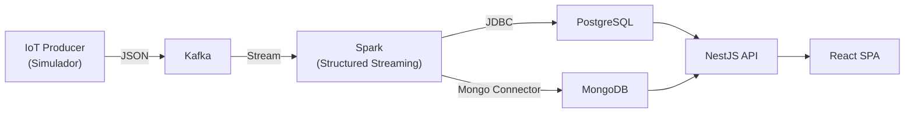

# ACME EV Data Platform

Plataforma de procesamiento de datos en tiempo real para vehículos eléctricos. Proyecto de Arquitectura de Datos — Universidad.

## Arquitectura General



## Stack Tecnológico

| Capa | Tecnología | Versión |
|------|-----------|---------|
| Simulador IoT | Node.js + KafkaJS | 22.12.0 |
| Mensajería | Apache Kafka  | latest |
| Procesamiento | Apache Spark (Structured Streaming) | 3.5.1 |
| BD Relacional | PostgreSQL | 16.2 |
| BD Documental | MongoDB | 7 |
| Backend API | NestJS + TypeORM + Mongoose | 11 |
| Frontend | React + MUI + DataGrid | 19 / v9 |
| Infraestructura | Docker Compose | v2 |

## Estructura del Proyecto

```
proyecto/
├── .env                  # Variables de entorno (gitignored)
├── .env.template         # Template de variables
├── compose.yml           # Docker Compose local (con PG + Mongo)
├── compose.prod.yml      # Docker Compose producción (Supabase + Atlas)
├── database/             # Migraciones SQL
├── backend/              # API REST (NestJS 11, CQRS)
├── client/               # Frontend (React 19, MUI v9)
├── iot-producer/         # Simulador IoT → Kafka
├── spark/
│   └── jobs/
│       ├── common/       # Config, Kafka reader, parsers, schemas
│       ├── writers/      # PostgreSQL writer, MongoDB writer
│       └── pipelines/    # GPS stream, Status stream
└── docs/                 # Documentación detallada
```

## Quick Start

### 1. Configurar variables de entorno

```bash
cp .env.template .env
# Editar .env con tus valores
```

### 2. Levantar servicios

```bash
docker compose up -d
```

### 3. Ejecutar migraciones y seed

```bash
cd backend
npm install
npm run seed
```

### 4. Iniciar pipelines Spark

```bash
# Pipeline GPS → PostgreSQL
docker exec -it spark-master /opt/spark/bin/spark-submit \
  --master spark://spark-master:7077 \
  --conf spark.jars.ivy=/tmp/.ivy2 \
  --conf spark.driver.extraClassPath=/tmp/.ivy2/jars/org.postgresql_postgresql-42.7.3.jar \
  --conf spark.executor.extraClassPath=/tmp/.ivy2/jars/org.postgresql_postgresql-42.7.3.jar \
  --packages org.apache.spark:spark-sql-kafka-0-10_2.12:3.5.1,org.postgresql:postgresql:42.7.3 \
  /opt/spark/jobs/pipelines/process_gps_stream.py

# Pipeline Status → MongoDB
docker exec -it spark-master /opt/spark/bin/spark-submit \
  --master spark://spark-master:7077 \
  --conf spark.jars.ivy=/tmp/.ivy2 \
  --packages org.apache.spark:spark-sql-kafka-0-10_2.12:3.5.1,org.mongodb.spark:mongo-spark-connector_2.12:10.4.0 \
  /opt/spark/jobs/pipelines/process_status_stream.py
```

### 5. Acceder a la aplicación

| Servicio | URL |
|----------|-----|
| Frontend | <http://localhost:3000> |
| Backend API | <http://localhost:3000/acme-ev> |
| Swagger Docs | <http://localhost:3000/docs> |
| Spark Master UI | <http://localhost:8080> |

## Comandos Útiles

### Kafka

```bash
# Listar tópicos
docker exec -it broker /opt/kafka/bin/kafka-topics.sh \
  --bootstrap-server broker:9092 --list

# Consumir mensajes GPS (debug)
docker exec -it broker /opt/kafka/bin/kafka-console-consumer.sh \
  --bootstrap-server broker:9092 \
  --topic acme.ev.gps --from-beginning --max-messages 5
```

### Base de datos

```bash
# PostgreSQL
docker exec -it postgres-database psql -U postgres -d acme

# MongoDB
docker exec -it mongo mongosh -u mongodb -p <password> --authenticationDatabase admin acme
```

## Tópicos Kafka

| Tópico | Particiones | Destino |
|--------|-------------|---------|
| `acme.ev.gps` | 3 | PostgreSQL (`gps_events`) |
| `acme.ev.status` | 3 | MongoDB (`status_events`) |

## Roles de Usuario

| Rol | Acceso |
|-----|--------|
| `ADMIN` | Dashboard global, gestión de usuarios/sucursales/vehículos |
| `BRANCH_USER` | Dashboard de sucursal, vehículos asignados, status events |
| `OWNER` | Dashboard propietario, GPS events, descarga CSV, claim vehículo |

### Credenciales de prueba (después de seed)

| Email | Password | Rol |
|-------|----------|-----|
| `admin@acme-ev.com` | `admin123` | ADMIN |
| `branch1@acme-ev.com` | `branch123` | BRANCH_USER |
| `owner1@acme-ev.com` | `owner123` | OWNER |

## Servicios Docker

| Servicio | Puerto | Descripción |
|----------|--------|-------------|
| `postgres` | 5432 | Base de datos relacional |
| `mongo` | 27017 | Base de datos documental |
| `broker` | 9092 | Kafka (KRaft, sin ZooKeeper) |
| `iot-producer` | — | Simulador de telemetría IoT |
| `backend-service` | 3000 | API REST NestJS |
| `client` | 80/3000 | SPA React + nginx |
| `spark-master` | 8080, 7077, 4040 | Spark Master |
| `spark-worker-1/2` | — | Spark Workers (1GB, 1 core c/u) |

## Documentación

| Documento | Descripción |
|-----------|-------------|
| [Arquitectura](docs/architecture.md) | Diagramas C4, infraestructura Docker, despliegue |
| [Flujo de Datos](docs/data-flow.md) | Pipelines Spark, transformaciones, simulador IoT |
| [Base de Datos](docs/database.md) | Esquemas PostgreSQL y MongoDB, ER diagrams |
| [API REST](docs/api.md) | Endpoints, autenticación, roles, paginación |
| [Local Setup](docs/local-setup.md) | Guía completa de instalación y comandos |
