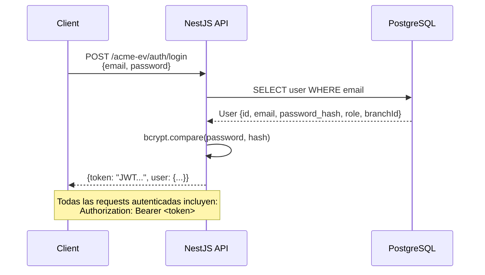
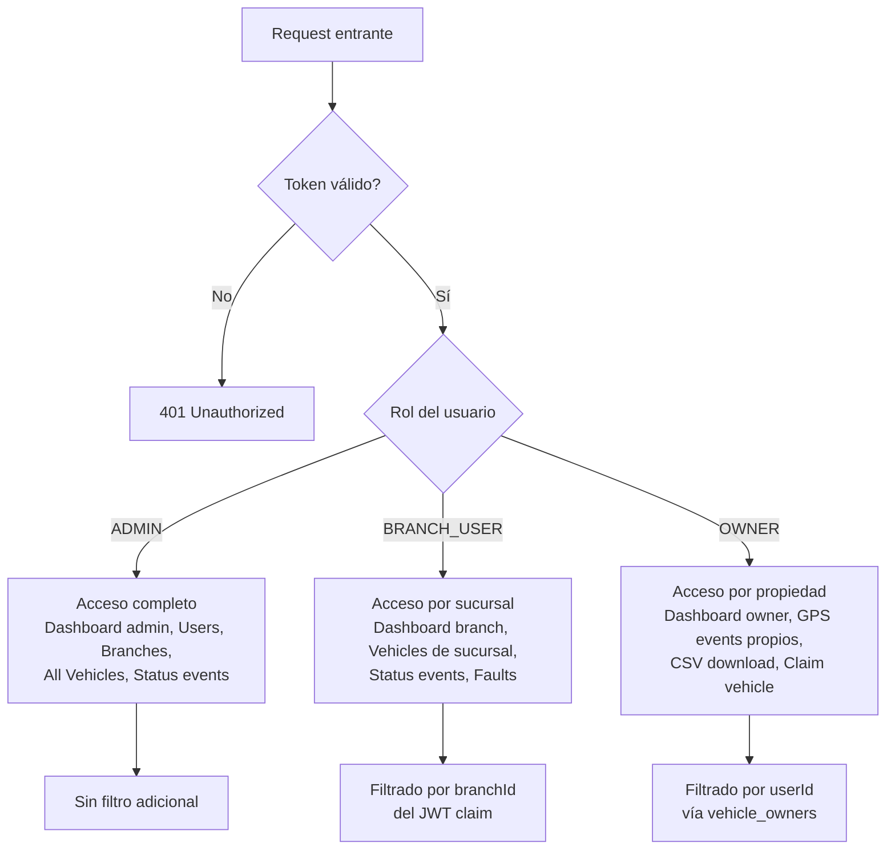

# API REST — ACME EV Data Platform

## Información General

| Propiedad | Valor |
|-----------|-------|
| Base URL | `/acme-ev` |
| Auth | JWT Bearer Token |
| Swagger UI | `/docs` |
| Content-Type | `application/json` |
| Validación | `class-validator` (whitelist + transform) |

## Flujo de autenticación



### JWT Payload (Claims)

```json
{
  "sub": 1,
  "email": "admin@acme-ev.com",
  "role": "ADMIN",
  "branchId": null,
  "iat": 1718370000,
  "exp": 1718456400
}
```

---

## Endpoints

### Auth

| Método | Ruta | Roles | Descripción |
|--------|------|-------|-------------|
| POST | `/auth/login` | Público | Autenticación de usuario |

**Request:**
```json
{
  "email": "admin@acme-ev.com",
  "password": "admin123"
}
```

**Response (200):**
```json
{
  "token": "eyJhbGciOiJIUzI1NiIs...",
  "user": {
    "id": 1,
    "email": "admin@acme-ev.com",
    "name": "Admin Principal",
    "role": "ADMIN",
    "branchId": null
  }
}
```

---

### Users

| Método | Ruta | Roles | Descripción |
|--------|------|-------|-------------|
| GET | `/users` | ADMIN | Listar usuarios con paginación |

**Query Params:** `page`, `limit`

---

### Branches

| Método | Ruta | Roles | Descripción |
|--------|------|-------|-------------|
| GET | `/branches` | ADMIN | Listar sucursales |

**Query Params:** `page`, `limit`

---

### Vehicles

| Método | Ruta | Roles | Descripción |
|--------|------|-------|-------------|
| GET | `/vehicles` | ADMIN, BRANCH_USER | Listar vehículos (filtrado por sucursal automático) |
| GET | `/vehicles/owner` | OWNER | Listar vehículos propios |
| GET | `/vehicles/:vin` | ADMIN, BRANCH_USER | Obtener vehículo por VIN |
| POST | `/vehicles/claim` | OWNER | Registrar (claim) un vehículo por VIN |

**Claim Request:**
```json
{
  "vin": "ACME1000000000001"
}
```

---

### GPS Events

| Método | Ruta | Roles | Descripción |
|--------|------|-------|-------------|
| GET | `/gps/events` | OWNER | Consultar eventos GPS con filtros |
| GET | `/gps/events/download` | OWNER | Descargar CSV de eventos GPS |

**Query Params:** `vin`, `startDate`, `endDate`, `page`, `limit`

---

### Status Events

| Método | Ruta | Roles | Descripción |
|--------|------|-------|-------------|
| GET | `/status/events` | ADMIN, BRANCH_USER | Consultar eventos de estado |
| GET | `/status/latest/:vin` | ADMIN, BRANCH_USER | Último estado de un vehículo |
| GET | `/status/faults` | ADMIN, BRANCH_USER | Vehículos con fallas activas |

**Query Params (events):** `vin`, `startDate`, `endDate`, `page`, `limit`

---

### Dashboard

| Método | Ruta | Roles | Descripción |
|--------|------|-------|-------------|
| GET | `/dashboard/admin` | ADMIN | Dashboard global (métricas agregadas) |
| GET | `/dashboard/branch` | BRANCH_USER | Dashboard de sucursal |

---

## Control de Acceso por Rol



## Paginación

Todos los endpoints de listado soportan paginación server-side:

**Query Params:**
- `page` (default: 1)
- `limit` (default: 10)

**Response wrapper:**
```json
{
  "data": [...],
  "meta": {
    "page": 1,
    "limit": 10,
    "total": 150,
    "totalPages": 15
  }
}
```

## Códigos de Error

| Código | Significado |
|--------|-------------|
| 400 | Validación fallida (class-validator) |
| 401 | Token ausente o inválido |
| 403 | Rol insuficiente para el recurso |
| 404 | Recurso no encontrado |
| 500 | Error interno del servidor |
