# Arquitectura — ACME EV Data Platform

## Diagrama de Contexto (C4 — Nivel 1)

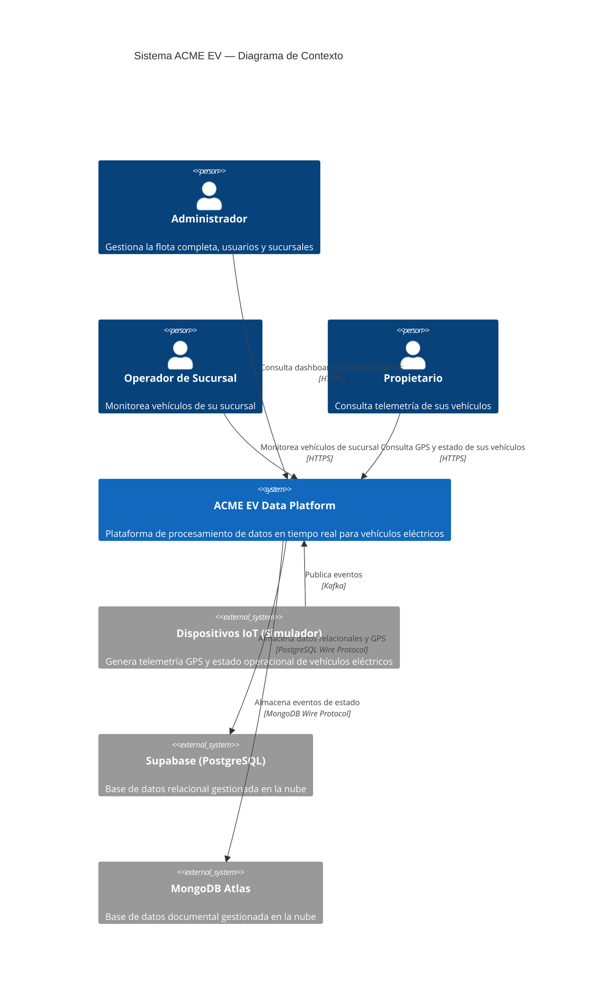

## Diagrama de Contenedores (C4 — Nivel 2)

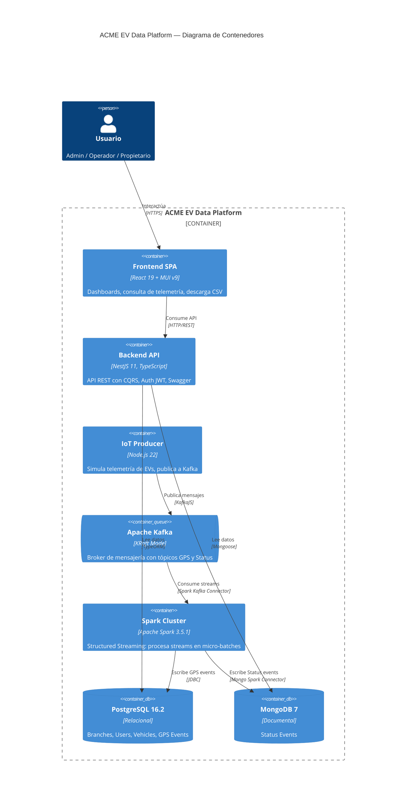

## Diagrama de Componentes — Backend (C4 — Nivel 3)

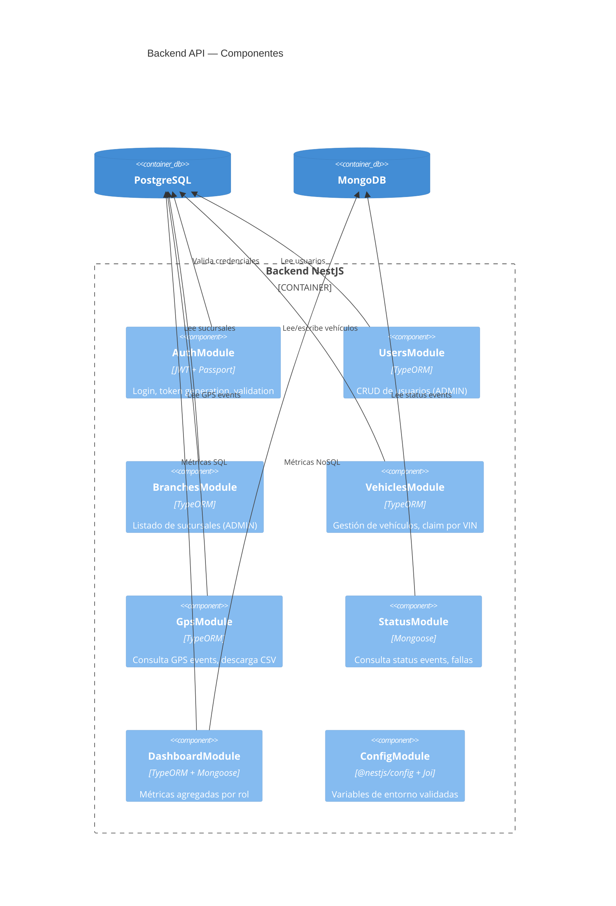

## Flujo de Datos — Telemetría en Tiempo Real

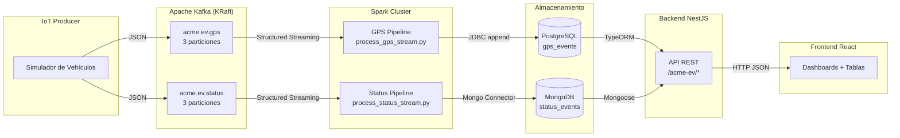

## Flujo de Datos Detallado — Pipeline GPS

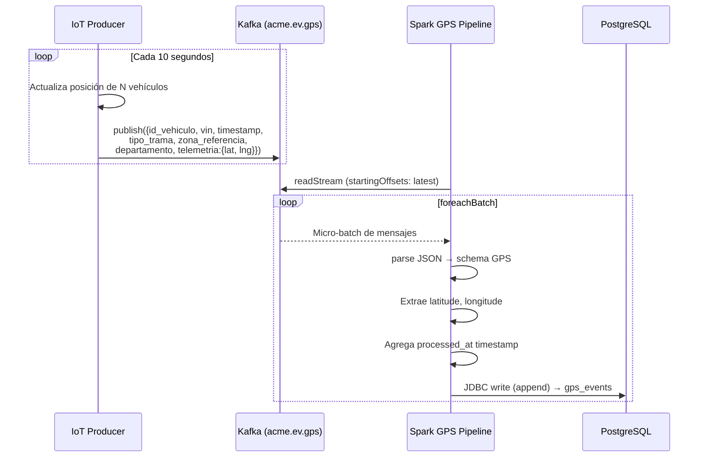

## Flujo de Datos Detallado — Pipeline Status

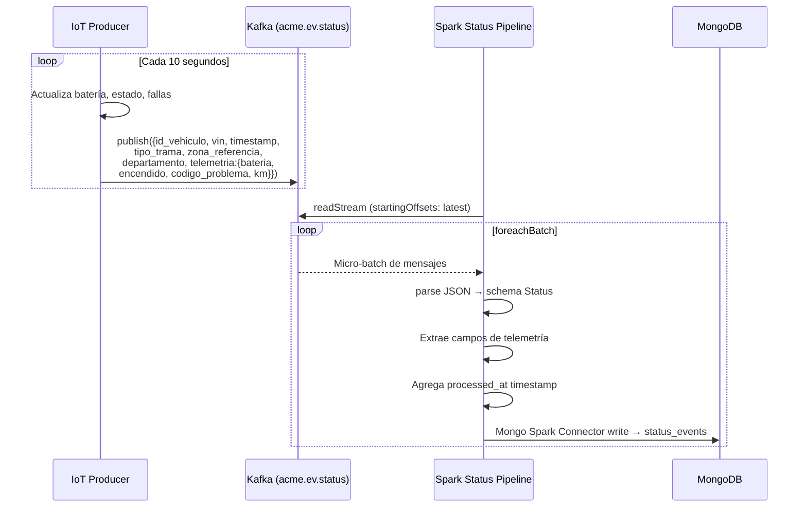

## Flujo de Autenticación

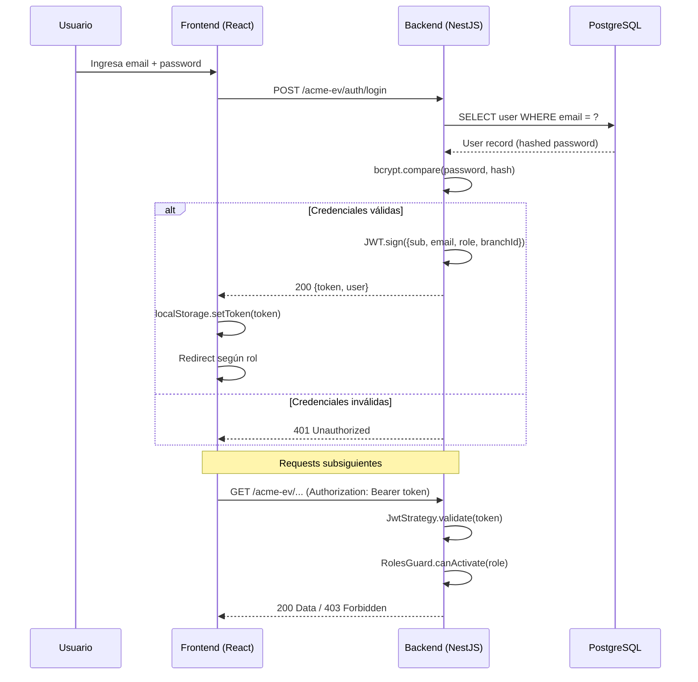

## Modelo de Base de Datos — PostgreSQL

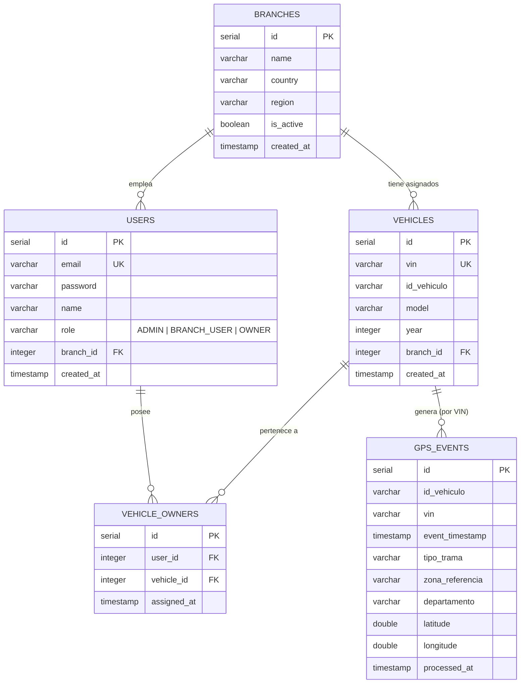

## Modelo de Base de Datos — MongoDB

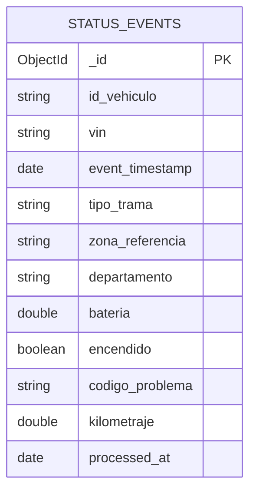

## Infraestructura Docker

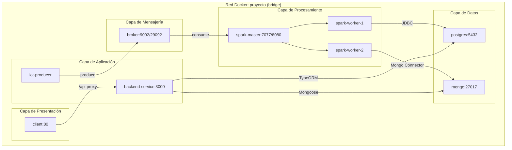

## Diagrama de Despliegue — Producción

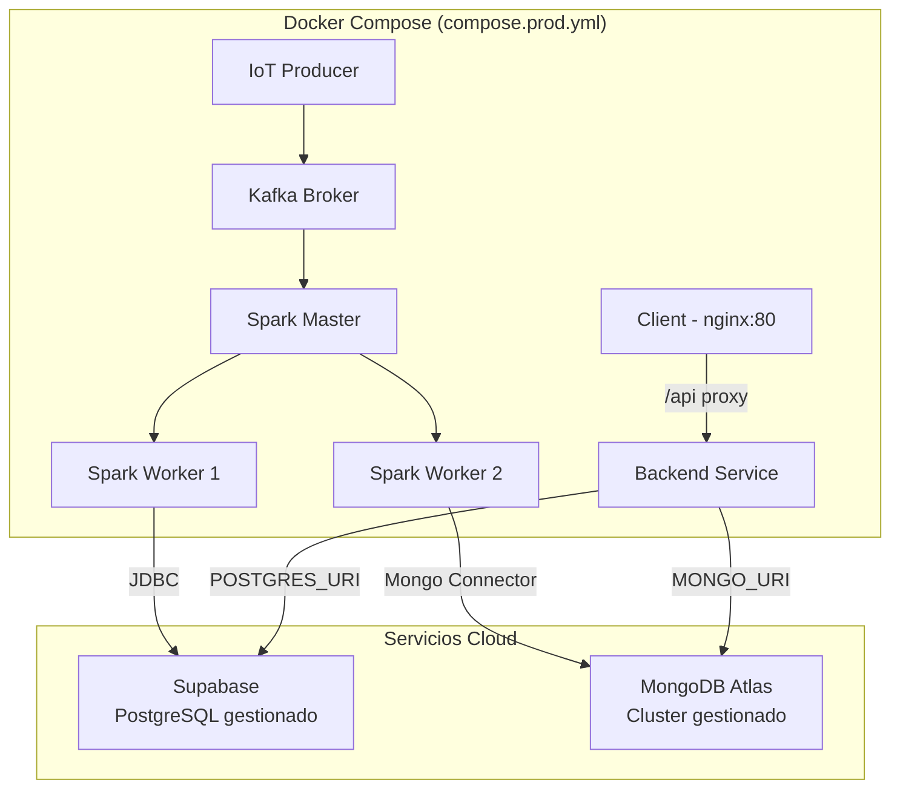

## Resumen de Servicios

| Servicio | Imagen/Build | Puerto Expuesto | Función |
|----------|-------------|-----------------|---------|
| `postgres` | `postgres:16.2` | 5432 | Base de datos relacional (solo local) |
| `mongo` | `mongo:7` | 27017 | Base de datos documental (solo local) |
| `broker` | `apache/kafka:latest` | 9092 | Message broker (KRaft, sin ZooKeeper) |
| `iot-producer` | Build `./iot-producer` | — | Simulador de telemetría IoT |
| `backend-service` | Build `./backend` | 3000 | API REST NestJS |
| `client` | Build `./client` | 80 (prod) / 3000 (local) | SPA React + nginx |
| `spark-master` | `apache/spark:3.5.1` | 8080, 7077, 4040 | Spark Master node |
| `spark-worker-1` | `apache/spark:3.5.1` | — | Spark Worker (1 core, 1GB) |
| `spark-worker-2` | `apache/spark:3.5.1` | — | Spark Worker (1 core, 1GB) |
