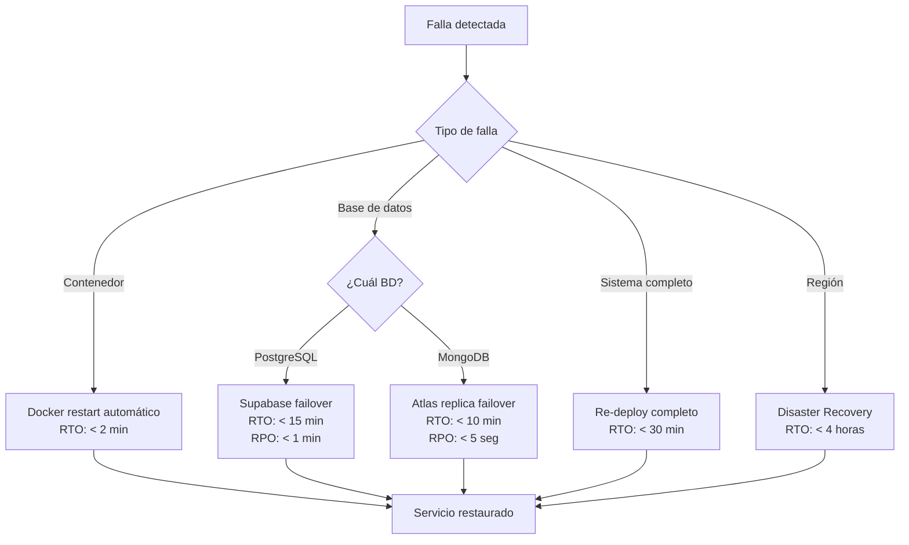

# Plan de Continuidad de Negocio — ACME EV Data Platform

## 1. Plan de Escalabilidad (5 años)

### 1.1 Proyección de crecimiento

| Año | Vehículos | Crecimiento | Msgs GPS/día | Msgs Status/día | Storage GPS/mes | Storage Status/mes |
|-----|-----------|-------------|-------------|-----------------|-----------------|-------------------|
| 1 | 10,000 | Base | 28.8M | 14.4M | ~216 GB | ~130 GB |
| 2 | 12,000 | +20% | 34.6M | 17.3M | ~259 GB | ~156 GB |
| 3 | 14,400 | +20% | 41.5M | 20.7M | ~311 GB | ~187 GB |
| 4 | 17,280 | +20% | 49.8M | 24.9M | ~373 GB | ~224 GB |
| 5 | 20,736 | +20% | 59.7M | 29.9M | ~448 GB | ~269 GB |

**Acumulado a 5 años (considerando retención):**

- GPS (30 días retención): máximo ~448 GB activos
- Status (365 días retención): máximo ~3.2 TB activos

### 1.2 Estrategia de escalamiento por componente

| Componente | Tipo | Estrategia Año 1-2 | Estrategia Año 3-5 |
|-----------|------|---------------------|---------------------|
| **Kafka** | Horizontal | 1 broker, 3 particiones/tópico | 3 brokers, 6-9 particiones/tópico, replication factor 3 |
| **Spark** | Horizontal | 1 master + 2 workers (1 core, 1GB c/u) | 1 master + 4-6 workers (2 cores, 2GB c/u) |
| **PostgreSQL** | Vertical + particionamiento | Supabase Pro (2 vCPU, 8GB) | Supabase Team (4 vCPU, 16GB), particionamiento por fecha en `gps_events` |
| **MongoDB** | Horizontal | Atlas M10 (2GB RAM, auto-scaling) | Atlas M30 (8GB RAM), sharding por VIN |
| **Backend** | Horizontal | 1 réplica (stateless) | 2-3 réplicas con load balancer |
| **Frontend** | CDN | nginx single instance | CDN (CloudFront o similar) + múltiples nodos nginx |

### 1.3 Particionamiento de datos

**PostgreSQL — `gps_events`:**

```sql
-- Partición por rango de fecha (mensual)
CREATE TABLE gps_events (
    id SERIAL,
    vin VARCHAR,
    event_timestamp TIMESTAMP,
    ...
) PARTITION BY RANGE (event_timestamp);

-- Crear particiones mensuales automáticas
CREATE TABLE gps_events_2026_06 PARTITION OF gps_events
    FOR VALUES FROM ('2026-06-01') TO ('2026-07-01');
```

**MongoDB — `status_events`:**

- Shard key: `{ vin: 1, event_timestamp: 1 }` (compound)
- Distribución uniforme por VIN con localidad temporal

### 1.4 Políticas de retención automática

| Dato | Retención | Mecanismo |
|------|-----------|-----------|
| GPS Events | 30 días | `pg_cron` DROP PARTITION mensual o Supabase scheduled function |
| Status Events | 365 días | MongoDB TTL index en `event_timestamp` |
| Logs aplicación | 7 días | Docker log rotation |
| Checkpoints Spark | Indefinido (limpieza manual) | Script cron cada 30 días |

---

## 2. Política de Backups

### 2.1 Estrategia por componente

| Componente | Método | Frecuencia | Retención Backup | Ubicación |
|-----------|--------|-----------|-----------------|-----------|
| **PostgreSQL (Supabase)** | Point-in-Time Recovery (PITR) automático | Continuo (WAL streaming) | 7 días de PITR | Supabase infraestructura (multi-AZ) |
| **PostgreSQL (Supabase)** | Snapshot diario | Cada 24h a las 02:00 UTC | 30 días | Bucket S3 en región secundaria |
| **MongoDB (Atlas)** | Continuous backup (oplog) | Continuo | 7 días de PIT restore | Atlas infraestructura (replica set) |
| **MongoDB (Atlas)** | Snapshot automático | Cada 6 horas | 7 días | Atlas cloud backup (cross-region) |
| **Kafka** | Replication factor = 3 (a partir de Año 2) | En tiempo real | N/A (datos transitorios) | Brokers distribuidos |
| **Kafka** | Topic retention | 7 días | Auto-purgado | Brokers locales |
| **Configuración (.env, compose)** | Git + repositorio privado | Cada commit | Indefinido | GitHub/GitLab |
| **Spark checkpoints** | Almacenamiento local persistente | Continuo | Último checkpoint válido | Docker volume montado en host |

### 2.2 Tipo de backup por capa

```
┌─────────────────────────────────────────────┐
│  Capa de Datos (crítica)                     │
│  PostgreSQL: PITR + snapshots diarios        │
│  MongoDB: Continuous backup + snapshots 6h   │
├─────────────────────────────────────────────┤
│  Capa de Mensajería (transitoria)            │
│  Kafka: Replicación entre brokers            │
│  No requiere backup externo (datos fluyen)   │
├─────────────────────────────────────────────┤
│  Capa de Aplicación (reconstruible)          │
│  Código: Git                                 │
│  Config: .env en vault/secretos              │
│  Imágenes Docker: Registry                   │
└─────────────────────────────────────────────┘
```

### 2.3 Procedimiento de restauración

1. **PostgreSQL:** Supabase Dashboard → Backups → Seleccionar punto en el tiempo → Restore
2. **MongoDB:** Atlas Console → Backup → Continuous → Select point-in-time → Restore to cluster
3. **Aplicación completa:** `git clone` + configurar `.env` + `docker compose up -d`
4. **Spark pipelines:** Los checkpoints permiten reanudar desde el último offset procesado

---

## 3. RTO (Recovery Time Objective)

> **Tiempo máximo aceptable para restaurar el servicio tras una falla.**

| Escenario | RTO | Justificación |
|-----------|-----|---------------|
| **Falla de Backend (crash/restart)** | < 2 minutos | Contenedor stateless, Docker reinicia automáticamente con `restart: unless-stopped` |
| **Falla de PostgreSQL** | < 15 minutos | Supabase PITR: restauración automática desde WAL. Failover a réplica de lectura. |
| **Falla de MongoDB** | < 10 minutos | Atlas replica set: failover automático (elección de nuevo primary ~10s, reconexión app ~1min) |
| **Falla de Kafka** | < 5 minutos | KRaft auto-recovery; con replicación, otro broker asume liderazgo de partición |
| **Falla de Spark** | < 5 minutos | Spark reinicia job desde último checkpoint; no pierde datos (Kafka retiene mensajes) |
| **Falla completa del sistema** | < 30 minutos | Re-despliegue via `docker compose up -d`; bases en cloud no se pierden |
| **Disaster Recovery (región completa)** | < 4 horas | Restauración desde backups cross-region + re-despliegue en nueva infraestructura |

**RTO global del sistema: 30 minutos** (escenario más probable: falla parcial de un componente)

---

## 4. RPO (Recovery Point Objective)

> **Máxima cantidad de datos que es aceptable perder ante una falla.**

| Componente | RPO | Justificación |
|-----------|-----|---------------|
| **PostgreSQL (GPS events)** | < 1 minuto | PITR con WAL streaming continuo. Pérdida máxima: último WAL segment no replicado (~seconds) |
| **MongoDB (Status events)** | < 5 segundos | Continuous backup via oplog. Replica set con write concern `majority` |
| **Kafka (mensajes en tránsito)** | 0 (con replicación) | `acks=all` + replication factor 3. Mensajes confirmados no se pierden |
| **Spark (procesamiento)** | 0 (idempotente) | Checkpointing + Kafka offset. Si cae, reprocesa desde último offset committed |
| **Datos de usuarios/config** | < 24 horas | Snapshot diario de PostgreSQL. En la práctica, PITR reduce esto a ~1 min |

**RPO global del sistema: < 1 minuto** para datos de telemetría (el activo más crítico)

---

## 5. Resumen Ejecutivo

| Métrica | Valor | Notas |
|---------|-------|-------|
| **RTO** | 30 minutos | Falla parcial típica: < 5 min |
| **RPO** | < 1 minuto | Telemetría con PITR/continuous backup |
| **Backup PostgreSQL** | PITR continuo + snapshot diario | 7 días PIT + 30 días snapshots |
| **Backup MongoDB** | Continuous + snapshot cada 6h | 7 días PIT restore |
| **Retención GPS** | 30 días | Particionamiento por fecha, purga automática |
| **Retención Status** | 365 días | TTL index en MongoDB |
| **Escalamiento** | Horizontal en todos los componentes | Kafka brokers, Spark workers, Backend réplicas |
| **Disponibilidad objetivo** | 99.5% | ~43 horas de downtime permitido/año |

---

## 6. Diagrama de Recuperación



---

*Estos valores son realistas para un proyecto universitario con servicios gestionados (Supabase + Atlas) que ofrecen alta disponibilidad out-of-the-box. En producción empresarial, se podría reducir el RTO a < 5 min y el RPO a 0 con arquitectura multi-región activo-activo, pero eso excede el alcance de este proyecto.*
