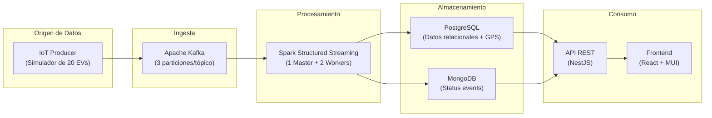
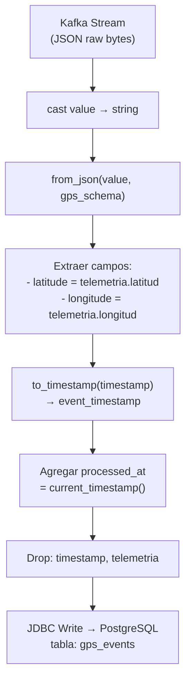
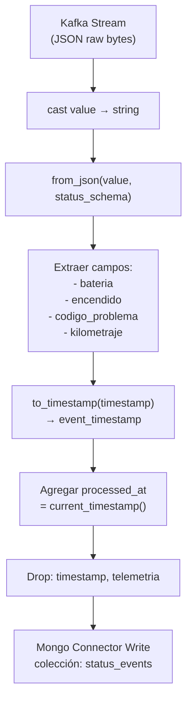
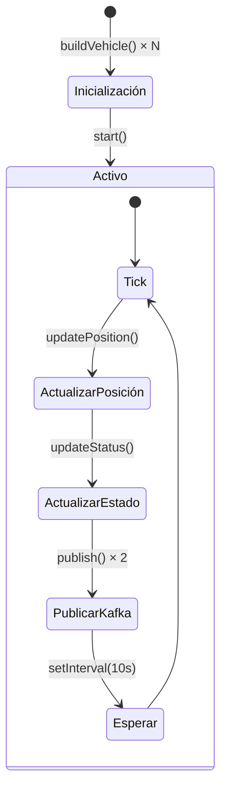

# Flujo de Datos — ACME EV Data Platform

## Visión General

La plataforma procesa telemetría de vehículos eléctricos en tiempo real a través de un pipeline de datos que fluye desde los dispositivos IoT hasta los dashboards del usuario final.



## Estructura de Mensajes Kafka

### Tópico: `acme.ev.gps`

Telemetría de posición geográfica del vehículo.

```json
{
  "id_vehiculo": "EV-ACME-10001",
  "vin": "ACME0000000000001",
  "timestamp": "2026-06-14T15:30:00.000Z",
  "tipo_trama": "GPS",
  "zona_referencia": "Ciudad de Guatemala",
  "departamento": "Guatemala",
  "telemetria": {
    "latitud": 14.6349,
    "longitud": -90.5069
  }
}
```

### Tópico: `acme.ev.status`

Estado operacional del vehículo.

```json
{
  "id_vehiculo": "EV-ACME-10001",
  "vin": "ACME0000000000001",
  "timestamp": "2026-06-14T15:30:00.000Z",
  "tipo_trama": "ESTADO",
  "zona_referencia": "Ciudad de Guatemala",
  "departamento": "Guatemala",
  "telemetria": {
    "estado_bateria_porcentaje": 78.5,
    "encendido": true,
    "codigo_problema": "000",
    "kilometraje": 12345.6
  }
}
```

## Transformaciones en Spark

### Pipeline GPS (`process_gps_stream.py`)



**Columnas resultantes en `gps_events`:**

| Columna | Tipo | Origen |
|---------|------|--------|
| id | SERIAL | Auto-generado por PostgreSQL |
| id_vehiculo | VARCHAR(50) | Directo del mensaje |
| vin | VARCHAR(50) | Directo del mensaje |
| event_timestamp | TIMESTAMP | Parseado de `timestamp` |
| tipo_trama | VARCHAR(20) | Directo del mensaje |
| zona_referencia | VARCHAR(100) | Directo del mensaje |
| departamento | VARCHAR(100) | Directo del mensaje |
| latitude | DOUBLE | Extraído de `telemetria.latitud` |
| longitude | DOUBLE | Extraído de `telemetria.longitud` |
| processed_at | TIMESTAMP | Generado por Spark |

### Pipeline Status (`process_status_stream.py`)



**Campos resultantes en `status_events`:**

| Campo | Tipo | Origen |
|-------|------|--------|
| _id | ObjectId | Auto-generado por MongoDB |
| id_vehiculo | String | Directo del mensaje |
| vin | String | Directo del mensaje |
| event_timestamp | Date | Parseado de `timestamp` |
| tipo_trama | String | Directo del mensaje |
| zona_referencia | String | Directo del mensaje |
| departamento | String | Directo del mensaje |
| bateria | Double | Extraído de `telemetria.estado_bateria_porcentaje` |
| encendido | Boolean | Extraído de `telemetria.encendido` |
| codigo_problema | String | Extraído de `telemetria.codigo_problema` |
| kilometraje | Double | Extraído de `telemetria.kilometraje` |
| processed_at | Date | Generado por Spark |

## Simulador IoT — Comportamiento



### Lógica del simulador

- **20 vehículos** distribuidos en 5 zonas de Guatemala
- **Movimiento:** Hasta 0.2 km por tick, con bearing aleatorio (±35°), rebota en el borde de la zona
- **Batería:** Decrece 0.01-0.07% por tick si encendido; posibilidad de recarga si apagado
- **Encendido/Apagado:** 2% probabilidad de cambiar estado cada tick
- **Códigos de problema:**
  - `000` = Sin falla (97% del tiempo)
  - `101` = Batería baja (35% probabilidad si batería ≤ 15%)
  - `001-999` = Falla aleatoria (3% probabilidad)

### Zonas geográficas

| Zona | Departamento | Centro (lat, lng) | Radio |
|------|-------------|-------------------|-------|
| Ciudad de Guatemala | Guatemala | 14.6349, -90.5069 | 7 km |
| Villa Nueva | Guatemala | 14.5251, -90.5875 | 6 km |
| Mixco | Guatemala | 14.6333, -90.6064 | 6 km |
| Antigua Guatemala | Sacatepéquez | 14.5586, -90.7295 | 5 km |
| Escuintla | Escuintla | 14.3009, -90.7850 | 7 km |

## Flujo de Datos por Rol de Usuario

```mermaid
flowchart TD
    subgraph Admin["ADMIN"]
        A1[Dashboard Admin] --> A2[Métricas globales]
        A1 --> A3[Vehículos con fallas]
        A4[Listados] --> A5[Usuarios]
        A4 --> A6[Sucursales]
        A4 --> A7[Todos los vehículos]
        A4 --> A8[Status events]
    end

    subgraph Branch["BRANCH_USER"]
        B1[Dashboard Branch] --> B2[Vehículos de sucursal]
        B1 --> B3[Status latest por VIN]
        B1 --> B4[Fallas de sucursal]
        B5[Status Events] --> B6[Filtros + Tabla]
    end

    subgraph Owner["OWNER"]
        O1[Dashboard Owner] --> O2[Mis vehículos]
        O1 --> O3[Registrar vehículo por VIN]
        O4[GPS Events] --> O5[Filtros + Tabla]
        O4 --> O6[Descarga CSV]
    end

    PG[(PostgreSQL)] --> A2
    PG --> A5
    PG --> A6
    PG --> A7
    PG --> B2
    PG --> O2
    PG --> O5
    MG[(MongoDB)] --> A3
    MG --> A8
    MG --> B3
    MG --> B4
    MG --> B6
```



## Volumen de Datos Estimado

Con la configuración por defecto (20 vehículos, intervalo 10s):

| Métrica | Valor |
|---------|-------|
| Mensajes GPS por minuto | 120 |
| Mensajes Status por minuto | 120 |
| Mensajes totales por hora | 14,400 |
| Mensajes totales por día | 345,600 |
| Tamaño promedio mensaje GPS | ~250 bytes |
| Tamaño promedio mensaje Status | ~300 bytes |
| Ingesta total por día | ~95 MB |

## Checkpoints y Recuperación

Spark Structured Streaming utiliza checkpoints para garantizar **exactly-once** processing:

```
/opt/spark/work-dir/checkpoints/
├── acme-ev-gps/          ← Pipeline GPS
│   ├── offsets/          ← Kafka offsets procesados
│   ├── commits/          ← Batches confirmados
│   └── metadata          ← Metadata del query
└── acme-ev-status/       ← Pipeline Status
    ├── offsets/
    ├── commits/
    └── metadata
```

Si un pipeline se reinicia, retoma desde el último offset confirmado sin duplicar datos.
