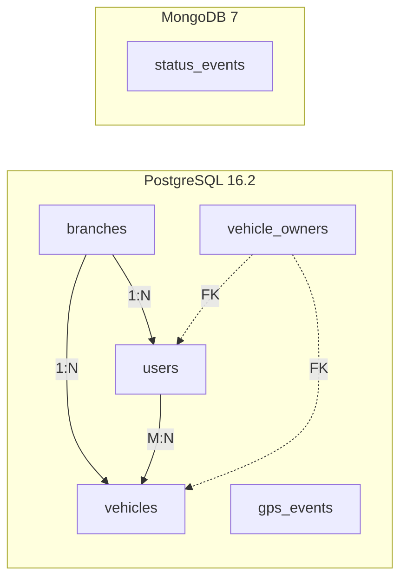
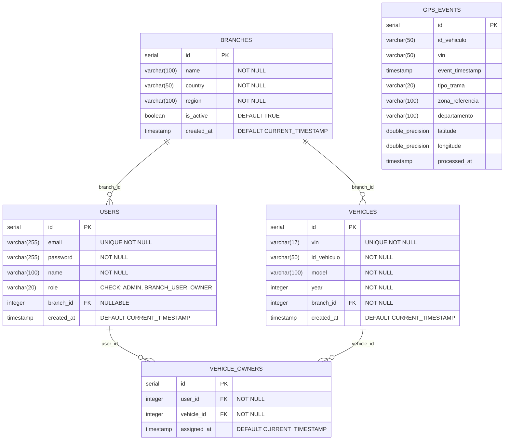
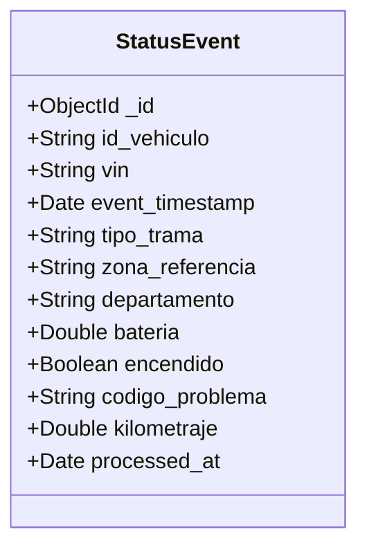
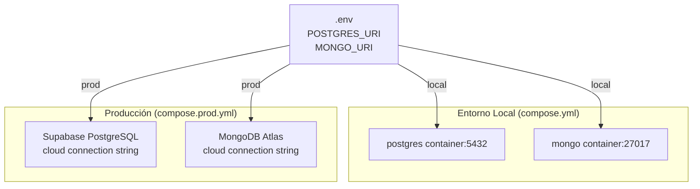

# Base de Datos — ACME EV Data Platform

## Estrategia de Almacenamiento

La plataforma utiliza un enfoque **polyglot persistence**: dos motores de base de datos optimizados para diferentes tipos de datos.

| Motor | Uso | Justificación |
|-------|-----|---------------|
| **PostgreSQL 16.2** | Entidades relacionales + GPS events | Integridad referencial, joins, transacciones ACID |
| **MongoDB 7** | Status events (telemetría operacional) | Esquema flexible, escritura rápida, consultas por documento |



---

## PostgreSQL — Esquema Relacional

### Diagrama ER completo



### DDL — `branches`

```sql
CREATE TABLE branches (
  id SERIAL PRIMARY KEY,
  name VARCHAR(100) NOT NULL,
  country VARCHAR(50) NOT NULL,
  region VARCHAR(100) NOT NULL,
  is_active BOOLEAN DEFAULT TRUE,
  created_at TIMESTAMP DEFAULT CURRENT_TIMESTAMP
);
```

### DDL — `users`

```sql
CREATE TABLE users (
  id SERIAL PRIMARY KEY,
  email VARCHAR(255) UNIQUE NOT NULL,
  password VARCHAR(255) NOT NULL,
  name VARCHAR(100) NOT NULL,
  role VARCHAR(20) NOT NULL CHECK (role IN ('ADMIN', 'BRANCH_USER', 'OWNER')),
  branch_id INTEGER REFERENCES branches(id),
  created_at TIMESTAMP DEFAULT CURRENT_TIMESTAMP
);
```

### DDL — `vehicles`

```sql
CREATE TABLE vehicles (
  id SERIAL PRIMARY KEY,
  vin VARCHAR(17) UNIQUE NOT NULL,
  id_vehiculo VARCHAR(50) NOT NULL,
  model VARCHAR(100) NOT NULL,
  year INTEGER NOT NULL,
  branch_id INTEGER NOT NULL REFERENCES branches(id),
  created_at TIMESTAMP DEFAULT CURRENT_TIMESTAMP
);
```

### DDL — `vehicle_owners`

```sql
CREATE TABLE vehicle_owners (
  id SERIAL PRIMARY KEY,
  user_id INTEGER NOT NULL REFERENCES users(id),
  vehicle_id INTEGER NOT NULL REFERENCES vehicles(id),
  assigned_at TIMESTAMP DEFAULT CURRENT_TIMESTAMP,
  UNIQUE(user_id, vehicle_id)
);
```

### DDL — `gps_events`

```sql
CREATE TABLE gps_events (
  id SERIAL PRIMARY KEY,
  id_vehiculo VARCHAR(50),
  vin VARCHAR(50),
  event_timestamp TIMESTAMP,
  tipo_trama VARCHAR(20),
  zona_referencia VARCHAR(100),
  departamento VARCHAR(100),
  latitude DOUBLE PRECISION,
  longitude DOUBLE PRECISION,
  processed_at TIMESTAMP
);
```

### Relaciones y constraints

| Relación | Tipo | Constraint |
|----------|------|-----------|
| users → branches | N:1 | `branch_id` FK (nullable para ADMIN/OWNER) |
| vehicles → branches | N:1 | `branch_id` FK (NOT NULL) |
| vehicle_owners → users | N:1 | `user_id` FK (NOT NULL) |
| vehicle_owners → vehicles | N:1 | `vehicle_id` FK (NOT NULL) |
| vehicle_owners | — | UNIQUE(user_id, vehicle_id) |
| users.role | — | CHECK IN ('ADMIN', 'BRANCH_USER', 'OWNER') |
| vehicles.vin | — | UNIQUE |
| users.email | — | UNIQUE |

---

## MongoDB — Esquema Documental

### Colección: `status_events`



### Documento ejemplo

```json
{
  "_id": "ObjectId('...')",
  "id_vehiculo": "EV-ACME-10001",
  "vin": "ACME0000000000001",
  "event_timestamp": "2026-06-14T15:30:00.000Z",
  "tipo_trama": "ESTADO",
  "zona_referencia": "Ciudad de Guatemala",
  "departamento": "Guatemala",
  "bateria": 78.5,
  "encendido": true,
  "codigo_problema": "000",
  "kilometraje": 12345.6,
  "processed_at": "2026-06-14T15:30:01.234Z"
}
```

### Consultas principales del backend sobre esta colección

| Endpoint | Query pattern |
|----------|--------------|
| `GET /status/events` | `find({vin, event_timestamp range}).sort(-event_timestamp).skip().limit()` |
| `GET /status/latest/:vin` | `findOne({vin}).sort(-event_timestamp)` |
| `GET /status/faults` | `find({codigo_problema: {$ne: "000"}}).sort(-event_timestamp)` |

---

## Migración a Cloud

### PostgreSQL → Supabase

1. Cambiar `POSTGRES_URI` en `.env` por el connection string de Supabase
2. Ejecutar migraciones SQL en el panel de Supabase
3. Usar `compose.prod.yml` (sin servicio `postgres`)

### MongoDB → Atlas

1. Crear cluster en Atlas
2. Cambiar `MONGO_URI` en `.env` por el connection string de Atlas
3. Usar `compose.prod.yml` (sin servicio `mongo`)



> La arquitectura permite swap directo: solo cambiando las URIs en `.env` se puede alternar entre bases locales y cloud sin modificar código.
