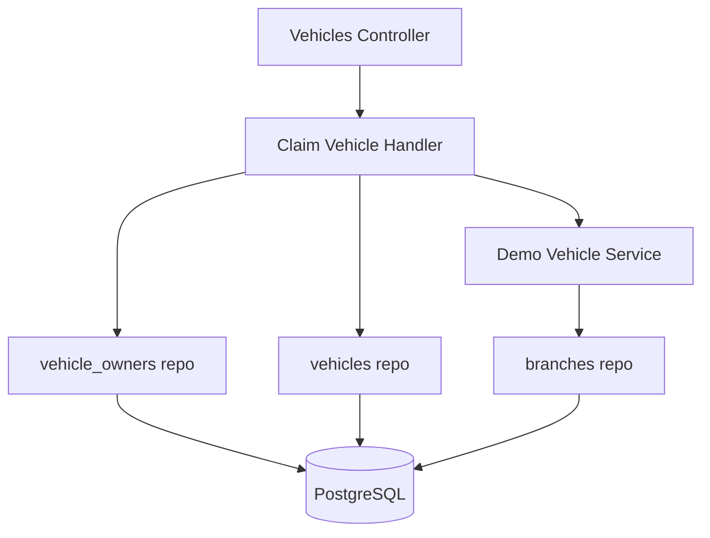

# Claim Vehicle — Components

## Component Table

| Component | Responsibility | Inputs | Outputs | Dependencies | Failure modes |
|-----------|----------------|--------|---------|--------------|---------------|
| Vehicles Controller | Receive claim, enforce `OWNER` role, dispatch command | `ClaimVehicleRequestDto`, JWT user | `ClaimVehicleResponseDto` | CommandBus, RolesGuard | `403` non-owner; `400` invalid body |
| Claim Vehicle Handler | Orchestrate the claim inside a transaction | `ClaimVehicleCommand` | `{ message, vin }` | DataSource, DemoVehicleService | `400` already claimed; rollback on any error |
| Demo Vehicle Service | Generate a vehicle when the VIN is unknown | vin, EntityManager | `Vehicle` | branches repo | falls back to branch id 1 if no branch exists |
| vehicle_owners repo | Read existing link; insert new link | vin / userId, vehicleId | ownership rows | PostgreSQL (transaction) | write error → rollback |
| vehicles repo | Find or persist the vehicle | vin / new vehicle | `Vehicle` | PostgreSQL (transaction) | write error → rollback |

## Diagram

---

[Previous: Sequence](sequence.md) · [Flow Index](index.md) · [Next: Domain Context](domain-context.md)
