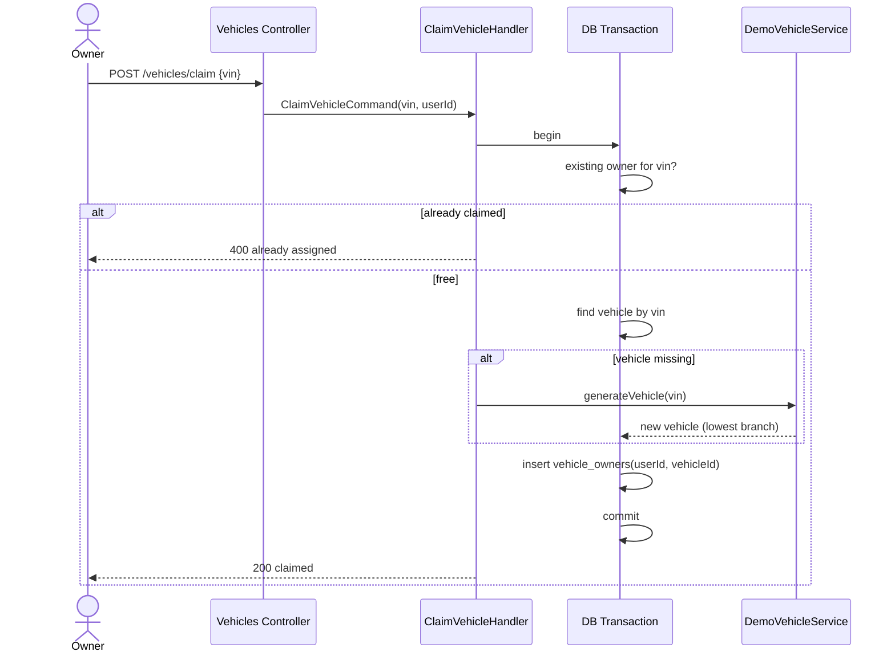

# Claim Vehicle — Sequence

## Happy path

1. An `OWNER` posts `{ vin }` to `POST /acme-ev/vehicles/claim`; JWT validated, role checked.
2. `ClaimVehicleHandler` opens a database transaction.
3. It checks whether any `vehicle_owners` row already links a vehicle with that `vin`.
4. If unclaimed, it loads the vehicle by `vin`; if none exists, `DemoVehicleService` generates one (random model, assigned to the lowest-id branch).
5. It creates a `vehicle_owners` row linking `userId` → `vehicle.id` and commits.
6. Responds `200` with `{ message: "Vehicle claimed successfully", vin }`.

## Validation flow

- Missing/invalid `vin` → `400` from the validation pipe.
- Already-claimed `vin` → `400` ("Vehicle is already assigned to an owner").

## Failure flow

- Any error inside the transaction (DB failure, save conflict) rolls the whole transaction back — no partial vehicle or ownership row remains.
- A non-`OWNER` caller is rejected by `RolesGuard` (`403`).

## Retry behavior

None automatic. The already-claimed guard makes a retried claim of the same VIN return `400` rather than create a duplicate link.

## Idempotency

Effectively idempotent on the **claimed state**: a second claim of the same VIN fails with `400` instead of creating a second ownership row. It is not idempotent on response (first succeeds, repeat errors).

## External integration calls

PostgreSQL only, within a single transaction.

## Diagram

---

[Flow Index](index.md) · [Next: Components](components.md)
