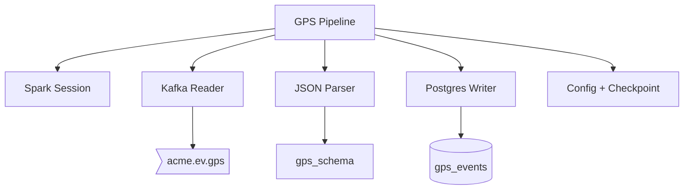

# Ingest GPS — Components

## Component Table

| Component | Responsibility | Inputs | Outputs | Dependencies | Failure modes |
|-----------|----------------|--------|---------|--------------|---------------|
| Pipeline (`process_gps_stream.py`) | Wire read → parse → transform → write; manage the streaming query | env config | running query | all components below | Query stops on unrecoverable error; restart resumes from checkpoint |
| Spark session (`common/spark_session.py`) | Create the Spark session | app name | session | Spark cluster | Fails if master unreachable |
| Kafka reader (`common/kafka_reader.py`) | Open streaming read on the topic | bootstrap servers, topic | raw stream DF | Kafka broker | Read fails if broker down |
| Parser (`common/parsers.py`) | Cast value to string and `from_json` against schema | raw DF, schema | parsed DF | — | Malformed JSON → null fields (no throw) |
| GPS schema (`common/schemas.py`) | Define the expected GPS frame structure | — | `gps_schema` | — | Schema drift yields nulls |
| Postgres writer (`writers/postgres_writer.py`) | Append a batch to a table via JDBC | batch DF, table, creds | rows in PostgreSQL | PostgreSQL, JDBC driver | Write error fails the batch (retried); early-returns on empty batch |
| Config (`common/config.py`) | Topics, JDBC URL, checkpoint path | environment | constants | — | Bad URL/creds → write failure |

## Diagram

