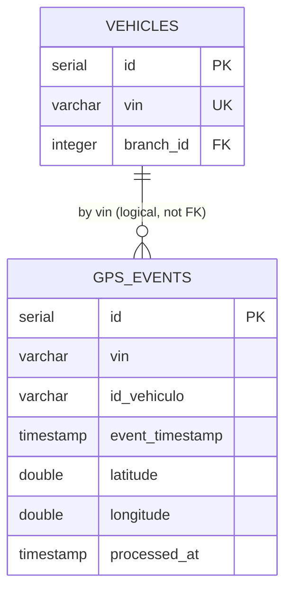

# Ingest GPS — Database

This flow writes to one PostgreSQL table. The relational schema choice is recorded in [ADR-0002](../../adrs/0002-polyglot-persistence.md).

## Table: `gps_events`

| Field | Description |
|-------|-------------|
| Name | `gps_events` |
| Purpose | Append-only store of every GPS position frame, queryable by VIN and time range |
| Primary key | `id` (SERIAL) |
| Attributes | `id_vehiculo`, `vin`, `event_timestamp`, `tipo_trama`, `zona_referencia`, `departamento`, `latitude`, `longitude`, `processed_at` |
| Indexes | Query pattern is `(vin, event_timestamp)`; an index on those columns supports owner range queries |
| TTL | None native; 30-day retention enforced by partition drop / scheduled cleanup (see [`hld.md`](../../hld.md)) |

### Column origin

| Column | Type | Origin |
|--------|------|--------|
| `id` | SERIAL | PostgreSQL auto-generated |
| `id_vehiculo` | VARCHAR | from frame |
| `vin` | VARCHAR | from frame |
| `event_timestamp` | TIMESTAMP | parsed from frame `timestamp` |
| `tipo_trama` | VARCHAR | from frame |
| `zona_referencia` | VARCHAR | from frame |
| `departamento` | VARCHAR | from frame |
| `latitude` | DOUBLE PRECISION | from `telemetria.latitud` |
| `longitude` | DOUBLE PRECISION | from `telemetria.longitud` |
| `processed_at` | TIMESTAMP | set by Spark at ingestion |

### Example row

```json
{
  "id": 84213,
  "id_vehiculo": "EV-ACME-10001",
  "vin": "ACME0000000000001",
  "event_timestamp": "2026-06-14T15:30:00.000Z",
  "tipo_trama": "GPS",
  "zona_referencia": "Ciudad de Guatemala",
  "departamento": "Guatemala",
  "latitude": 14.6349,
  "longitude": -90.5069,
  "processed_at": "2026-06-14T15:30:01.234Z"
}
```

## Access Patterns

- **Write (this flow):** JDBC `mode=append`, one batch per micro-batch. No conditional writes; no upsert.
- **Read (by [Query GPS Events](../query-gps-events/)):** `WHERE vin = ? AND event_timestamp BETWEEN ? AND ?` ordered by `event_timestamp`, paginated. Consistency is eventual relative to ingestion latency.

## Relationships

`gps_events` is intentionally **denormalized** — it carries `vin` and `id_vehiculo` as plain columns rather than foreign keys, so ingestion never blocks on a vehicle lookup. The join to `vehicles`/`vehicle_owners` for access scoping happens at read time in the API.

## ER Diagram



## Performance Considerations

- High write volume — append-only, no indexes needed on the write path beyond the PK.
- Read index on `(vin, event_timestamp)` keeps owner range queries fast.
- At scale, range-partition by `event_timestamp` (monthly) to keep partitions and the retention drop cheap.

## Retention

30 days. Implemented via monthly range partitions dropped on schedule (or a scheduled delete). Telemetry is never updated, only inserted and eventually purged.
