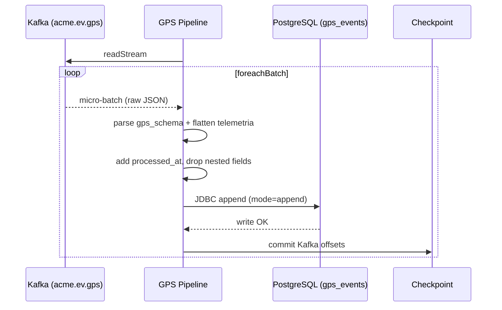

# Ingest GPS — Sequence

## Happy path

1. The pipeline creates a Spark session and opens a streaming read on `acme.ev.gps`.
2. Each Kafka value (raw bytes) is cast to string and parsed as JSON against `gps_schema`.
3. Transformations: `event_timestamp` from `timestamp`; `latitude`/`longitude` lifted out of the nested `telemetria`; `processed_at` set to the current time; the original `timestamp` and `telemetria` columns are dropped.
4. For each micro-batch, `write_batch_to_postgres` appends the rows to `gps_events` over JDBC.
5. Spark commits the Kafka offsets for the batch to the checkpoint only after the write succeeds.

## Validation flow

Parsing is schema-driven: fields absent or mistyped relative to `gps_schema` become `null` rather than throwing. There is no business validation at ingestion — telemetry is stored as received (append-only).

## Failure flow

- If the JDBC write fails (PostgreSQL down, network), the micro-batch errors and its offsets are **not** committed; Spark retries the same offsets.
- A malformed JSON value yields nulls for the affected fields rather than failing the batch.

## Retry behavior

Structured Streaming re-attempts a failed batch. Because the offset is committed only on success, a transient datastore outage causes reprocessing of the same frames once the datastore recovers — no committed frame is skipped.

## Idempotency

At-least-once into PostgreSQL. The writer appends; it does not deduplicate. On replay after a partial failure, the same frame could be written twice. See [ADR-0004](../../history/adrs/0004-spark-checkpointing.md) "Future Considerations" for an upsert path if strict exactly-once is required.

## External integration calls

- Reads from Kafka `acme.ev.gps`.
- Writes to PostgreSQL `gps_events` via the JDBC driver `org.postgresql.Driver`.

## Diagram

---

[Flow Index](index.md) · [Next: Components](components.md)
