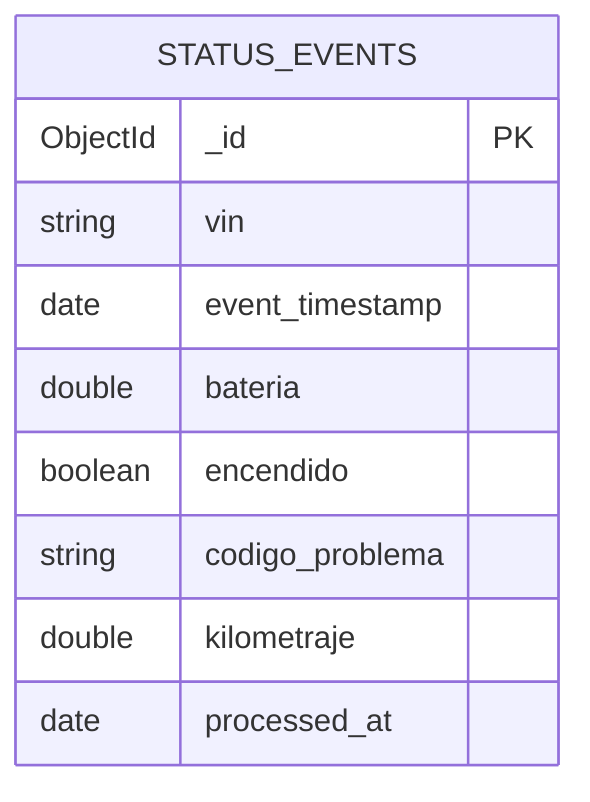

# Ingest Status — Database

This flow writes to one MongoDB collection. The document-store choice is recorded in [ADR-0002](../../adrs/0002-polyglot-persistence.md).

## Collection: `status_events`

| Field | Description |
|-------|-------------|
| Name | `status_events` |
| Purpose | Append-only store of operational status frames; flexible schema for future fields |
| Primary key | `_id` (ObjectId, auto) |
| Attributes | `id_vehiculo`, `vin`, `event_timestamp`, `tipo_trama`, `zona_referencia`, `departamento`, `bateria`, `encendido`, `codigo_problema`, `kilometraje`, `processed_at` |
| Indexes | `{ vin: 1, event_timestamp: -1 }` for latest/range queries; `codigo_problema` participates in fault aggregation |
| TTL | TTL index on `event_timestamp` enforces 365-day retention |

### Field origin

| Field | Type | Origin |
|-------|------|--------|
| `_id` | ObjectId | MongoDB auto-generated |
| `id_vehiculo` | String | from frame |
| `vin` | String | from frame |
| `event_timestamp` | Date | parsed from frame `timestamp` |
| `tipo_trama` | String | from frame |
| `zona_referencia` | String | from frame |
| `departamento` | String | from frame |
| `bateria` | Double | from `telemetria.estado_bateria_porcentaje` |
| `encendido` | Boolean | from `telemetria.encendido` |
| `codigo_problema` | String | from `telemetria.codigo_problema` |
| `kilometraje` | Double | from `telemetria.kilometraje` |
| `processed_at` | Date | set by Spark at ingestion |

### Example document

```json
{
  "_id": "ObjectId('66a1f3c2e1a2b3c4d5e6f701')",
  "id_vehiculo": "EV-ACME-10001",
  "vin": "ACME0000000000001",
  "event_timestamp": "2026-06-14T15:30:00.000Z",
  "tipo_trama": "ESTADO",
  "zona_referencia": "Ciudad de Guatemala",
  "departamento": "Guatemala",
  "bateria": 78.5,
  "encendido": true,
  "codigo_problema": "000",
  "kilometraje": 12345.6,
  "processed_at": "2026-06-14T15:30:01.234Z"
}
```

## Access Patterns

- **Write (this flow):** connector `mode=append`, one batch per micro-batch; no upsert.
- **Read (by [Query Status Events](../query-status-events/)):**
  - events: `find({ vin, event_timestamp range }).sort(event_timestamp desc).skip().limit()`
  - latest: `findOne({ vin }).sort(event_timestamp desc)`
  - faults: aggregation grouping by VIN, taking the latest event, then matching `codigo_problema` not in `[null, '']` and not `000`.
- Consistency is eventual relative to ingestion latency.

## Relationships

The collection stores `vin` only; there is no database-level reference to `vehicles` (which lives in PostgreSQL). Branch scoping for reads resolves VINs from PostgreSQL first, then filters the Mongo query — a deliberate consequence of polyglot persistence.

## ER Diagram



## Performance Considerations

- High write volume — append-only.
- Compound index `{ vin: 1, event_timestamp: -1 }` serves both latest and range reads.
- At scale, shard by `vin` for write distribution with temporal locality.

## Retention

365 days, enforced by a MongoDB TTL index on `event_timestamp`. Documents are never updated, only inserted and expired.
