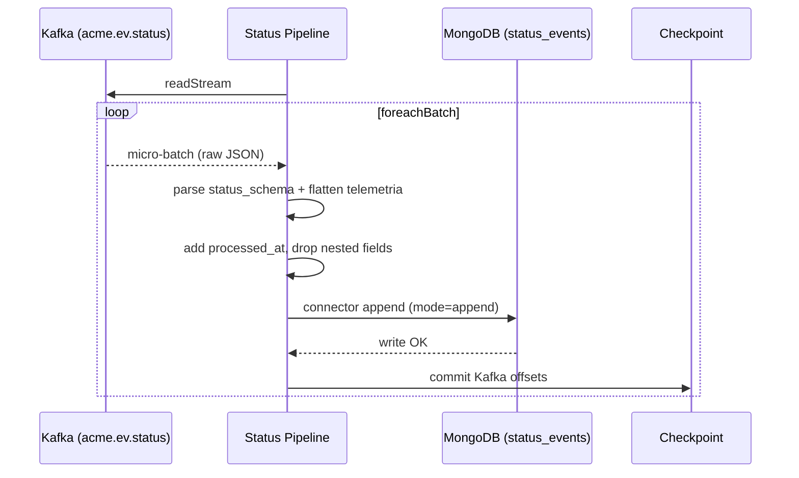

# Ingest Status — Sequence

## Happy path

1. The pipeline creates a Spark session and opens a streaming read on `acme.ev.status`.
2. Each Kafka value is cast to string and parsed as JSON against `status_schema`.
3. Transformations: `event_timestamp` from `timestamp`; `bateria`, `encendido`, `codigo_problema`, `kilometraje` lifted out of nested `telemetria`; `processed_at` set to current time; `timestamp` and `telemetria` dropped.
4. For each micro-batch, `write_batch_to_mongo` appends documents to the `status_events` collection via the Mongo Spark connector.
5. Spark commits the Kafka offsets to the checkpoint only after the write succeeds.

## Validation flow

Schema-driven parsing; missing/mistyped fields become `null`. No business validation at ingestion — status is stored as received.

## Failure flow

- A failed Mongo write errors the micro-batch; offsets are not committed and Spark retries.
- Malformed JSON degrades to null fields rather than failing the batch.

## Retry behavior

Same as [Ingest GPS](../ingest-gps/sequence.md): offset commit follows a successful write, so a transient MongoDB outage causes reprocessing once Mongo recovers.

## Idempotency

At-least-once into MongoDB. The connector appends; no dedup. Replays after a partial write can duplicate documents.

## External integration calls

- Reads from Kafka `acme.ev.status`.
- Writes to MongoDB `status_events` via `mongo-spark-connector_2.12:10.4.0`.

## Diagram

