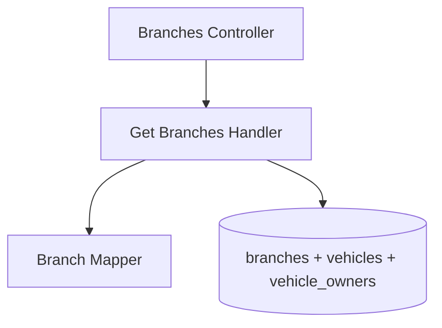

# List Branches — Components

## Component Table

| Component | Responsibility | Inputs | Outputs | Dependencies | Failure modes |
|-----------|----------------|--------|---------|--------------|---------------|
| Branches Controller | Route the read; enforce `ADMIN` | `GetBranchesRequestDto` | paginated branches | QueryBus, RolesGuard | `403` non-admin; `400` invalid params |
| Get Branches Handler | Query branches with counts, search, sort, pagination | `GetBranchesQuery` | `PaginationResponse<GetBranchAdminResponseDto>` | branches repo (joins vehicles/owners) | read error → `500` |
| Branch Mapper | Map entity + counts → DTO | `Branch` + counts | `GetBranchAdminResponseDto` | — | none (pure) |

## Diagram

---

[Previous: Sequence](sequence.md) · [Flow Index](index.md) · [Next: Persistence Context](persistence.md)
