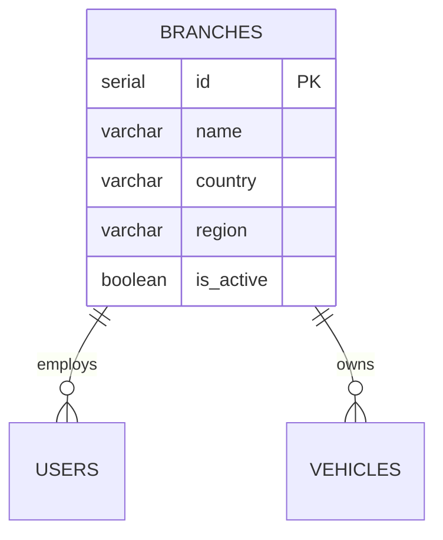

# List Branches — Database

This flow reads the `branches` master table and counts related rows. `branches` is seeded/administered, not written by a documented flow, so its schema is documented here, where it is most centrally read.

## Table: `branches`

| Field | Description |
|-------|-------------|
| Name | `branches` |
| Purpose | Regional ACME EV locations that own vehicles and employ branch operators |
| Primary key | `id` (SERIAL) |
| Attributes | `name`, `country`, `region`, `is_active` (default true), `created_at` |
| Indexes | PK; optionally on `name` for search |
| TTL | None — master data |

### Example row

```json
{ "id": 1, "name": "Guatemala City", "country": "Guatemala", "region": "Guatemala", "is_active": true, "created_at": "2026-06-15T00:00:00.000Z" }
```

## Access Patterns

- **List with counts:** `branches` left-joined to count of `vehicles` and `vehicle_owners` per branch, with search/sort/pagination.
- **Consistency:** strong reads against the relational store.

## Relationships



## Performance Considerations

Low-cardinality master data; the count joins are cheap at this scale. No partitioning needed.

## Retention

Permanent master data; branches are added/deactivated (`is_active`), not deleted on a schedule.
