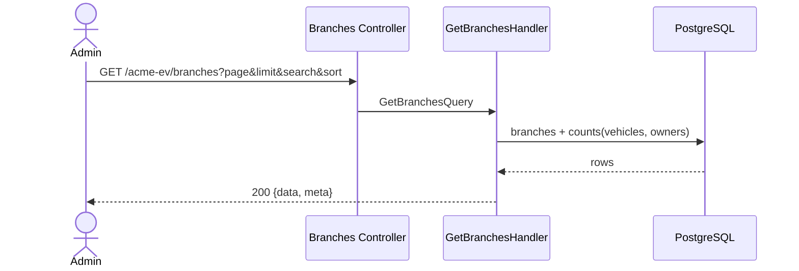

# List Branches — Sequence

## Happy path

1. An `ADMIN` requests `GET /acme-ev/branches` with pagination/search/sort params; JWT and role checked.
2. `GetBranchesHandler` reads `branches`, joining counts of vehicles and owners per branch.
3. Applies search, sort, and pagination.
4. Responds `200` with `{ data, meta }`.

## Validation flow

Invalid pagination/sort params → `400` from the validation pipe.

## Failure flow

- Non-admin caller → `403` (`RolesGuard`).
- Datastore unavailable → `500`.

## Retry behavior

None; idempotent read.

## Idempotency

Read-only.

## External integration calls

PostgreSQL read only.

## Diagram

---

[Flow Index](index.md) · [Next: Components](components.md)
