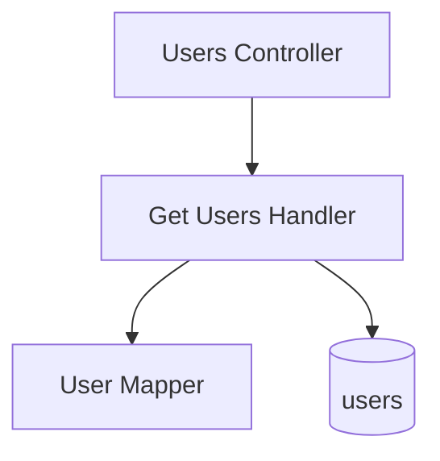

# List Users — Components

## Component Table

| Component | Responsibility | Inputs | Outputs | Dependencies | Failure modes |
|-----------|----------------|--------|---------|--------------|---------------|
| Users Controller | Route the read; enforce `ADMIN` | `GetUsersRequestDto` | paginated users | QueryBus, RolesGuard | `403` non-admin; `400` invalid params |
| Get Users Handler | Query users with search/role-filter/sort/pagination | `GetUsersQuery` | `PaginationResponse<GetUserAdminResponseDto>` | users repo | read error → `500` |
| User Mapper | Map entity → DTO, omitting the password hash | `User` | `GetUserAdminResponseDto` | — | none (pure) |

## Diagram

