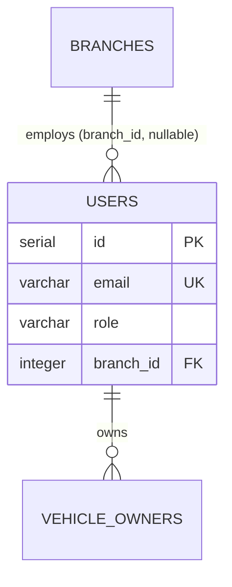

# List Users — Database

This flow reads the `users` master table. `users` is seeded/administered (and authenticated by [Login](../login/)), not written by a documented flow, so its schema is documented here, where it is most centrally read.

## Table: `users`

| Field | Description |
|-------|-------------|
| Name | `users` |
| Purpose | Platform accounts with a role and optional branch assignment |
| Primary key | `id` (SERIAL) |
| Attributes | `email` (UNIQUE), `password` (bcrypt hash — never returned), `name`, `role` (`ADMIN`/`BRANCH_USER`/`OWNER`), `branch_id` (FK, nullable), `created_at` |
| Indexes | unique on `email`; FK index on `branch_id` |
| TTL | None — master data |

### Example row (as stored)

```json
{ "id": 1, "email": "admin@acme-ev.com", "password": "$2b$10$...", "name": "Admin Principal", "role": "ADMIN", "branch_id": null, "created_at": "2026-06-15T00:00:00.000Z" }
```

## Access Patterns

- **List (this flow):** `users` with search/role-filter/sort/pagination; the mapper omits `password`.
- **Auth ([Login](../login/)):** `findOne({ email })` to verify credentials.
- **Consistency:** strong reads against the relational store.

## Relationships



- `branch_id` is set for `BRANCH_USER`; null for `ADMIN` and `OWNER`.
- An `OWNER`'s vehicles are linked through `vehicle_owners`, not `branch_id`.

## Performance Considerations

Low-cardinality master data; pagination bounds responses. The `email` unique index serves login lookups.

## Security

The `password` column holds a bcrypt hash and must never be serialized in an API response — enforced by the mapper ([components.md](components.md)).

## Retention

Permanent master data; accounts are created/managed, not expired on a schedule.
