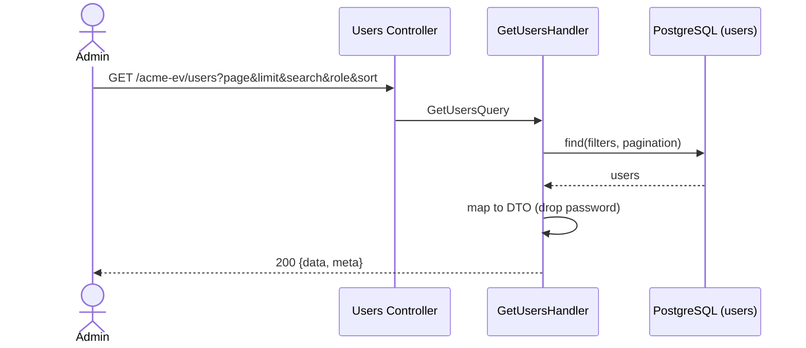

# List Users — Sequence

## Happy path

1. An `ADMIN` requests `GET /acme-ev/users` with `page`, `limit`, optional search/role-filter/sort; JWT and role checked.
2. `GetUsersHandler` reads `users`, applying the filters and pagination.
3. The mapper projects each user to a DTO that **excludes the password hash**.
4. Responds `200` with `{ data, meta }`.

## Validation flow

Invalid pagination/filter params → `400` from the validation pipe.

## Failure flow

- Non-admin caller → `403` (`RolesGuard`).
- Datastore unavailable → `500`.

## Retry behavior

None; idempotent read.

## Idempotency

Read-only.

## External integration calls

PostgreSQL read only.

## Diagram

