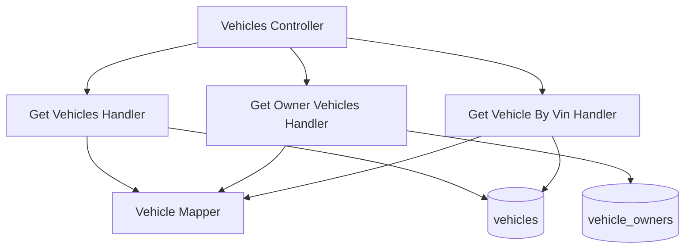

# List Vehicles — Components

## Component Table

| Component | Responsibility | Inputs | Outputs | Dependencies | Failure modes |
|-----------|----------------|--------|---------|--------------|---------------|
| Vehicles Controller | Route the three reads; enforce roles | query params, JWT user | paginated / single vehicle DTO | QueryBus, RolesGuard | `403` wrong role; `400` invalid params |
| Get Vehicles Handler | List with admin/branch scope + pagination | `GetVehiclesQuery` | paginated vehicles | vehicles repo | read error → `500` |
| Get Owner Vehicles Handler | List vehicles linked to the owner | `GetOwnerVehiclesQuery` | owner vehicles | vehicle_owners + vehicles repos | read error → `500` |
| Get Vehicle By Vin Handler | Single lookup with branch check | `GetVehicleByVinQuery` | vehicle DTO | vehicles repo | `404` unknown; `403` out-of-branch |
| Vehicle Mapper | Map entity → DTO | `Vehicle` | `GetVehicleResponseDto` | — | none (pure) |

## Diagram

---

[Previous: Sequence](sequence.md) · [Flow Index](index.md) · [Next: Persistence Context](persistence.md)
