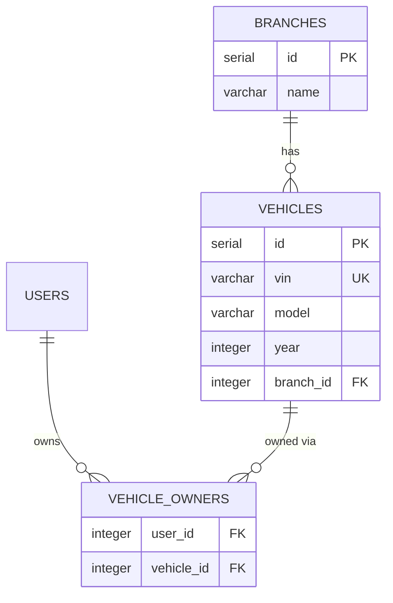

# List Vehicles — Database

This flow reads the relational `vehicles` table (and joins `vehicle_owners`/`branches` for scoping). `vehicles` is **seeded/administered**, not written by any documented flow, so its schema is documented here, where it is most centrally read.

## Table: `vehicles`

| Field | Description |
|-------|-------------|
| Name | `vehicles` |
| Purpose | The fleet registry — one row per known vehicle |
| Primary key | `id` (SERIAL) |
| Attributes | `vin` (UNIQUE), `id_vehiculo`, `model`, `year`, `branch_id` (FK → branches) |
| Indexes | unique on `vin`; FK index on `branch_id` |
| TTL | None — master data |

### Example row

```json
{
  "id": 1,
  "vin": "ACME0000000000001",
  "id_vehiculo": "EV-ACME-10001",
  "model": "ACME Volt",
  "year": 2026,
  "branch_id": 1
}
```

## Access Patterns

- **Admin list:** `vehicles` paginated, no branch filter.
- **Branch list:** `WHERE branch_id = :userBranchId`, paginated.
- **Owner list:** `vehicle_owners` joined to `vehicles` filtered by `user_id`.
- **By VIN:** `WHERE vin = :vin`; branch users additionally constrained to their `branch_id`.
- **Consistency:** strong reads against the relational store.

## Relationships



## Performance Considerations

Low-volume master data; pagination keeps responses bounded. The `vin` unique index serves the by-VIN lookup directly.

## Retention

Permanent master data; rows are added (seed or [Claim Vehicle](../claim-vehicle/) demo fallback) but not expired.
