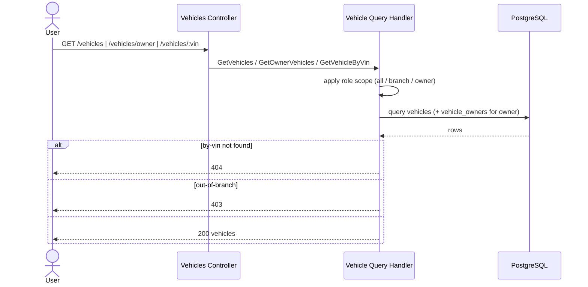

# List Vehicles — Sequence

Three endpoints, each scoped differently by role. All require a valid JWT.

## `GET /vehicles` (ADMIN, BRANCH_USER)

1. Request with pagination/filter params; role checked.
2. `GetVehiclesHandler` reads `vehicles`. For `ADMIN`, no branch filter; for `BRANCH_USER`, results are filtered to `user.branchId`.
3. Responds `200` with a paginated list.

## `GET /vehicles/owner` (OWNER)

1. JWT identifies the owner.
2. `GetOwnerVehiclesHandler` joins `vehicle_owners` to return only vehicles linked to `user.sub`.
3. Responds `200` with the owner's vehicles.

## `GET /vehicles/:vin` (ADMIN, BRANCH_USER)

1. `GetVehicleByVinHandler` loads the vehicle by VIN.
2. For `BRANCH_USER`, access is allowed only if the vehicle belongs to their branch; otherwise `403`.
3. `404` if no vehicle matches the VIN.

## Validation flow

Invalid pagination/query params → `400` from the validation pipe.

## Failure flow

- Role not permitted → `403` (`RolesGuard`).
- `BRANCH_USER` requesting a vehicle outside their branch → `403`.
- Unknown VIN → `404`.

## Retry behavior

None; idempotent reads.

## Idempotency

All three endpoints are read-only and idempotent.

## External integration calls

PostgreSQL reads only.

## Diagram

