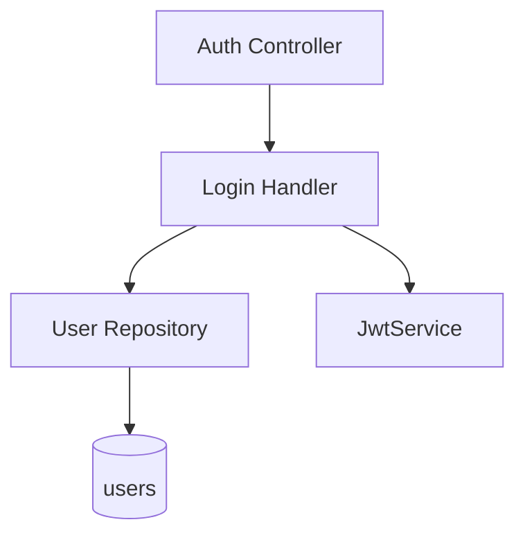

# Login — Components

## Component Table

| Component | Responsibility | Inputs | Outputs | Dependencies | Failure modes |
|-----------|----------------|--------|---------|--------------|---------------|
| Auth Controller | Receive the request, dispatch the query | `LoginRequestDto` | `LoginResponseDto` | QueryBus | `400` on invalid body (validation pipe) |
| Login Handler | Verify credentials and sign the token | `LoginQuery` | `{ accessToken, user }` | User repo, JwtService, bcrypt | `401` on unknown email or bad password |
| User Repository (TypeORM) | Load a user by email | email | `User` or null | PostgreSQL | Read error → `500` if DB down |
| JwtService | Sign the JWT with configured secret/expiry | payload | signed token | `JWT_SECRET`, `JWT_EXPIRES_IN` | Misconfigured secret → sign error |

## Diagram

---

[Previous: Sequence](sequence.md) · [Flow Index](index.md) · [Next: Contract Usage](contract-usage.md)
