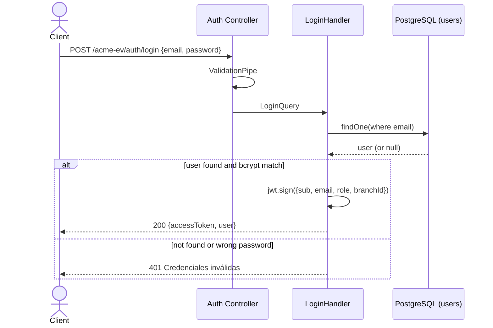

# Login — Sequence

## Happy path

1. Client posts `{ email, password }` to `POST /acme-ev/auth/login`.
2. The global `ValidationPipe` validates and whitelists the body.
3. The controller dispatches a `LoginQuery`; `LoginHandler` loads the user by email.
4. `bcrypt.compare` checks the password against the stored hash.
5. On success, the handler signs a JWT with claims `{ sub, email, role, branchId }`.
6. Responds `200` with `{ accessToken, user }`.

## Validation flow

- Missing or malformed `email`/`password` → `400` from the validation pipe.
- The password itself is verified by bcrypt, not by the pipe.

## Failure flow

- Unknown email → `UnauthorizedException` (`401`, message "Credenciales inválidas").
- Wrong password → `401` with the **same** message, so the response does not reveal whether the email exists.

## Retry behavior

None. Login is a single read; clients re-submit on `401`.

## Idempotency

Naturally idempotent — repeated valid logins simply mint new tokens; no state is mutated.

## External integration calls

Reads `users` from PostgreSQL via TypeORM. No external services.

## Diagram

---

[Flow Index](index.md) · [Next: Components](components.md)
