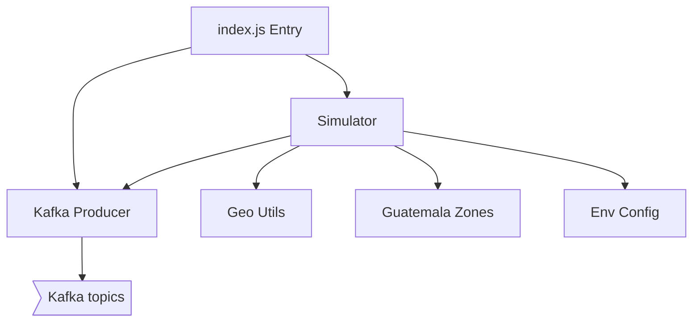

# Produce Telemetry — Components

## Component Table

| Component | Responsibility | Inputs | Outputs | Dependencies | Failure modes |
|-----------|----------------|--------|---------|--------------|---------------|
| Entry (`index.js`) | Bootstrap: connect producer, init vehicles, start loop | — | running process | Producer, Simulator | Exits if producer connect fails (Docker restarts) |
| Simulator (`simulator.js`) | Hold vehicle state and run the tick loop | interval, env config | GPS + status frames | Kafka producer, geo utils, zones | A throw inside a tick is isolated per publish via `allSettled` |
| Kafka Producer (`kafka/producer.js`) | Connect and publish messages | topic, payload | Kafka records | Kafka broker | Publish rejects on broker error; frame lost for that tick |
| Geo utils (`utils/geo.js`) | Move points, compute distance/bearing | position, step, bearing | next position | — | Pure functions; no I/O failure |
| Zones (`data/guatemala-zones.js`) | Define the 5 geographic zones and centers | — | zone metadata | — | Static data |
| Env config (`config/env.js`) | Read `process.env` (topics, interval, vehicle count) | environment | typed config | — | Missing vars fall back to defaults |

## Diagram

