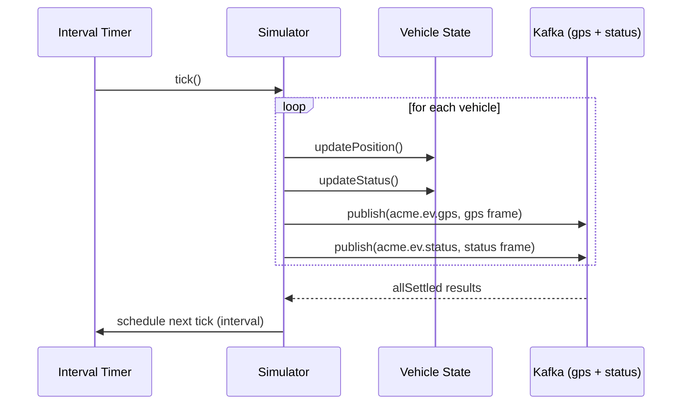

# Produce Telemetry — Sequence

## Happy path

1. On startup, `initializeProducer()` connects the KafkaJS producer to the broker.
2. `initialize()` builds `TOTAL_VEHICLES` in-memory vehicles, each placed in one of the Guatemala zones.
3. `start()` runs an immediate `tick()` and then schedules `tick()` every `SIMULATION_INTERVAL_MS`.
4. Each `tick()` iterates all vehicles: updates position and status, then publishes one GPS frame and one status frame per vehicle.
5. All publishes for the tick are awaited together with `Promise.allSettled`, so one failed publish does not abort the others.

## Validation flow

The producer performs no schema validation — it constructs frames in a fixed shape. The schema contract is enforced downstream by the Spark parsers ([Ingest GPS](../ingest-gps/), [Ingest Status](../ingest-status/)).

## Failure flow

- A failed publish for one frame is captured by `Promise.allSettled` and does not stop the tick; that frame is simply lost (no durable producer-side buffer).
- If the broker is unreachable at startup, `initializeProducer()` rejects and the process exits — Docker restarts it per `restart: unless-stopped`.

## Retry behavior

Relies on KafkaJS's built-in producer retries for transient broker errors. There is no application-level replay of a dropped frame; the next tick emits fresh state.

## Idempotency

Not idempotent and not required to be: each tick emits new frames with the current timestamp. Duplicate suppression, if ever needed, would live downstream.

## External integration calls

Publishes to Kafka topics `acme.ev.gps` and `acme.ev.status` via KafkaJS.

## Diagram

