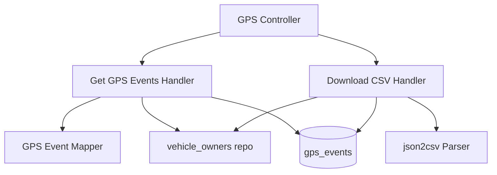

# Query GPS Events — Components

## Component Table

| Component | Responsibility | Inputs | Outputs | Dependencies | Failure modes |
|-----------|----------------|--------|---------|--------------|---------------|
| GPS Controller | Route the two endpoints; set CSV headers on download | query DTOs, JWT user | JSON page / CSV response | QueryBus, Express `Response` | `400` on invalid params |
| Get GPS Events Handler | Ownership + range check, paginated read | `GetGpsEventsQuery` | `PaginationResponse<GpsEventDto>` | gps_events repo, vehicle_owners repo | `403` not owned; `400` bad range |
| Download CSV Handler | Ownership + range check, full read, CSV serialize | `DownloadGpsCsvQuery` | `{ csv, filename }` | gps_events repo, vehicle_owners repo, json2csv | `403`, `400`, `404` empty range |
| GPS Event Mapper | Map entity → DTO | `GpsEvent` | `GpsEventDto` | — | none (pure) |
| vehicle_owners repo | Confirm ownership | user id, vin | ownership row | PostgreSQL | read error → `500` |

## Diagram

