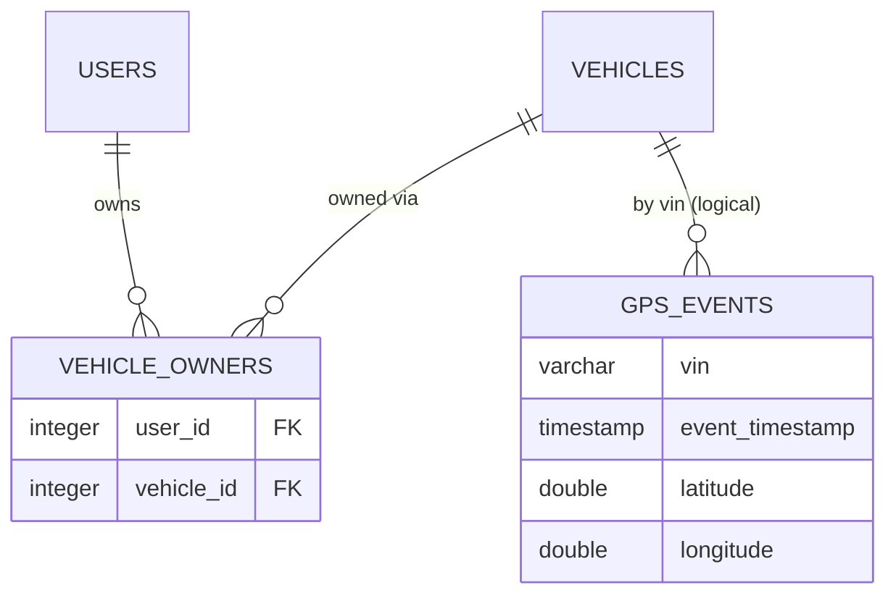

# Query GPS Events — Database

This flow **reads** two PostgreSQL tables. The `gps_events` write schema is owned by [Ingest GPS](../ingest-gps/database.md); this file documents the **read access patterns** and the ownership join.

## Tables read

| Table | Why this flow reads it |
|-------|------------------------|
| `gps_events` | The GPS history returned/exported (full column reference in [Ingest GPS → Database](../ingest-gps/database.md)) |
| `vehicle_owners` | Confirms the caller owns the requested `vin` before any data is returned |

## Access Patterns

- **Ownership check:** `vehicle_owners.findOne({ userId: user.sub, vehicle: { vin } })` joined to `vehicles` via relation. Returns the link or null.
- **Paginated read (`/events`):** `WHERE vin = ? AND event_timestamp BETWEEN ? AND ?`, `ORDER BY event_timestamp DESC`, `skip/take`.
- **Full read (`/events/download`):** same filter, `ORDER BY event_timestamp ASC`, no pagination — all rows in range.
- **Consistency:** eventual relative to ingestion; reads see whatever [Ingest GPS](../ingest-gps/) has committed.

## Relationships

## Performance Considerations

- The read index on `gps_events(vin, event_timestamp)` is what keeps both queries fast.
- The download path is unbounded in row count — a wide date range can return a large result set. Consider capping the range or streaming the CSV at scale.

## Retention

Read-only flow; it never writes or deletes. It can only return data still within the 30-day GPS retention window.
