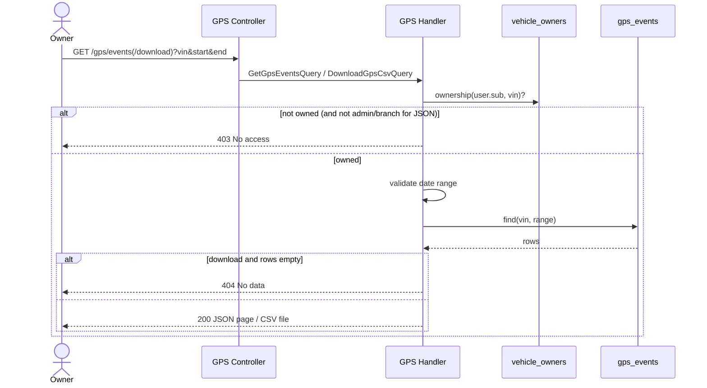

# Query GPS Events — Sequence

Two endpoints share the same ownership + date-range checks; they differ in output (paginated JSON vs. a CSV file).

## Happy path — `GET /gps/events`

1. Request arrives with `vin`, `startDate`, `endDate`, `page`, `limit`; JWT validated by `JwtAuthGuard`.
2. `GetGpsEventsHandler` looks up `vehicle_owners` for `(user.sub, vin)` to confirm ownership.
3. Date range is validated (`startDate <= endDate`).
4. `gps_events` is queried `WHERE vin AND event_timestamp BETWEEN start AND end`, ordered by `event_timestamp` desc, with skip/take pagination.
5. Responds `200` with `{ data, meta }`.

## Happy path — `GET /gps/events/download`

1–3. Same ownership and date-range checks (download is restricted to `OWNER`).
4. All matching rows are fetched (ascending by `event_timestamp`).
5. Rows are serialized to CSV (`VIN, datetime, latitude, longitude`) via `json2csv`.
6. Responds `200` with `Content-Disposition: attachment; filename="<vin>_<start>_<end>.csv"`.

## Validation flow

- Invalid query params (missing `vin`/dates) → `400` from the validation pipe.
- `startDate > endDate` → `400` ("La fecha de inicio no puede ser mayor a la fecha de fin").

## Failure flow

- Caller does not own the requested `vin` → `403` ("No tienes acceso a este vehículo"). For the JSON endpoint, ADMIN/BRANCH_USER bypass the ownership requirement; the download endpoint requires ownership outright.
- Download with no rows in range → `404` ("No hay datos GPS para el rango solicitado").

## Retry behavior

None; idempotent reads.

## Idempotency

Both endpoints are read-only and idempotent.

## External integration calls

PostgreSQL reads only.

## Diagram

---

[Flow Index](index.md) · [Next: Components](components.md)
