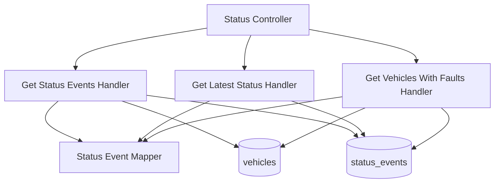

# Query Status Events — Components

## Component Table

| Component | Responsibility | Inputs | Outputs | Dependencies | Failure modes |
|-----------|----------------|--------|---------|--------------|---------------|
| Status Controller | Route the three reads; enforce roles | query/path params, JWT user | status DTOs | QueryBus, RolesGuard | `403` wrong role; `400` invalid params |
| Get Status Events Handler | Scoped, paginated event read | `GetStatusEventsQuery` | paginated events | StatusEvent model, vehicles repo | `403` out-of-branch VIN |
| Get Latest Status Handler | Latest document for a VIN | `GetLatestStatusQuery` | latest event | StatusEvent model, vehicles repo | `404` no events; `403` out-of-branch |
| Get Vehicles With Faults Handler | Latest-per-VIN fault aggregation for a branch | `GetVehiclesWithFaultsQuery` | faulted vehicles | StatusEvent model (aggregate), vehicles repo | empty list if no branch/vehicles |
| Status Event Mapper | Map document → DTO (incl. fault DTO) | `StatusEvent` | DTOs | — | none (pure) |

## Diagram

---

[Previous: Sequence](sequence.md) · [Flow Index](index.md) · [Next: Domain Context](domain-context.md)
