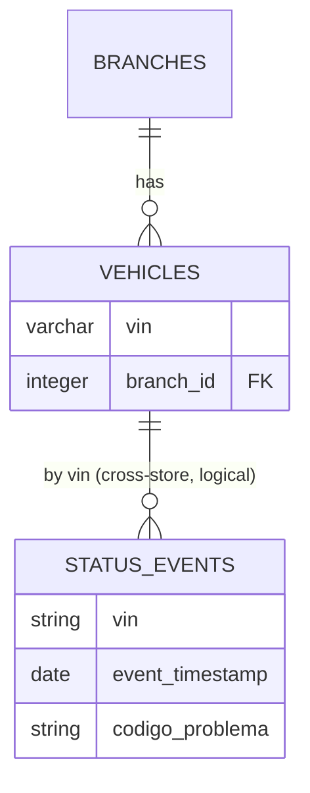

# Query Status Events — Database

This flow **reads across both datastores**: it queries MongoDB `status_events` and resolves branch VINs from PostgreSQL `vehicles`. The `status_events` document schema is owned by [Ingest Status](../ingest-status/database.md); this file documents the read access patterns and the cross-store scoping.

## Stores read

| Store | Collection/Table | Why this flow reads it |
|-------|------------------|------------------------|
| MongoDB | `status_events` | The status data returned (events, latest, faults) |
| PostgreSQL | `vehicles` | Resolve which VINs belong to a branch operator's branch |

## Access Patterns

- **Events:** `find({ vin?, event_timestamp range })`, `sort({ event_timestamp: -1 })`, `skip/limit`.
- **Latest:** `findOne({ vin })`, `sort({ event_timestamp: -1 })`.
- **Faults (aggregation):**
  1. `$match` VINs in the branch set,
  2. `$sort` by `event_timestamp` desc,
  3. `$group` by `vin` taking the first (latest) event,
  4. `$match` where `codigo_problema` is not in `[null, '']`.
- **Branch scoping (PostgreSQL):** `vehicles.find({ branchId })` → list of VINs used to constrain the Mongo query.
- **Consistency:** eventual relative to status ingestion.

## Cross-store scoping

Because `vehicles` (PostgreSQL) and `status_events` (MongoDB) live in different engines, the branch→VIN→status join is performed in application code, not the database. This is the direct operational consequence of [ADR-0002](../../adrs/0002-polyglot-persistence.md).

## Performance Considerations

- The compound index `{ vin: 1, event_timestamp: -1 }` on `status_events` serves events and latest reads.
- The faults aggregation scans recent documents for the branch's VIN set; index support on `vin` + `event_timestamp` keeps the `$match`/`$sort` efficient.

## Retention

Read-only flow; bounded by the 365-day status retention window.
