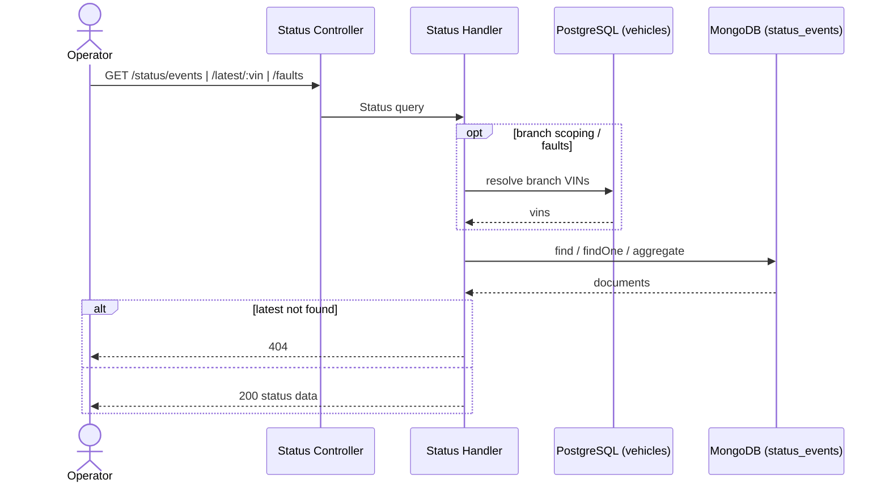

# Query Status Events — Sequence

Three endpoints over `status_events`, all for `ADMIN` and `BRANCH_USER`. Branch operators are scoped to their branch's vehicles.

## `GET /status/events`

1. Request with optional `vin`, `startDate`, `endDate`, `page`, `limit`.
2. `GetStatusEventsHandler` applies scope: `ADMIN` may filter by VIN/date freely; `BRANCH_USER` is constrained to VINs of their branch, and a VIN outside their branch is rejected.
3. Queries `status_events` (`find` + sort desc + skip/limit).
4. Responds `200` with a paginated list.

## `GET /status/latest/:vin`

1. `GetLatestStatusHandler` finds the most recent `status_events` document for the VIN.
2. Branch users may only query a VIN in their branch.
3. `404` if the vehicle/VIN has no status events; otherwise `200` with the latest document.

## `GET /status/faults`

1. `GetVehiclesWithFaultsHandler` resolves the caller's branch vehicles from PostgreSQL (returns empty if the user has no `branchId` or no vehicles).
2. Runs a Mongo aggregation: match those VINs → sort by `event_timestamp` desc → group by VIN taking the latest → keep only those whose latest `codigo_problema` is not null/empty.
3. Responds `200` with the list of faulted vehicles.

## Validation flow

Invalid params → `400`. Branch-scope violations → `403`.

## Failure flow

- Role not permitted → `403`.
- `BRANCH_USER` requesting a VIN outside their branch → `403`.
- `latest/:vin` with no events → `404`.
- User without a `branchId` calling `faults` → `200` with an empty list (not an error).

## Retry behavior

None; idempotent reads.

## Idempotency

All three endpoints are read-only.

## External integration calls

MongoDB reads (events/latest/faults) and a PostgreSQL read (branch VIN resolution for scoping and faults).

## Diagram

---

[Flow Index](index.md) · [Next: Components](components.md)
