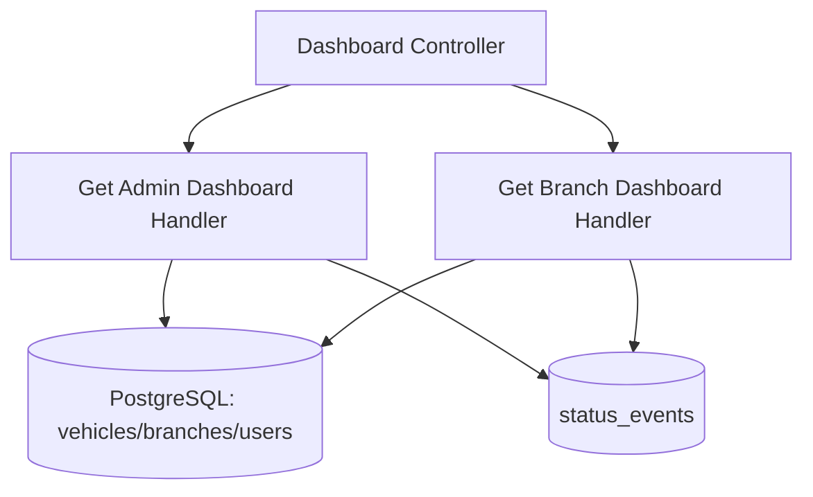

# View Dashboards — Components

## Component Table

| Component | Responsibility | Inputs | Outputs | Dependencies | Failure modes |
|-----------|----------------|--------|---------|--------------|---------------|
| Dashboard Controller | Route the two dashboards; enforce roles | JWT user | dashboard DTOs | QueryBus, RolesGuard | `403` wrong role |
| Get Admin Dashboard Handler | Compute global counts + fault total | `GetAdminDashboardQuery` | `AdminDashboardResponseDto` | vehicles/branches/users repos, StatusEvent model | `500` if a store is down |
| Get Branch Dashboard Handler | Branch vehicle list + per-vehicle fault state | `GetBranchDashboardQuery` | `BranchDashboardResponseDto` | vehicles repo, StatusEvent model | `500` if a store is down |

## Diagram

