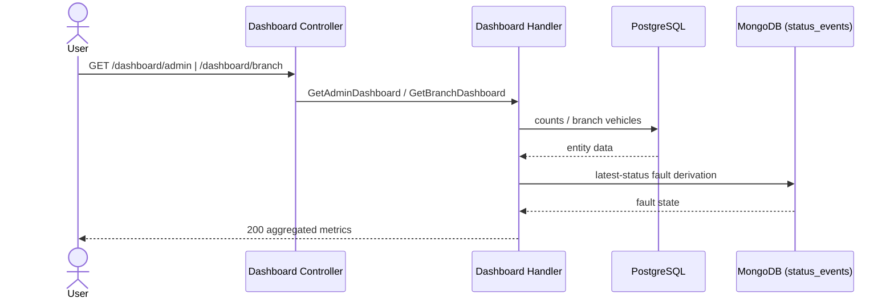

# View Dashboards — Sequence

## `GET /dashboard/admin` (ADMIN)

1. JWT validated, role `ADMIN` enforced.
2. `GetAdminDashboardHandler` computes global counts: total vehicles, active branches, total users, and vehicles currently in fault.
3. Fault count derives from the latest status per vehicle (non-`000` code) in MongoDB; entity counts come from PostgreSQL.
4. Responds `200` with the aggregated metrics.

## `GET /dashboard/branch` (BRANCH_USER)

1. JWT validated, role `BRANCH_USER` enforced.
2. `GetBranchDashboardHandler` resolves the operator's branch vehicles, then attaches each vehicle's fault state from its latest status event.
3. Responds `200` with the branch's vehicle list and fault flags.

## Validation flow

No input beyond the JWT; the role gate is the only check.

## Failure flow

- Wrong role → `403` (`RolesGuard`).
- A datastore being unavailable surfaces as `500`; the dashboard aggregates from both stores.

## Retry behavior

None; idempotent reads.

## Idempotency

Both endpoints are read-only.

## External integration calls

PostgreSQL (entity counts, branch vehicles) and MongoDB (fault state) reads.

## Diagram

---

[Flow Index](index.md) · [Next: Components](components.md)
