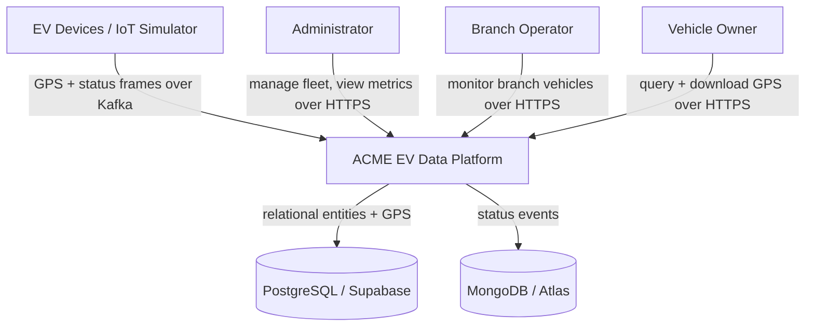
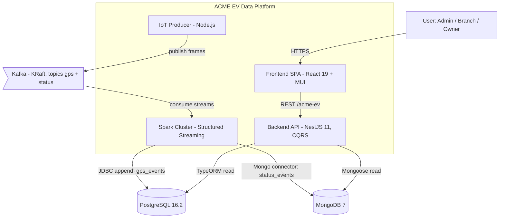

# High-Level Design — ACME EV Data Platform

The L1 system vision. It describes what the platform is, how its parts fit together, and routes you to the deeper layers. After this, browse canonical knowledge via the [Knowledge Registries](knowledge/index.md), drill into a flow via the [Flow Map](navigation/flow-map.md), or operate the system via the [Operations Guide](operations/operations-guide.md).

## Overview

ACME EV Data Platform is a real-time data platform for an electric-vehicle company. Vehicles emit GPS position and operational-status telemetry; the platform ingests that telemetry as a continuous stream, stores it, and serves it through a role-aware API and dashboards.

- **Audience:** fleet administrators, branch operators, and vehicle owners.
- **Key capabilities:** telemetry ingestion, authenticated access, owner GPS access (incl. CSV export), fleet status monitoring, and fleet administration.

## Goals

- Ingest GPS and status telemetry continuously with no separate batch layer (Kappa — [ADR-0001](history/adrs/0001-kappa-architecture.md)).
- Store each datum in the engine best suited to it (relational for GPS + entities, document for status — [ADR-0002](history/adrs/0002-polyglot-persistence.md)).
- Enforce confidentiality: each owner sees only their own vehicles; each branch operator only their branch ([ADR-0005](history/adrs/0005-jwt-rbac-data-scoping.md)).
- Preserve integrity: telemetry is append-only; events carry both `event_timestamp` (generation) and `processed_at` (ingestion).
- Honor retention windows: GPS 30 days, status 365 days.

### Success criteria

- A vehicle's telemetry is queryable through the API shortly after it is emitted.
- No committed frame is lost or double-written across a pipeline restart.
- An owner can download their GPS history as CSV.

## Non-Goals

- Not a command-and-control system: the platform reads telemetry, it does not actuate vehicles.
- No batch/replay analytics layer (intentionally excluded by the Kappa choice).
- No real IoT device firmware — the [Produce Telemetry](flows/produce-telemetry/index.md) flow simulates devices and is replaced by real hardware in production.
- The backend does not write telemetry; ingestion is owned exclusively by the Spark pipelines.

## Architecture

### C4 Context (Level 1)

### C4 Container (Level 2)

### Services and responsibilities

| Container | Responsibility |
|-----------|----------------|
| IoT Producer | Simulates a fleet of EVs and publishes GPS + status frames to Kafka. See [Produce Telemetry](flows/produce-telemetry/index.md). |
| Apache Kafka (KRaft) | Durable, partitioned transport. Two topics: `acme.ev.gps`, `acme.ev.status` (3 partitions each). |
| Spark Cluster | Two Structured Streaming pipelines that parse frames and write to storage. See [Ingest GPS](flows/ingest-gps/index.md), [Ingest Status](flows/ingest-status/index.md). |
| PostgreSQL | Relational entities (branches, users, vehicles, vehicle_owners) and `gps_events`. |
| MongoDB | `status_events` collection (flexible schema for future fields). |
| Backend API | Read API over telemetry + auth + administration, CQRS, JWT, Swagger at `/docs`. |
| Frontend SPA | Role-based dashboards and telemetry tables. |

The conceptual and physical data model these containers share is owned by the [Database registry](knowledge/database.md); the interfaces between them by the [Contracts registry](knowledge/contracts.md).

## External Integrations

The platform depends on a message broker (Kafka), two datastores (PostgreSQL, MongoDB), and — in production — their managed equivalents (Supabase, MongoDB Atlas). The complete dependency table, context diagram, and per-dependency degradation behavior live in the [Integration Map](navigation/integration-map.md). The cloud-swap decision is recorded in [ADR-0007](history/adrs/0007-managed-cloud-databases.md).

## Deployment

- **Topology:** Docker Compose on a single bridge network (`proyecto`).
- **Local** (`compose.yml`): includes PostgreSQL and MongoDB containers.
- **Production** (`compose.prod.yml`): omits the database containers; the app connects to Supabase and Atlas via `POSTGRES_URI` / `MONGO_URI`.
- **Mechanism:** images built per service; `restart: unless-stopped` for resilience. The frontend is served by nginx in production.

### Running locally

System-wide local bring-up (flow-specific run steps live in each ingestion flow's `installation.md`):

1. Copy `.env.template` → `.env` and fill values (single root `.env` feeds every service).
2. Start the stack: `docker compose up -d` (local, includes PostgreSQL + MongoDB) or `docker compose -f compose.prod.yml up -d` (Supabase + Atlas).
3. Apply SQL migrations from `database/` (TypeORM `synchronize: true` auto-creates tables in dev; migrations are for prod).
4. Seed demo data: `cd backend && npm install && npm run seed` (3 branches, 6 users, 10 vehicles, ownership links).
5. Submit the Spark pipelines — see [Ingest GPS → Installation](flows/ingest-gps/installation.md) and [Ingest Status → Installation](flows/ingest-status/installation.md).
6. API at `http://localhost:3000/acme-ev`, Swagger at `/docs`, Spark Master UI at `:8080`.

Demo credentials (seed): `admin@acme-ev.com` / `admin123` (ADMIN), `branch1@acme-ev.com` / `branch123` (BRANCH_USER), `owner1@acme-ev.com` / `owner123` (OWNER).

## Security

The platform authenticates with stateless JWTs and authorizes with roles plus per-handler data scoping, so each owner sees only their vehicles and each branch operator only their branch. Secrets come from a single root `.env`; transport is HTTPS with CORS restricted in production. The full trust-boundary model, sensitive-data handling, controls, and known gaps are owned by [Security](security.md); the scoping rationale is in [ADR-0005](history/adrs/0005-jwt-rbac-data-scoping.md).

## Scalability

Expected load at year 1: ~10,000 vehicles emitting GPS every 30s and status every 60s (~28.8M GPS + 14.4M status messages/day), with ~20% annual fleet growth over a 5-year horizon.

| Component | Strategy |
|-----------|----------|
| Kafka | Add brokers and partitions; raise replication factor to 3 (year 2+). |
| Spark | Scale workers horizontally; increase cores/memory per worker. |
| PostgreSQL | Vertical scaling on Supabase; range partition `gps_events` by month. |
| MongoDB | Atlas auto-scaling; shard `status_events` by VIN. |
| Backend | Stateless — add replicas behind a load balancer. |
| Frontend | Static assets via CDN. |

Primary bottleneck is sustained write throughput into the datastores; partitioning/sharding addresses it. Detailed 5-year projections are summarized here; operational thresholds are in [Observability](operations/observability.md).

## Failure Recovery

- **High availability:** managed databases run multi-AZ/replica-set in production.
- **Retries:** Spark commits a Kafka offset only after a successful write, so a failed batch reprocesses from the last committed offset ([ADR-0004](history/adrs/0004-spark-checkpointing.md)).
- **Failover:** Supabase PITR and Atlas continuous backup provide point-in-time restore.
- **Targets:** system RTO ~30 min (typical partial failure < 5 min); RPO < 1 min for telemetry. Component-level targets and the recovery decision tree are in the [Operations Guide](operations/operations-guide.md).

## Navigation

- [Flow Map](navigation/flow-map.md) — all flows grouped by business capability
- [Knowledge Registries](knowledge/index.md) — canonical domain, contracts, and database knowledge
- [Integration Map](navigation/integration-map.md) — external systems and blast radius
- [Security](security.md) — trust boundaries, identity, and controls
- [Decision Index](history/decision-index.md) — index of architectural decisions
- [Operations Guide](operations/operations-guide.md) and [Observability](operations/observability.md) — operate and monitor the system

## References

- [ADR-0001](history/adrs/0001-kappa-architecture.md), [ADR-0002](history/adrs/0002-polyglot-persistence.md), [ADR-0003](history/adrs/0003-kafka-kraft-broker.md) shaped the streaming + storage core.
- External docs, specs, and dashboards: [References](knowledge/references.md).
- Shared vocabulary: [Glossary](knowledge/glossary.md).
