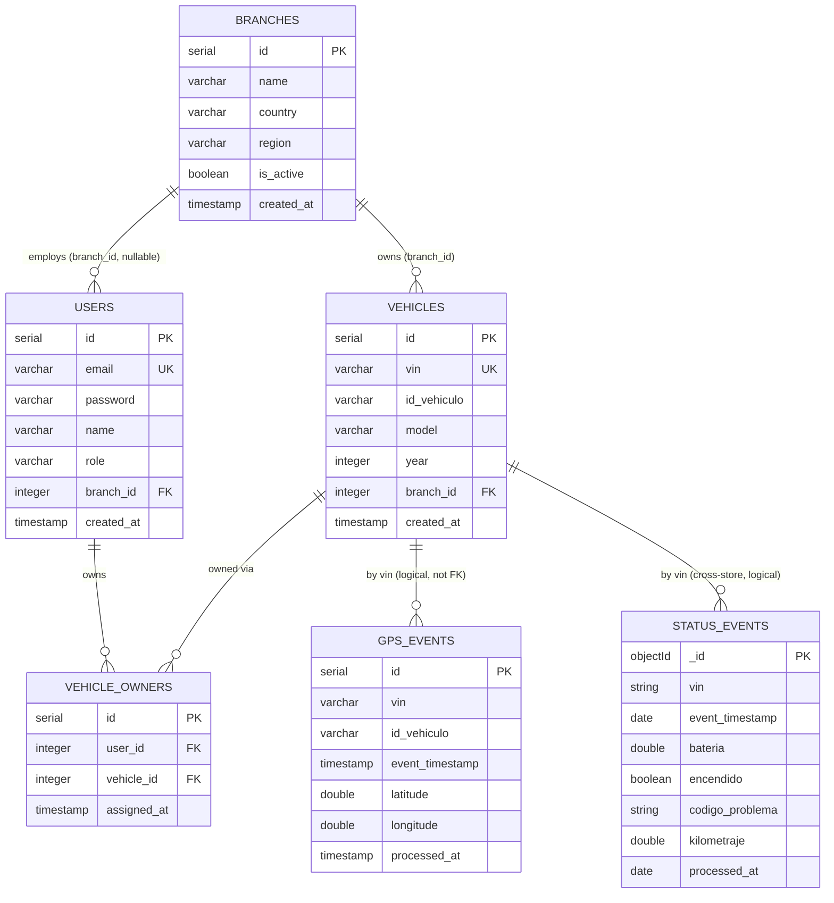

# Database

Canonical registry for the platform's data and persistence knowledge. It owns the conceptual data model, the physical persistence model, the entity-relationship view, indexes, relationships, and constraints. Flows reference these definitions and document their local access in their `persistence.md`; they never redefine them.

The platform uses **polyglot persistence** ([ADR-0002](../history/adrs/0002-polyglot-persistence.md)): PostgreSQL for relational entities and GPS events, MongoDB for status events. Production swaps these for managed equivalents (Supabase, Atlas) by connection string only ([ADR-0007](../history/adrs/0007-managed-cloud-databases.md)).

Schema sources of truth: SQL migrations in [`database/`](../../database/), TypeORM entities under [`backend/src/`](../../backend/src/), and the Mongoose schema [`status-event.schema.ts`](../../backend/src/status/schemas/status-event.schema.ts). This document explains durable meaning; it does not copy generated schemas.

## 1. Data Model

The conceptual data the system owns, independent of storage technology.

### branches

| Field | Value |
|-------|-------|
| Meaning | A regional ACME EV location that owns vehicles and employs branch operators |
| Identifier | `id` (auto integer) |
| Owner | Fleet Administration |
| Important attributes | `name`, `country`, `region`, `is_active`, `created_at` |
| Lifecycle | Created/seeded; deactivated via `is_active`; not deleted on a schedule |
| Source of truth | PostgreSQL `branches` |
| Used by flows | [List Branches](../flows/list-branches/index.md), [List Vehicles](../flows/list-vehicles/index.md), [View Dashboards](../flows/view-dashboards/index.md) |

### users

| Field | Value |
|-------|-------|
| Meaning | A platform account with a role and optional branch assignment |
| Identifier | `id` (auto integer); `email` is the unique business key |
| Owner | Identity & Access |
| Important attributes | `email`, `password` (bcrypt hash, never returned), `name`, `role` (`ADMIN`/`BRANCH_USER`/`OWNER`), `branch_id` (nullable), `created_at` |
| Lifecycle | Created/seeded and administered; not expired on a schedule |
| Source of truth | PostgreSQL `users` |
| Used by flows | [Login](../flows/login/index.md), [List Users](../flows/list-users/index.md) |

### vehicles

| Field | Value |
|-------|-------|
| Meaning | The fleet registry — one row per known vehicle |
| Identifier | `id` (auto integer); `vin` is the unique business key (17 chars) |
| Owner | Fleet Administration |
| Important attributes | `vin`, `id_vehiculo`, `model`, `year`, `branch_id`, `created_at` |
| Lifecycle | Created by seed or by the [Claim Vehicle](../flows/claim-vehicle/index.md) demo fallback; not expired |
| Source of truth | PostgreSQL `vehicles` |
| Used by flows | [List Vehicles](../flows/list-vehicles/index.md), [Claim Vehicle](../flows/claim-vehicle/index.md), [Query Status Events](../flows/query-status-events/index.md), [View Dashboards](../flows/view-dashboards/index.md) |

### vehicle_owners

| Field | Value |
|-------|-------|
| Meaning | The ownership link associating a user with a vehicle |
| Identifier | `id` (auto integer); `(user_id, vehicle_id)` is unique |
| Owner | Fleet Administration |
| Important attributes | `user_id`, `vehicle_id`, `assigned_at` |
| Lifecycle | Created when an owner claims a vehicle; no transfer or removal flow today |
| Source of truth | PostgreSQL `vehicle_owners` |
| Used by flows | [Claim Vehicle](../flows/claim-vehicle/index.md), [Query GPS Events](../flows/query-gps-events/index.md), [List Vehicles](../flows/list-vehicles/index.md) |

### gps_events

| Field | Value |
|-------|-------|
| Meaning | An append-only GPS position frame, queryable by VIN and time range |
| Identifier | `id` (auto integer) |
| Owner | Telemetry Ingestion |
| Important attributes | `id_vehiculo`, `vin`, `event_timestamp`, `tipo_trama`, `zona_referencia`, `departamento`, `latitude`, `longitude`, `processed_at` |
| Lifecycle | Inserted by the GPS pipeline; never updated; purged after the 30-day retention window |
| Source of truth | PostgreSQL `gps_events` |
| Used by flows | [Ingest GPS](../flows/ingest-gps/index.md) (write), [Query GPS Events](../flows/query-gps-events/index.md) (read) |

### status_events

| Field | Value |
|-------|-------|
| Meaning | An append-only operational status frame with a flexible schema for future fields |
| Identifier | `_id` (MongoDB ObjectId) |
| Owner | Telemetry Ingestion |
| Important attributes | `id_vehiculo`, `vin`, `event_timestamp`, `tipo_trama`, `zona_referencia`, `departamento`, `bateria`, `encendido`, `codigo_problema`, `kilometraje`, `processed_at` |
| Lifecycle | Inserted by the status pipeline; never updated; expired after the 365-day retention window |
| Source of truth | MongoDB `status_events` |
| Used by flows | [Ingest Status](../flows/ingest-status/index.md) (write), [Query Status Events](../flows/query-status-events/index.md) (read), [View Dashboards](../flows/view-dashboards/index.md) (faults) |

`event_timestamp` is when the vehicle generated the frame; `processed_at` is when the platform ingested it. Both telemetry stores are denormalized: they carry `vin` as a plain field rather than a foreign key, so ingestion never blocks on a vehicle lookup. The join to `vehicles`/`vehicle_owners` for access scoping happens at read time in the API.

## 2. Persistence Model

### Datastore Catalog

| Field | PostgreSQL | MongoDB |
|-------|------------|---------|
| Datastore | Relational store | Document store |
| Technology | PostgreSQL 16.2 local; Supabase managed in production | MongoDB 7 local; MongoDB Atlas managed in production |
| Responsibility | `branches`, `users`, `vehicles`, `vehicle_owners`, `gps_events` | `status_events` |
| Data model | Relational tables | Document collection |
| Consistency | Strong, read-your-writes within the store | Eventual relative to ingestion latency |
| Durability and recovery | Supabase PITR (continuous WAL) + daily snapshot; RTO < 15 min, RPO < 1 min | Atlas continuous (oplog) + periodic snapshot; RTO < 10 min, RPO < 5 s |
| Residency | Single managed region (provider-configured) | Single managed region (provider-configured) |
| Schema source | [`database/`](../../database/) migrations; TypeORM entities under [`backend/src/`](../../backend/src/) | [`status-event.schema.ts`](../../backend/src/status/schemas/status-event.schema.ts) |
| Owner | Data Platform Team | Data Platform Team |

Recovery objectives are summarized here and detailed in the [Operations Guide](../operations/operations-guide.md).

### Physical Mapping

| Conceptual entity | Physical structure | Notes |
|-------------------|--------------------|-------|
| branches | `branches` table | Master data |
| users | `users` table | `password` holds a bcrypt hash; `branch_id` nullable |
| vehicles | `vehicles` table | `vin` unique, fixed 17 chars |
| vehicle_owners | `vehicle_owners` table | Associative table; unique `(user_id, vehicle_id)` |
| gps_events | `gps_events` table | Denormalized; flattened from the Kafka frame's nested `telemetria` |
| status_events | `status_events` collection | Denormalized document; flattened from `telemetria`; flexible schema absorbs future fields |

Both telemetry structures are written by Spark micro-batches in append mode, flattening the producer's nested `telemetria` object into top-level columns/fields and adding `processed_at` at ingestion. No denormalization beyond this flattening, no sharding or partitioning is active today; the scaling plan in the [High-Level Design](../hld.md) proposes monthly range partitioning for `gps_events` and sharding `status_events` by `vin`.

## 3. ER

The conceptual relationships across both datastores. The telemetry stores relate to `vehicles` by `vin` logically (not by a database foreign key), and `status_events` lives in a different engine, so its relationship is a cross-store logical one.

## 4. Indexes

### Present indexes

These exist in the migrations/entities today.

| Index | Entity / structure | Fields and order | Type | Uniqueness | Supported access pattern | Cost and trade-off | Used by flows |
|-------|--------------------|------------------|------|------------|--------------------------|--------------------|----------------|
| `branches_pkey` | `branches` (table) | `id` | Primary | Unique | Lookup/join by branch id | Minimal | All branch reads |
| `users_pkey` | `users` (table) | `id` | Primary | Unique | Lookup by user id | Minimal | [Login](../flows/login/index.md), [List Users](../flows/list-users/index.md) |
| `users_email_key` | `users` (table) | `email` | Unique | Unique | Auth lookup by email | One unique check per insert | [Login](../flows/login/index.md) |
| `vehicles_pkey` | `vehicles` (table) | `id` | Primary | Unique | Lookup/join by vehicle id | Minimal | [List Vehicles](../flows/list-vehicles/index.md) |
| `vehicles_vin_key` | `vehicles` (table) | `vin` | Unique | Unique | Lookup by VIN; claim existence check | One unique check per insert | [Claim Vehicle](../flows/claim-vehicle/index.md), [List Vehicles](../flows/list-vehicles/index.md) |
| `vehicle_owners_pkey` | `vehicle_owners` (table) | `id` | Primary | Unique | Lookup by link id | Minimal | — |
| `vehicle_owners_user_id_vehicle_id_key` | `vehicle_owners` (table) | `(user_id, vehicle_id)` | Unique composite | Unique | Prevent duplicate user↔vehicle link | One unique check per insert | [Claim Vehicle](../flows/claim-vehicle/index.md) |
| `gps_events_pkey` | `gps_events` (table) | `id` | Primary | Unique | Row identity | Minimal | [Ingest GPS](../flows/ingest-gps/index.md) |
| `_id_` | `status_events` (collection) | `_id` | Primary | Unique | Document identity | Minimal (default) | [Ingest Status](../flows/ingest-status/index.md) |

### Recommended indexes (not yet in the schema)

These access patterns are exercised today but rely on sequential scans because the supporting index is not yet defined. They are recorded here so the justification is explicit; adding them is part of the scaling plan.

| Index | Entity / structure | Fields and order | Type | Supported access pattern | Cost and trade-off |
|-------|--------------------|------------------|------|--------------------------|--------------------|
| GPS range index | `gps_events` | `(vin, event_timestamp)` | Composite secondary | Owner range queries `WHERE vin = ? AND event_timestamp BETWEEN ? AND ?` ([Query GPS Events](../flows/query-gps-events/index.md)) | Write amplification on a high-volume append table |
| Status access index | `status_events` | `{ vin: 1, event_timestamp: -1 }` | Compound secondary | Latest/range/faults reads ([Query Status Events](../flows/query-status-events/index.md)) | Index maintenance on every insert |
| Status retention TTL | `status_events` | `event_timestamp` | TTL | Automatic 365-day expiry | Background TTL deletion load |

`branch_id` foreign-key columns are not indexed; PostgreSQL does not create FK indexes automatically. At the current master-data volume the branch-scoped scans are cheap, but a `vehicles(branch_id)` index is worth adding as the fleet grows.

## 5. Relationships

| Relationship | Cardinality | Ownership | Optionality | Physical representation | Integrity enforcement | Cascade behavior |
|--------------|-------------|-----------|-------------|-------------------------|-----------------------|------------------|
| branches → users | One-to-many | Branch | A user may have no branch (`ADMIN`/`OWNER`); a branch may have no users | `users.branch_id` FK (nullable) | Database FK | No cascade; deleting a referenced branch is rejected |
| branches → vehicles | One-to-many | Branch | Every vehicle has a branch; a branch may have no vehicles | `vehicles.branch_id` FK (not null) | Database FK | No cascade; rejected while referenced |
| users ↔ vehicles (via vehicle_owners) | Many-to-many, constrained to one owner per vehicle | Ownership link | A vehicle may be unclaimed; a user may own many | `vehicle_owners` associative rows with FKs to both | Database FKs + unique `(user_id, vehicle_id)`; **single-owner-per-vehicle enforced in application** ([Claim Vehicle](../flows/claim-vehicle/index.md)) | No cascade; links persist |
| vehicles → gps_events | One-to-many | None (logical) | Events exist independently of a `vehicles` row | `gps_events.vin` plain column (no FK) | Application join at read time | None |
| vehicles → status_events | One-to-many (cross-store) | None (logical) | Documents exist independently in MongoDB | `status_events.vin` plain field (no FK) | Application join at read time; branch scoping resolves VINs in PostgreSQL first | None |

The telemetry relationships are intentionally logical, not enforced by the database — a direct consequence of polyglot persistence and the append-only ingestion model ([ADR-0002](../history/adrs/0002-polyglot-persistence.md)).

## 6. Constraints

| Constraint | Scope | Type | Rule | Enforcement layer | Failure behavior | Related flows |
|------------|-------|------|------|-------------------|------------------|----------------|
| Primary keys | All tables + `status_events._id` | Primary key | Every row/document has a unique identity | Database | Insert rejected on conflict | All write flows |
| Unique email | `users.email` | Unique | No two accounts share an email | Database | Insert/update rejected (`23505`) | [Login](../flows/login/index.md) |
| Unique VIN | `vehicles.vin` | Unique | One vehicle row per VIN | Database | Insert rejected on duplicate | [Claim Vehicle](../flows/claim-vehicle/index.md) |
| Unique ownership pair | `vehicle_owners (user_id, vehicle_id)` | Unique composite | A user cannot be linked to the same vehicle twice | Database | Insert rejected on duplicate | [Claim Vehicle](../flows/claim-vehicle/index.md) |
| Role check | `users.role` | Check | Value in `ADMIN`, `BRANCH_USER`, `OWNER` | Database | Insert/update rejected | [Login](../flows/login/index.md), [List Users](../flows/list-users/index.md) |
| Branch FK (users) | `users.branch_id` | Foreign key (nullable) | Must reference an existing branch when set | Database | Insert/update rejected if branch absent | [List Users](../flows/list-users/index.md) |
| Branch FK (vehicles) | `vehicles.branch_id` | Foreign key (not null) | Must reference an existing branch | Database | Insert rejected if branch absent | [Claim Vehicle](../flows/claim-vehicle/index.md), [List Vehicles](../flows/list-vehicles/index.md) |
| Ownership FKs | `vehicle_owners.user_id`, `vehicle_owners.vehicle_id` | Foreign key (not null) | Must reference an existing user and vehicle | Database | Insert rejected if either absent | [Claim Vehicle](../flows/claim-vehicle/index.md) |
| Single owner per vehicle | `vehicle_owners` | Business invariant | A vehicle already linked to any owner cannot be claimed again | Application (claim transaction) | Claim fails with `400` | [Claim Vehicle](../flows/claim-vehicle/index.md) |
| Telemetry append-only | `gps_events`, `status_events` | Business invariant | Telemetry is inserted, never updated | Application / pipeline | Writers only append | [Ingest GPS](../flows/ingest-gps/index.md), [Ingest Status](../flows/ingest-status/index.md) |
| GPS retention (30 days) | `gps_events` | Business invariant | Rows older than 30 days are purged | Scheduled job / partition drop (planned) | Old rows removed | [Ingest GPS](../flows/ingest-gps/index.md), [Query GPS Events](../flows/query-gps-events/index.md) |
| Status retention (365 days) | `status_events` | Business invariant | Documents older than 365 days expire | MongoDB TTL index (planned — see recommended indexes) | Old documents removed | [Ingest Status](../flows/ingest-status/index.md), [Query Status Events](../flows/query-status-events/index.md) |

Constraints enforced outside the database (single-owner-per-vehicle, append-only, retention) are persistence knowledge and are recorded here even though no database constraint expresses them.
