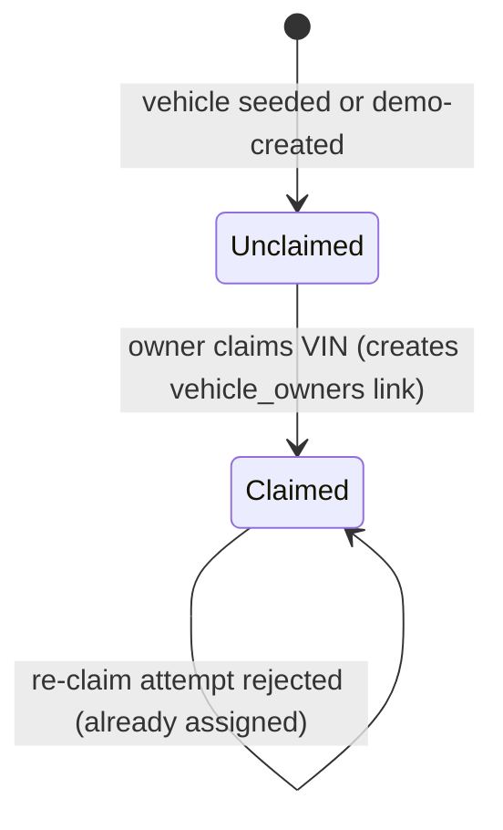

# Domain

Canonical registry for shared business concepts, invariants, state models, and policies. Flows reference these rules from their `domain-context.md` and explain only how they apply locally; they never redefine them.

Short term definitions live in the [Glossary](glossary.md). This registry owns the rules and relationships. Data structures are owned by the [Database registry](database.md).

## Core Concepts

| Concept | Meaning | Related capability |
|---------|---------|--------------------|
| Telemetry | The GPS and status data streamed from vehicles; the platform's core, append-only asset | Telemetry Ingestion |
| GPS frame | A message carrying a vehicle's geographic position at a moment in time | Telemetry Ingestion |
| Status frame | A message carrying a vehicle's operational state (battery, ignition, fault code, odometer) | Telemetry Ingestion |
| VIN | Vehicle Identification Number — the unique business key linking telemetry to a vehicle | All |
| Fault code | A three-digit code in a status frame; `000` means no fault | Fleet Monitoring |
| Branch | A regional location that owns vehicles and employs operators | Fleet Administration |
| Owner | A customer who owns one or more vehicles and may access their telemetry | Vehicle Telemetry Access |
| Ownership | A link between a user and a vehicle that grants telemetry access | Fleet Administration |
| Data scoping | Restricting query results to the rows a caller is entitled to | All authenticated capabilities |

## Telemetry Ingestion

**Purpose:** Accept continuous GPS and status telemetry and persist it for query.
**Boundary:** From a published Kafka frame to a durably stored row/document. Generation (simulation or real devices) and downstream reads are out of scope.

### Concepts and relationships

- A vehicle emits two independent frame types on their own cadences: GPS position and operational status.
- Each frame carries `event_timestamp` (when the vehicle generated it) and gains `processed_at` (when the platform ingested it).
- Frames are keyed by `vin`; the relationship to the `vehicles` registry is logical, resolved at read time (see [Database → Relationships](database.md#5-relationships)).

### Invariants

- **Append-only:** telemetry is inserted, never updated or deleted by a flow.
- **VIN format:** a VIN is the `ACME` prefix plus a zero-padded index, total length 17 (e.g. `ACME0000000000001`).
- **Tipo de trama:** GPS frames carry `tipo_trama = "GPS"`; status frames carry `tipo_trama = "ESTADO"`.
- **At-least-once delivery:** a frame may be stored more than once after a pipeline retry; there is no ingestion-time deduplication ([ADR-0004](../history/adrs/0004-spark-checkpointing.md)).

### Fault code semantics

The `codigo_problema` on a status frame classifies vehicle health and is shared by Fleet Monitoring and dashboards:

- `000` — no fault (the common case).
- `101` — low battery.
- any other `001`–`999` — a generic fault.

When a vehicle is off, its fault code is `000`. The probabilistic rules that *generate* fault codes in the simulator are local to [Produce Telemetry](../flows/produce-telemetry/index.md) and do not constrain real devices.

### Applied by flows

[Produce Telemetry](../flows/produce-telemetry/index.md), [Ingest GPS](../flows/ingest-gps/index.md), [Ingest Status](../flows/ingest-status/index.md).

## Identity & Access

**Purpose:** Establish who a caller is and what role they hold.
**Boundary:** Authentication and claim issuance; per-request data scoping is a shared policy applied across capabilities.

### Invariants

- A user holds exactly one role: `ADMIN`, `BRANCH_USER`, or `OWNER`.
- A `BRANCH_USER` is assigned a branch; `ADMIN` and `OWNER` have no branch.
- Credentials are verified against a stored bcrypt hash; the hash is never returned by any interface.

See [Security](../security.md) for the authentication and authorization model and [ADR-0005](../history/adrs/0005-jwt-rbac-data-scoping.md) for the rationale.

### Applied by flows

[Login](../flows/login/index.md), and every authenticated flow.

## Vehicle Telemetry Access

**Purpose:** Let a vehicle owner read and export the telemetry of vehicles they own.
**Boundary:** Owner-facing GPS reads; status reads belong to Fleet Monitoring.

### Invariants

- An owner may read GPS history only for vehicles linked to them through ownership.
- A query's date range is `[startDate, endDate]` over `event_timestamp`; `startDate` must not be after `endDate`.
- Reads can only return data still within the GPS retention window.

### Applied by flows

[Query GPS Events](../flows/query-gps-events/index.md).

## Fleet Monitoring

**Purpose:** Let admins and branch operators observe operational status and active faults.
**Boundary:** Status reads, latest-status lookups, and fault detection; aggregated counts are surfaced by [View Dashboards](../flows/view-dashboards/index.md).

### Concepts

- **Active fault:** the *latest* status event for a vehicle reports a fault code that is not null, not empty, and not `000`.
- **Branch scope:** the set of vehicles whose `branch_id` matches the operator's branch.

### Invariants

- **Latest semantics:** "latest" is decided by `event_timestamp` (generation time), not `processed_at`, so out-of-order ingestion never misreports current state.
- A fault that has since cleared (a newer `000`) does not count — only the latest event matters.
- A `BRANCH_USER` sees status only for vehicles in their branch; an operator with no branch sees an empty fault list, not an error.
- `ADMIN` may query any vehicle without branch restriction.

### Applied by flows

[Query Status Events](../flows/query-status-events/index.md), [View Dashboards](../flows/view-dashboards/index.md).

## Fleet Administration

**Purpose:** Manage branches, users, vehicles, and ownership.
**Boundary:** Registry reads and the owner claim operation. Telemetry is not administered here.

### Concepts and lifecycle

- **Claim:** an owner associates a vehicle (by VIN) with their account, creating an ownership link.
- **Demo vehicle:** when an owner claims a VIN the platform has never seen, a synthetic vehicle is auto-created so demos and the project defense run smoothly. This is a convenience, not a production onboarding path; the generation mechanics are local to [Claim Vehicle](../flows/claim-vehicle/index.md).

### Invariants

- **One owner per vehicle:** a vehicle already linked to any owner cannot be claimed again; there is no ownership transfer flow.
- A claim is atomic: the existence check, optional vehicle creation, and ownership insert succeed together or not at all.

### Ownership lifecycle

### Applied by flows

[Claim Vehicle](../flows/claim-vehicle/index.md), [List Vehicles](../flows/list-vehicles/index.md), [List Branches](../flows/list-branches/index.md), [List Users](../flows/list-users/index.md).

## Shared Policies

### Data scoping

Every data-returning interface restricts results to what the caller is entitled to, based on JWT role:

| Role | Scope |
|------|-------|
| `ADMIN` | All data, no restriction |
| `BRANCH_USER` | Vehicles and status within the operator's branch |
| `OWNER` | Vehicles linked through ownership, and their GPS telemetry |

Scoping is applied inside each query handler. A scoping defect is a confidentiality defect. Rationale and trade-offs: [ADR-0005](../history/adrs/0005-jwt-rbac-data-scoping.md); enforcement model: [Security](../security.md).

### Retention

Telemetry is retained for a bounded window — GPS for 30 days, status for 365 days — then purged. The business policy lives here; the enforcement mechanism and its status are owned by [Database → Constraints](database.md#6-constraints).
