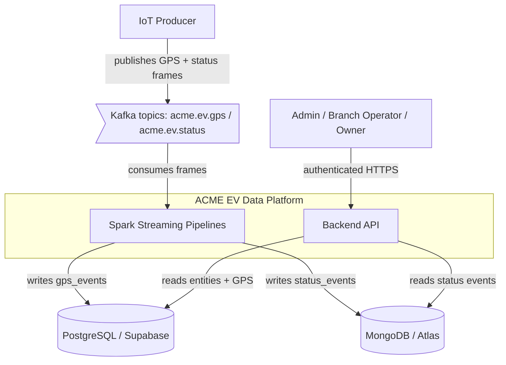

# Integration Map

External and infrastructure systems this platform depends on, and the impact when each is unavailable. Within a single deployment the components below talk to each other; the "external" systems from the application's point of view are the message broker, the two datastores, and (in production) the managed database providers.

| System | Type | Used by (flows) | Purpose | Failure impact |
|--------|------|-----------------|---------|----------------|
| Apache Kafka | Message broker (KRaft) | Produce Telemetry, Ingest GPS, Ingest Status | Durable transport of GPS/status frames | Producer cannot publish; ingestion stalls. Frames buffered briefly in the producer, then dropped. No API data loss for already-stored events. |
| PostgreSQL / Supabase | Relational DB | Ingest GPS, Login, Query GPS Events, Claim Vehicle, List Vehicles/Branches/Users, View Dashboards | Relational entities + GPS events | GPS ingestion fails (batch errors, Spark retries from last offset); auth and most read APIs fail closed. |
| MongoDB / Atlas | Document DB | Ingest Status, Query Status Events, View Dashboards (faults) | Operational status events | Status ingestion fails (Spark retries from checkpoint); status/faults endpoints fail closed. |
| Apache Spark cluster | Stream processor | Ingest GPS, Ingest Status | Structured Streaming micro-batch processing | Pipelines stop; Kafka retains frames within topic retention, so ingestion resumes from the last committed offset with no data loss. |

## System Context

The IoT Producer is the only writer into Kafka; Spark is the only consumer; the Backend API is read-only over telemetry data. This one-way flow (write path via Spark, read path via API) is what keeps the streaming and serving concerns decoupled.

## Degradation Behavior

- **Kafka down:** the producer's publish calls fail and frames for that tick are lost (the simulator holds no durable buffer). Already-published frames remain on the broker. Ingestion resumes automatically when the broker returns. Treated as **fail open** on the producer side — the simulator keeps ticking.
- **Spark pipeline down:** Kafka retains frames within the topic retention window. On restart, each pipeline resumes from its checkpointed offset, so no committed frame is skipped or double-written (see [ADR-0004](../history/adrs/0004-spark-checkpointing.md)).
- **PostgreSQL down:** GPS ingestion batches fail and Spark retries; the offset is not committed until the write succeeds. Auth and relational read endpoints **fail closed** (requests error).
- **MongoDB down:** status ingestion batches fail and retry from checkpoint; status/faults endpoints **fail closed**.
- **Identity (JWT validation):** auth is self-contained (HMAC-signed JWT, no external IdP). There is no external authentication dependency to degrade.

> Note: with a single Kafka broker and replication factor 1 (current local/demo setup), an unrecovered broker disk loss would lose unconsumed frames. The 5-year scaling plan raises replication to 3 — see [ADR-0003](../history/adrs/0003-kafka-kraft-broker.md) and the [High-Level Design](../hld.md).
