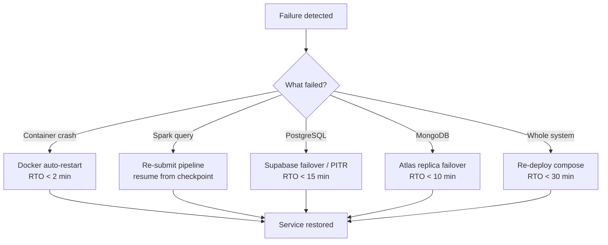

# Operations Guide

The global L4 runbook collection. It tells an operator how to run the platform and recover from known failures without reading any flow package. It pairs with [`observability.md`](observability.md): that file defines the signals, this file defines the responses.

## Common Operational Scenarios

| Scenario | Symptom | Severity | Runbook |
|----------|---------|----------|---------|
| Ingestion backlog | `kafka.topic.lag` / `ingestion.lag_seconds` rising | Warning | [Ingestion backlog](#runbook-ingestion-backlog) |
| Pipeline stopped | A Spark streaming query is no longer running | Critical | [Pipeline stopped](#runbook-pipeline-stopped) |
| Datastore outage | `db.write.errors` rising; reads failing | Critical | [Datastore outage](#runbook-datastore-outage) |
| Elevated 5xx | API error rate above SLO | Critical | [Elevated 5xx](#runbook-elevated-5xx) |
| Corrupt checkpoint | Pipeline fails to restart with a checkpoint error | Warning | [Corrupt checkpoint](#runbook-corrupt-checkpoint) |

## Runbook Structure

Every runbook has five parts: **Symptoms**, **Diagnosis** (copy-pasteable commands), **Remediation** (copy-pasteable commands), **Escalation**, and **Related**.

## Runbook: Ingestion backlog

**Symptoms:** `kafka.topic.lag` climbing; `ingestion.lag_seconds` p99 over a minute; data appears stale in the API but no errors.

**Diagnosis:**

```bash
# Is the broker healthy and are topics present?
docker exec -it broker /opt/kafka/bin/kafka-topics.sh \
  --bootstrap-server broker:9092 --list

# Consumer lag per partition (Spark uses its own offsets via checkpoints,
# but topic end-offsets reveal production rate)
docker exec -it broker /opt/kafka/bin/kafka-run-class.sh \
  kafka.tools.GetOffsetShell --broker-list broker:9092 --topic acme.ev.gps

# Are Spark workers registered and the query progressing?
docker logs spark-master --tail 50
```

**Remediation:**

```bash
# If workers are under-resourced, the streaming UI (:4040) shows batch
# duration > trigger interval. Scale workers by raising worker count/memory
# in compose, then recreate:
docker compose up -d --scale spark-worker-1=1 spark-worker-2=1
```

If production rate exceeds processing capacity sustainably, add Kafka partitions and Spark workers per the scaling plan in [`hld.md`](hld.md).

**Escalation:** Page the Data on-call if lag keeps rising for >30 min after scaling.

**Related:** [`observability.md`](observability.md) → `kafka.topic.lag`, `ingestion.lag_seconds`; flows [Ingest GPS](flows/ingest-gps/), [Ingest Status](flows/ingest-status/).

## Runbook: Pipeline stopped

**Symptoms:** `spark.query.running` = 0 for a pipeline; ingestion counter flat; no new rows in `gps_events` / `status_events`.

**Diagnosis:**

```bash
# Check master + worker logs for the failed query
docker logs spark-master --tail 100
docker logs spark-worker-1 --tail 100

# Confirm the datastore the pipeline writes to is reachable
docker exec -it spark-master sh -c "nc -zv postgres 5432"
docker exec -it spark-master sh -c "nc -zv mongo 27017"
```

**Remediation:** Re-submit the affected pipeline. It resumes from the last committed checkpoint, so no committed frame is reprocessed or lost.

```bash
# GPS -> PostgreSQL
docker exec -it spark-master /opt/spark/bin/spark-submit \
  --master spark://spark-master:7077 \
  --conf spark.jars.ivy=/tmp/.ivy2 \
  --conf spark.driver.extraClassPath=/tmp/.ivy2/jars/org.postgresql_postgresql-42.7.3.jar \
  --conf spark.executor.extraClassPath=/tmp/.ivy2/jars/org.postgresql_postgresql-42.7.3.jar \
  --packages org.apache.spark:spark-sql-kafka-0-10_2.12:3.5.1,org.postgresql:postgresql:42.7.3 \
  /opt/spark/jobs/pipelines/process_gps_stream.py

# Status -> MongoDB
docker exec -it spark-master /opt/spark/bin/spark-submit \
  --master spark://spark-master:7077 \
  --conf spark.jars.ivy=/tmp/.ivy2 \
  --packages org.apache.spark:spark-sql-kafka-0-10_2.12:3.5.1,org.mongodb.spark:mongo-spark-connector_2.12:10.4.0 \
  /opt/spark/jobs/pipelines/process_status_stream.py
```

**Escalation:** Page the Data on-call if the query crashes again immediately after restart (likely a poison frame or schema mismatch).

**Related:** [`observability.md`](observability.md) → `spark.query.running`; [ADR-0004](adrs/0004-spark-checkpointing.md).

## Runbook: Datastore outage

**Symptoms:** `db.write.errors` rising; Spark batches failing; auth/read endpoints returning 5xx.

**Diagnosis:**

```bash
# Reachability from the app + spark network
docker exec -it spark-master sh -c "nc -zv postgres 5432"
docker exec -it acme-ev-backend sh -c "nc -zv postgres 5432"
docker exec -it spark-master sh -c "nc -zv mongo 27017"

# Local DB health
docker exec -it postgres-database pg_isready -U postgres
docker exec -it mongo mongosh --eval "db.adminCommand('ping')"
```

**Remediation:**

```bash
# Local: restart the affected datastore container
docker compose restart postgres
docker compose restart mongo
```

In production (Supabase/Atlas), confirm provider status and trigger failover/restore from the provider console (PITR for PostgreSQL, continuous backup for MongoDB). Spark resumes from its checkpoint once the datastore is back; no committed offset is lost.

**Escalation:** Page the DB owner immediately; declare an incident if telemetry is unqueryable for customers.

**Related:** [`observability.md`](observability.md) → `db.write.errors`; [`integration-map.md`](integration-map.md) → degradation behavior.

## Runbook: Elevated 5xx

**Symptoms:** `api-5xx-rate` alert fires; users report errors loading dashboards or telemetry.

**Diagnosis:**

```bash
# Recent backend errors
docker logs acme-ev-backend --tail 200 | grep -i error

# Confirm DB connectivity from the backend
docker exec -it acme-ev-backend sh -c "nc -zv postgres 5432"
docker exec -it acme-ev-backend sh -c "nc -zv mongo 27017"
```

**Remediation:** If errors correlate with a recent deploy, roll back to the previous image tag and recreate the service. If they correlate with a datastore, follow [Datastore outage](#runbook-datastore-outage).

```bash
docker compose up -d --force-recreate backend-service
```

**Escalation:** Page the API on-call; declare an incident if the error budget burn is rapid.

**Related:** [`observability.md`](observability.md) → SLOs and error budget policy.

## Runbook: Corrupt checkpoint

**Symptoms:** A pipeline refuses to start, logging a checkpoint/offset error after an unclean shutdown.

**Diagnosis:**

```bash
docker exec -it spark-master ls -la /opt/spark/work-dir/checkpoints/acme-ev-gps
docker logs spark-master --tail 100
```

**Remediation:** Deleting a checkpoint makes the pipeline restart from the topic's `latest`/`earliest` offset depending on config — this can **skip or replay** frames. Only do this if the checkpoint is genuinely unrecoverable, and confirm the data impact first.

```bash
# Last resort — clears committed-offset state for the GPS pipeline
docker exec -it spark-master rm -rf /opt/spark/work-dir/checkpoints/acme-ev-gps
```

Then re-submit the pipeline (see [Pipeline stopped](#runbook-pipeline-stopped)).

**Escalation:** Get sign-off from the Data owner before clearing a checkpoint in production — it is a potential data-loss action.

**Related:** [ADR-0004](adrs/0004-spark-checkpointing.md); [Ingest GPS](flows/ingest-gps/), [Ingest Status](flows/ingest-status/).

## Backup, RTO & RPO

| Component | Backup | RTO | RPO |
|-----------|--------|-----|-----|
| PostgreSQL (Supabase) | PITR (continuous WAL) + daily snapshot | < 15 min | < 1 min |
| MongoDB (Atlas) | Continuous (oplog) + 6h snapshot | < 10 min | < 5 s |
| Kafka | Replication factor 3 (year 2+); topic retention | < 5 min | 0 with `acks=all` |
| Spark | Checkpoint-based resume | < 5 min | 0 (idempotent from offset) |
| Backend (stateless) | Image registry + Git | < 2 min | N/A |
| Full system | Re-deploy via `docker compose up -d` | < 30 min | n/a |

**System targets:** RTO 30 min (typical partial failure < 5 min); RPO < 1 min for telemetry.

## Recovery Decision Tree


