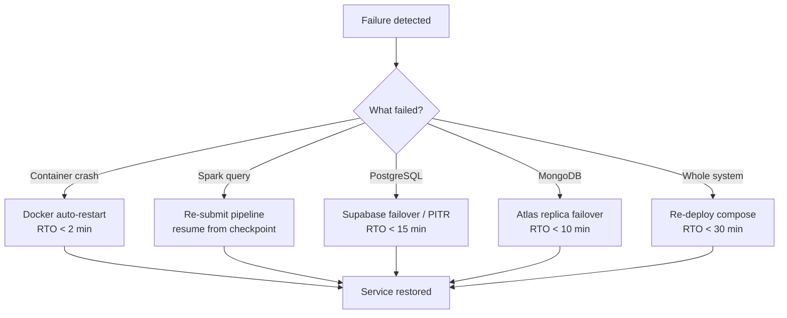

# Operations Guide

The scenario index for operating the platform. It routes an operator from a symptom to the runbook that resolves it, without duplicating the procedure. It pairs with [Observability](observability.md): that file defines the signals, the runbooks define the responses.

## Common Operational Scenarios

| Scenario | Symptoms | Severity | Owner | Runbook |
|----------|----------|----------|-------|---------|
| Ingestion backlog | `kafka.topic.lag` / `ingestion.lag_seconds` rising | Warning | Data on-call | [Ingestion backlog](runbooks/ingestion-backlog.md) |
| Pipeline stopped | A Spark streaming query is no longer running | Critical | Data on-call | [Pipeline stopped](runbooks/pipeline-stopped.md) |
| Datastore outage | `db.write.errors` rising; reads failing | Critical | DB owner | [Datastore outage](runbooks/datastore-outage.md) |
| Elevated 5xx | API error rate above SLO | Critical | API on-call | [Elevated 5xx](runbooks/elevated-5xx.md) |
| Corrupt checkpoint | Pipeline fails to restart with a checkpoint error | Warning | Data owner | [Corrupt checkpoint](runbooks/corrupt-checkpoint.md) |

Each runbook follows the same shape: purpose, symptoms, safety/prerequisites, diagnosis, remediation, validation, rollback, escalation, and related resources.

## Backup, RTO & RPO

| Component | Backup | RTO | RPO |
|-----------|--------|-----|-----|
| PostgreSQL (Supabase) | PITR (continuous WAL) + daily snapshot | < 15 min | < 1 min |
| MongoDB (Atlas) | Continuous (oplog) + 6h snapshot | < 10 min | < 5 s |
| Kafka | Replication factor 3 (year 2+); topic retention | < 5 min | 0 with `acks=all` |
| Spark | Checkpoint-based resume | < 5 min | 0 (idempotent from offset) |
| Backend (stateless) | Image registry + Git | < 2 min | N/A |
| Full system | Re-deploy via `docker compose up -d` | < 30 min | n/a |

**System targets:** RTO 30 min (typical partial failure < 5 min); RPO < 1 min for telemetry. These assume the managed-service guarantees described in the [High-Level Design](../hld.md).

## Recovery Decision Tree

## See Also

- [Observability](observability.md) — the signals these scenarios respond to.
- [Integration Map](../navigation/integration-map.md) — dependency failure impact.
