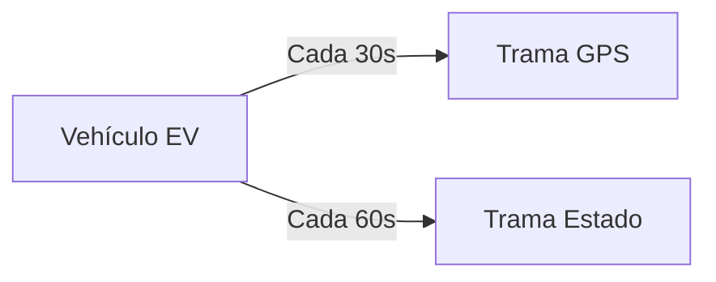
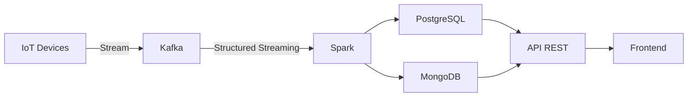
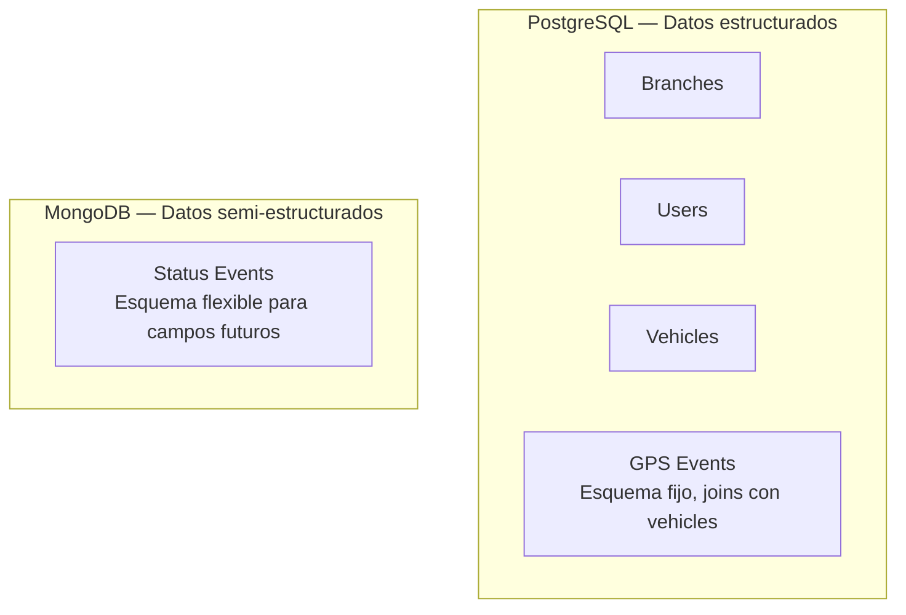
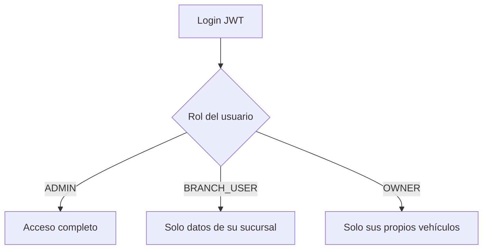

# Requerimientos del Proyecto

## Contexto Académico

| Campo | Detalle |
|-------|---------|
| **Curso** | Fundamentos de Arquitectura de Datos |
| **Universidad** | Universidad Rafael Landívar |
| **Modalidad** | Trabajo en grupo (máximo 6 integrantes) |
| **Entrega** | Última sesión de curso |
| **Título** | Arquitectura de Datos para la Movilidad Inteligente de ACME EV |

---

## 1. Objetivo General

Diseñar e implementar una Arquitectura de Datos moderna, escalable y eficiente que permita a ACME EV — empresa dedicada a la venta de vehículos eléctricos — consolidar su estrategia de diferenciación basada en el valor de los datos, tanto para el cliente como para la empresa.

---

## 2. Caso de Negocio

### 2.1 Descripción de ACME EV

ACME EV es una empresa de vehículos eléctricos con **10 sucursales** en distintos países. Su flota en circulación actualmente es de **10,000 vehículos** con crecimiento proyectado del **20% anual**.

### 2.2 Datos generados por los vehículos

#### Trama GPS (cada 30 segundos)

| Campo | Descripción | Ejemplo |
|-------|-------------|---------|
| VIN | Identificación única del vehículo | `ACME1000000000001` |
| Fecha/Hora | Timestamp de generación | `2026-06-14T15:30:00Z` |
| Latitud | Coordenada GPS | `14.6349` |
| Longitud | Coordenada GPS | `-90.5069` |

- **Retención:** 30 días

#### Trama Estado (cada 60 segundos)

| Campo | Descripción | Ejemplo |
|-------|-------------|---------|
| VIN | Identificación única del vehículo | `ACME1000000000001` |
| Fecha/Hora | Timestamp de generación | `2026-06-14T15:30:00Z` |
| Estado de batería | Porcentaje de carga | `78.5%` |
| Encendido/Apagado | Estado del motor | `On=1 / Off=0` |
| Código de problema | Desperfecto reportado (000-999, 000=OK) | `000` |
| Kilometraje | Odómetro del vehículo | `12345.6 km` |

- **Retención:** 365 días
- **Nota:** Futuros modelos enviarán atributos adicionales de estructura aún desconocida (justifica esquema flexible/NoSQL)

### 2.3 Necesidades de acceso a datos

| Actor | Necesidad |
|-------|-----------|
| **Sucursal** | Acceder a datos de estado para planificar mantenimientos y analizar fallas |
| **Propietario** | Descargar información GPS (VIN, fecha/hora, lat, lng) de sus vehículos |
| **ACME EV (corporativo)** | Analítica avanzada de movilidad eléctrica |

### 2.4 Requisitos de seguridad

- **Disponibilidad:** Datos accesibles dentro de los plazos de retención
- **Integridad:** Datos no alterados durante transmisión ni almacenamiento
- **Confidencialidad:** Control de acceso por rol; cada propietario solo ve sus propios datos

---

## 3. Actividades del Proyecto

### Rol A: Arquitecto de Datos

| # | Actividad |
|---|-----------|
| A1 | Diseño conceptual y lógico (documento nivel gerencial) |
| A2 | Integración de fuentes y flujo entre componentes |
| A3 | Selección y justificación de arquitectura (Lambda vs Kappa) | Kappa |
| A4 | Plan de escalabilidad (5 años de crecimiento) |
| A5 | Controles de seguridad y gobernanza de datos |
| A6 | Justificación de alineación con estrategia empresarial

### Rol B: Ingeniero de Datos

| # | Actividad |
|---|-----------|
| B1 | Selección de tecnologías (BD, ETL/ELT, almacenamiento distribuido) |
| B2 | Simulación con datos sintéticos |
| B3 | Carga de datos transaccionales desde simuladores |
| B4 | Almacenamiento en SQL y NoSQL |
| B5 | Procesamiento de flujos con Kafka + Spark |
| B6 | Serialización en JSON, CSV |
| B7 | Comparación batch vs tiempo real |

---

## 4. Entregables

### Informe Técnico (máx. 10 páginas)

1. **Diseño de Arquitectura** — Documento para discusión a nivel gerencial, evitando tecnicismos. Define el "QUÉ".
2. **Diseño de Ingeniería** — Documento técnico alineado con la arquitectura. Define el "CÓMO".

### Prototipo Funcional

| # | Entregable | Implementación |
|---|-----------|----------------|
| P1 | Ingesta de datos GPS | IoT Producer → Kafka → Spark → PostgreSQL |
| P2 | Ingesta de datos de Estado | IoT Producer → Kafka → Spark → MongoDB |
| P3 | Recuperación de datos para el cliente (GPS) | Frontend OWNER → API → PostgreSQL |
| P4 | Recuperación de datos para la sede (Estado) | Frontend BRANCH_USER → API → MongoDB |

---

## 5. Criterios de Evaluación

| Criterio | Ponderación |
|----------|-------------|
| Diseño de la Arquitectura Conceptual | 20% |
| Justificación y alineación estratégica | 10% |
| Implementación y simulación técnica | 10% |
| Comparación y análisis de eficiencia | 20% |
| Gobernanza y seguridad de datos | 10% |
| Calidad del informe final | 10% |
| Presentación y defensa del proyecto | 20% |

---

## 6. Decisiones de Diseño — Justificación

### Arquitectura Kappa (todo es streaming)

**¿Por qué Kappa y no Lambda?**

| Aspecto | Lambda | Kappa (elegida) |
|---------|--------|-----------------|
| Complejidad | Dos pipelines (batch + stream) | Un solo pipeline |
| Mantenimiento | Duplicación de lógica | Lógica unificada |
| Consistencia | Eventual entre capas | Inmediata |
| Caso ACME EV | Overkill para datos IoT periódicos | Natural para telemetría continua |

La naturaleza del dato (telemetría periódica de vehículos) se alinea con streaming puro. No hay necesidad de reprocesamiento batch masivo.

### Selección de tecnologías

| Componente | Tecnología | Justificación |
|-----------|-----------|---------------|
| Mensajería | Apache Kafka (KRaft) | Alta throughput, durabilidad, particionamiento, sin ZooKeeper |
| Procesamiento | Apache Spark Structured Streaming | Exactly-once semantics, micro-batch eficiente, conectores nativos |
| BD Relacional | PostgreSQL | ACID, integridad referencial, joins para entidades + GPS |
| BD Documental | MongoDB | Esquema flexible para status events con campos futuros desconocidos |
| API | NestJS (CQRS) | Separación clara lectura/escritura, TypeScript tipado |
| Frontend | React + MUI | SPA interactiva, DataGrid para tablas grandes |

### Almacenamiento diferenciado (Polyglot Persistence)

| Dato | Motor | Razón |
|------|-------|-------|
| GPS Events | PostgreSQL | Esquema fijo, necesita join con vehicles/owners para scoping |
| Status Events | MongoDB | Campos futuros desconocidos → esquema flexible |
| Entidades (users, vehicles, branches) | PostgreSQL | Integridad referencial, transacciones |

---

## 7. Plan de Escalabilidad (5 años)

### Proyección de volumen

| Año | Vehículos | Msgs GPS/día | Msgs Status/día | Almacenamiento GPS/mes | Almacenamiento Status/mes |
|-----|-----------|-------------|-----------------|----------------------|--------------------------|
| 1 | 10,000 | 28.8M | 14.4M | ~216 GB | ~130 GB |
| 2 | 12,000 | 34.6M | 17.3M | ~259 GB | ~156 GB |
| 3 | 14,400 | 41.5M | 20.7M | ~311 GB | ~187 GB |
| 4 | 17,280 | 49.8M | 24.9M | ~373 GB | ~224 GB |
| 5 | 20,736 | 59.7M | 29.9M | ~448 GB | ~269 GB |

### Estrategias de escalabilidad

| Componente | Estrategia |
|-----------|-----------|
| Kafka | Aumentar particiones, agregar brokers |
| Spark | Escalar workers horizontalmente |
| PostgreSQL | Supabase (escalado gestionado), particionamiento por fecha |
| MongoDB | Atlas (auto-scaling), sharding por VIN |
| Backend | Réplicas horizontales (stateless) |
| Frontend | CDN + nginx (estático) |

---

## 8. Seguridad y Gobernanza

### Control de acceso implementado

| Control | Implementación |
|---------|---------------|
| Autenticación | JWT (stateless, expiración configurable) |
| Autorización | Role-based (ADMIN, BRANCH_USER, OWNER) |
| Data scoping | Filtrado automático por branchId/userId |
| Passwords | bcrypt (hash + salt) |
| Transporte | HTTPS en producción |
| Secrets | Variables de entorno (no en código) |

### Principios de gobernanza

- **Trazabilidad:** Cada evento lleva timestamp de generación (`event_timestamp`) y de procesamiento (`processed_at`)
- **Inmutabilidad:** Los datos de telemetría son append-only, no se modifican
- **Retención:** Configurable por tipo de dato (implementable con políticas de TTL/particionamiento)
- **Auditoría:** Registro de quién accede a qué datos (por JWT claims)

---

## 9. Mapeo Requerimiento → Implementación

| Requerimiento del caso | Componente | Evidencia |
|----------------------|-----------|-----------|
| Transmisión GPS cada 30s | IoT Producer (configurable, actual: 10s) | `iot-producer/src/simulator.js` |
| Transmisión Estado cada 60s | IoT Producer (mismo tick, ambos tópicos) | `iot-producer/src/simulator.js` |
| 10,000 vehículos | Configurable vía `TOTAL_VEHICLES` | `.env` |
| Almacenamiento SQL | PostgreSQL (GPS events + entidades) | `database/*.sql` |
| Almacenamiento NoSQL | MongoDB (Status events) | `status_events` collection |
| Descarga GPS por propietario | `GET /gps/events/download` (CSV) | `backend/src/gps/` |
| Acceso por sucursal | `GET /status/events` + filtro branch | `backend/src/status/` |
| Control de acceso | JWT + Roles + Guards | `backend/src/auth/` |
| Procesamiento streaming | Spark Structured Streaming | `spark/jobs/pipelines/` |
| Esquema extensible para futuros modelos | MongoDB (schemaless) | `status_events` |
| Serialización JSON/CSV | Kafka (JSON), API (JSON), Download (CSV) | Múltiples módulos |

---

## 10. Tecnologías Utilizadas

| Categoría | Tecnología | Versión |
|-----------|-----------|---------|
| Base de datos relacional | PostgreSQL | 16.2 |
| Base de datos documental | MongoDB | 7 |
| Procesamiento streaming | Apache Spark | 3.5.1 |
| Mensajería | Apache Kafka (KRaft) | latest |
| Backend API | NestJS + TypeORM + Mongoose | 11 |
| Frontend | React + MUI | 19 / v9 |
| Lenguajes | TypeScript, Python, SQL, JavaScript | — |
| Serialización | JSON (Kafka, API), CSV (descarga) | — |
| Infraestructura | Docker Compose | v2 |
| Cloud (planificado) | Supabase, MongoDB Atlas | — |
