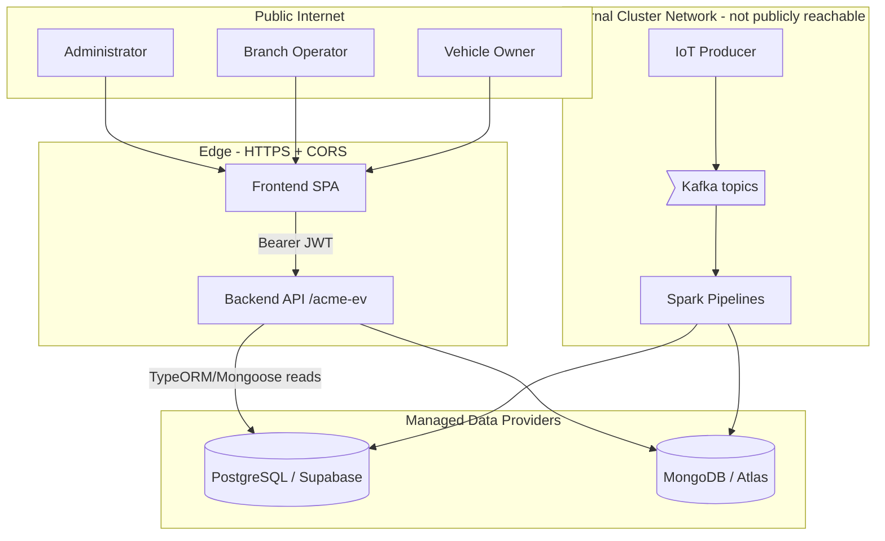

# Security

Authoritative owner of the platform's shared security knowledge: trust boundaries, identity, sensitive data, secrets, and the controls engineers must understand. Flows record flow-specific risks in their own `index.md` and link here; they do not create separate security documents.

## Trust Boundaries and Actors

| Actor | Identity | Trust level |
|-------|----------|-------------|
| Administrator | `ADMIN` JWT | Full read access and administration |
| Branch operator | `BRANCH_USER` JWT (carries `branchId`) | Scoped to their branch |
| Vehicle owner | `OWNER` JWT | Scoped to owned vehicles |
| IoT producer / devices | None (in-cluster) | Trusted transport on the internal network |
| Spark pipelines | Datastore credentials | Trusted ingestion writers |

The application boundary is the HTTPS edge in front of the Backend API. Kafka, Spark, and the local datastores sit on an internal network and are not publicly reachable; the producer→Kafka→Spark write path carries no application-level authentication and relies on network isolation.

## Authentication and Authorization

- **Authentication:** stateless, HMAC-signed JWT issued by [Login](flows/login/index.md). Claims are `{ sub, email, role, branchId }`. Every `/acme-ev/*` route except `POST /auth/login` requires a valid token (`JwtAuthGuard`). Passwords are verified against a bcrypt hash.
- **Authorization (role):** `@Roles(...)` plus a global `RolesGuard` gate each endpoint by role (`ADMIN`, `BRANCH_USER`, `OWNER`).
- **Authorization (data scoping):** each query handler further restricts results — branch operators to their `branchId`, owners to vehicles linked in `vehicle_owners`. The scoping policy is owned by [Domain → Data scoping](knowledge/domain.md#data-scoping); the rationale and trade-offs are in [ADR-0005](history/adrs/0005-jwt-rbac-data-scoping.md).

Because tokens are stateless, they remain valid until expiry (`JWT_EXPIRES_IN`); there is no revocation list today.

## Sensitive Data

| Data | Classification | Handling |
|------|----------------|----------|
| Passwords | Secret | Stored only as bcrypt hashes; never returned by any interface (the user mapper drops the field) |
| JWTs | Secret | Bearer credentials; never logged |
| Vehicle location (GPS) | Confidential / personal | Returned only to the owning user or a privileged role; bounded by retention |
| Owner↔vehicle links | Confidential | Drives owner scoping; exposed only within scope |
| Datastore credentials / JWT secret | Secret | Environment variables, never committed |

## Secrets and Key Management

Secrets are supplied through a single root `.env` (gitignored) and injected into each service by Docker; production reads the same variables from the deployment environment. The signing key (`JWT_SECRET`) and connection strings (`POSTGRES_URI`, `MONGO_URI`) are the sensitive values. No secrets are committed to the repository, and `.env.template` carries only placeholder keys.

## Input Validation and Abuse Protections

- A global `ValidationPipe` validates and whitelists every request body and query against its DTO, rejecting unknown or malformed input with `400`.
- CORS is restricted to the configured `WEB_APP_URL`; transport is HTTPS in production.
- **Gap:** there is no rate limiting on `POST /auth/login` today. A login throttle is recommended before exposing the API at scale to limit credential-stuffing — tracked as a future hardening item.

## Audit and Security-Event Visibility

The backend logs request/response with the resolved role; the login flow logs the email and outcome only, never the password. Passwords, bcrypt hashes, and JWTs are never written to logs. Authentication failures surface through the `api.5xx` / 4xx signals described in [Observability](operations/observability.md).

## Shared Controls and Risks Mitigated

| Control | Risk mitigated |
|---------|----------------|
| JWT + `RolesGuard` | Unauthorized access to endpoints |
| Per-handler data scoping | Cross-tenant data exposure (owner/branch confidentiality) |
| bcrypt password hashing | Credential disclosure on datastore compromise |
| `ValidationPipe` whitelist | Malformed/over-posted input |
| CORS + HTTPS | Cross-origin abuse and transport interception |
| Network isolation of Kafka/Spark/DBs | Direct tampering with the ingestion path |
| Managed-provider encryption at rest | Data disclosure on storage compromise |

## Ownership and Escalation

The Backend Team owns the authentication and authorization model; the Data Platform Team owns ingestion-path and datastore security. Security-relevant decisions that change architecture are recorded as ADRs — see [ADR-0005](history/adrs/0005-jwt-rbac-data-scoping.md). Escalate suspected exposure through the API on-call (edge/auth) or the Data on-call (ingestion/datastores) per the [Operations Guide](operations/operations-guide.md).
